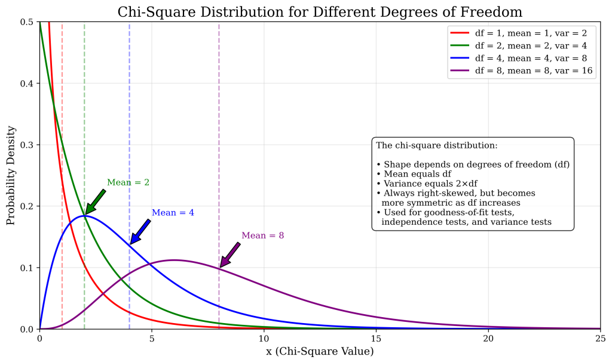

[Source](https://www.ariclabarr.com/logistic-regression/part_1_cat.html)

```{r}
#| message: false
library(AmesHousing)
library(tidyverse)
library(gmodels)
library(vcd)
library(vcdExtra)
library(DescTools)
```

# Exploratory Data Analysis

For this analysis we are going to the popular Ames housing dataset. This dataset contains information on home values for a sample of nearly 3,000 houses in Ames, Iowa in the early 2000s. 

```{r}
(ames <- make_ordinal_ames())
```

Imagine you worked for a real estate agency and got a bonus check if you sold a house above $175,000 in value. Let’s create this variable in our data:

```{r}
ames <- ames %>% 
  mutate(Bonus = if_else(Sale_Price > 175000, 1, 0))
```

Split training data.

```{r}
set.seed(123)
ames <- ames %>% 
  mutate(id = row_number())

train <- ames %>% 
  sample_frac(0.7)

test <- anti_join(
  ames, train, by = "id"
)
```

What are the variables associated with obtain a higher chance of receiving a bonus? To understand the distribution of categorical variables, we need to look at frequency tables.

```{r}
table(train$Bonus)
```

```{r}
ggplot(train, aes(x = Bonus)) +
  geom_bar()
```

```{r}
table(train$Central_Air)
```

```{r}
ggplot(data = train) +
  geom_bar(mapping = aes(x = Central_Air))
```

Let’s again examine bonus eligibility, but this time across levels of central air. Again, we can use the table function. The prop.table function allows us to compare two variables in terms of proportions instead of frequencies.

```{r}
table(train$Central_Air, train$Bonus)
```

```{r}
prop.table(table(train$Central_Air, train$Bonus))
```

```{r}
ggplot(data = train) +
  geom_bar(mapping = aes(x = Bonus, fill = Central_Air))
```

From the above output we can see that 147 homes have no central air with only 5 of them being bonus eligible. However, there are 1904 homes that have central air with 835 of them being bonus eligible. For an even more detailed breakdown we can use the CrossTable function.

```{r}
gmodels::CrossTable(
  train$Central_Air, train$Bonus,
  prop.chisq = F, expected = T
)
```

# Tests of Association

The null hypothesis is no association. The alternative is an association between the two variables. The tests follow a $\chi^2$-distribution.

- bounded below by 0
- right skewed
- one set of degrees of freedom



__Pearson $\chi^2$__

$$
\chi^2_P = \sum_{i=1}^R \sum_{j=1}^C \frac{(Obs_{i,j} - Exp_{i,j})^2}{Exp_{i,j}}
$$

__Likelihood Ratio test__

$$
\chi^2_L = 2 \times \sum_{i=1}^R \sum_{j=1}^C Obs_{i,j} \times \log(\frac{Obs_{i,j}}{Exp_{i,j}})
$$

The p-value comes from a $\chi^2$-distribution with degrees of freedom that equal the product of the number of rows minus one and the number of columns minus one. Both of the above tests have a sample size requirement. The sample size requirement is 80% or more of the cells in the cross-tabulation table need expected counts larger than 5. For smaller samples, use Fisher's exact test.

The tests compare the observed count of observations in each cell to their expected count _if_ there was no relationship. The greater the difference, the more evidence of a relationship between the variables.

For ordinal variables, can determine a _linear_ association with

__Mantel-Haenszel $\chi^2$ test__

$$
\chi^2_{MH} = (n-1)r^2
$$

where $r^2$ is the Pearson correlation between the column and row variables. This test follows a $\chi^2$-distribution with only one degree of freedom.

For smaller samples, use 

__Fisher's exact test__

$$
\chi^2 = \frac{\sum(O_i-E_i)^2}{E_i}\\
O_i: \text{Observed value} \\
E_i: \text{Expected value}
$$


$$
E_i = \frac{row total \times column total}{Sample\ size} 
$$

Assumptions:

- random samples
- mutually exclusive categories
- independent observations
- expected frequency count for each category is at least 5

```{r}
assocstats(table(train$Central_Air, train$Bonus))
```

The p-value comes from a -distribution with degrees of freedom that equal the product of the number of rows minus one and the number of columns minus one.

Since binary variables are ordinal, can use Mantel-Haenszel.

```{r}
CMHtest(table(train$Central_Air, train$Bonus))$table[1,]
```

While unnecessary here, the Fisher test:

```{r}
fisher.test(table(train$Central_Air, train$Bonus))
```

# Measures of Association

- __Odds ratio__: For 2 binary variables
- __Cramer's V__: Nominal variables with any number of categories
- __Searman's Correlation__: Ordinal variables with any number of categories

__Odds ratio__

Let’s look at the row without central air. The probability that a home without central air is not bonus eligible is 96.6%. That implies that the odds of not being bonus eligible in homes without central air is 28.41 (= 0.966/0.034). For homes with central air, the odds of not being bonus eligible are 1.28 (= 0.561/0.439). The odds ratio between these two would be approximately 22.2 (= 28.41/1.28). In other words, homes without central air are 22.2 times as likely (in terms of odds) to not be bonus eligible as compared to homes with central air. 

__Cramer's V__

$$
V = \sqrt{\frac{\chi^2_P/n}{\min(Rows-1, Columns-1)}}
$$

Bounded between 0 and 1 (-1 and 1 for binary variables). The further from 0, the stronger the correlation.

__Spearman's Correlation__

$$
r = \frac{Cov(X,Y)}{\sqrt{\text{Var}(X) \cdot \text{Var}(Y)}}
$$
The range is (-1,1), 1 being strong positive, 0 being no correlation. In
order to determine if the number is significant, must test.

```{r}
OddsRatio(table(train$Central_Air, train$Bonus))
```

This is the odds ratio of the left column odds in the top row over the left column odds in the bottom row. This means that homes without central air are 22.2 times as likely (in terms of odds) to not be bonus eligible as compared to homes with central air.

```{r}
assocstats(table(train$Central_Air, train$Bonus))
```

```{r}
assocstats(table(train$Lot_Shape, train$Bonus))
```


The Cramer’s V value is 0.212. There is no good or bad value for Cramer’s V. There is only better or worse when comparing to another variable. For example, when looking at the relationship between the lot shape of the home and bonus eligibility, the Cramer’s V is 0.31. This would mean that lot shape has a stronger association with bonus eligibility than central air.

```{r}
cor.test(
  x = as.numeric(ordered(train$Central_Air)),
  y = as.numeric(ordered(train$Bonus)),
  method = "spearman"
)
```

```{r}
cor.test(x = as.numeric(ordered(train$Fireplaces)), 
         y = as.numeric(ordered(train$Bonus)), 
         method = "spearman")
```

Again, as with Cramer’s V, Spearman’s correlation is a comparison metric, not a good vs. bad metric. For example, when looking at the relationship between the number of fireplaces of the home and bonus eligibility, the Spearman’s correlation is 0.43. This would mean that fireplace count has a stronger association with bonus eligibility than central air.

