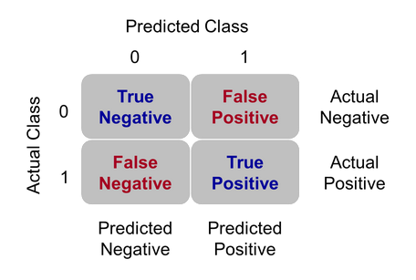
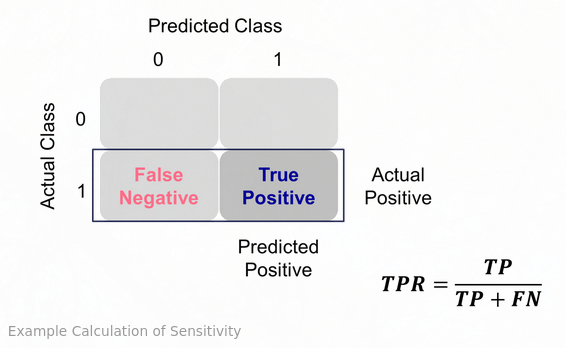
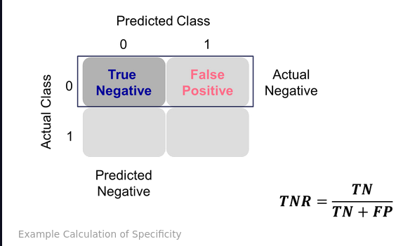
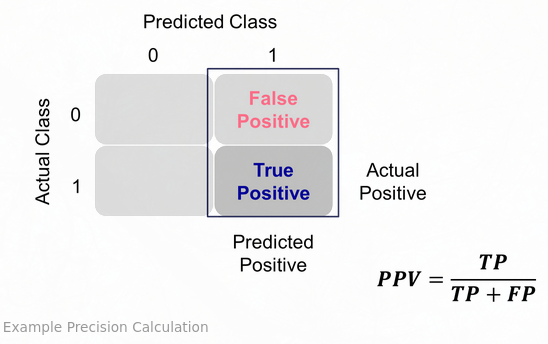
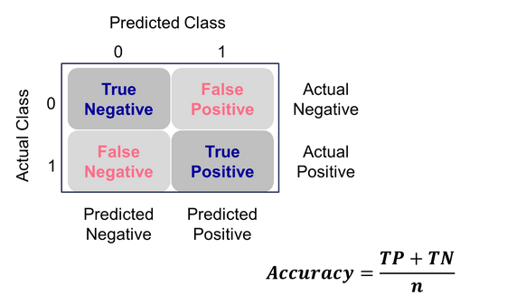
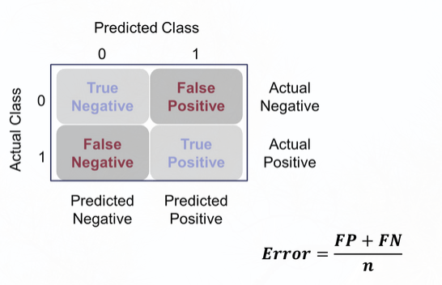

[Source](https://www.ariclabarr.com/logistic-regression/part_5_assess.html)

```{r}
options(paged.print = FALSE)
```

```{r}
#| message: false
library(AmesHousing)
library(tidyverse)
library(DescTools)
library(Hmisc)
library(ROCit)
library(ROCR)
```

```{r paged.print=FALSE}
ames <- make_ordinal_ames() %>% 
  mutate(Bonus = if_else(Sale_Price > 175000, 1, 0))

set.seed(123)
ames <- ames %>% 
  mutate(id = row_number())

train <- ames %>% 
  sample_frac(0.7)

test <- anti_join(
  ames, train, by = "id"
)
head(ames)
```

# Comparing Models

Good is relative. Three common model metrics based on deviance/likelihood are AIC, BIC and Generalized $R^2$. The AIC is a crude, large sample approximation of leave-one-out cross validation. The BIC on the other hand favors a smaller model than the AIC as it penalizes model complexity more. Lower is better. For pseudo-$R^2$, higher is better, but no interpretive value.

```{r}
logit_model <- glm(
  Bonus ~ Gr_Liv_Area + factor(House_Style) + Garage_Area +
    Fireplaces + factor(Full_Bath) + Lot_Area + factor(Central_Air) +
    TotRms_AbvGrd + Gr_Liv_Area:Fireplaces,
  data = train, family = binomial(link = "logit")
)

AIC(logit_model)
BIC(logit_model)
PseudoR2(logit_model, which = "Nagelkerke")
```

R-squared is rescaled to be between 0 and 1.

# Probability Metrics

Logistic regression predicts the probability of an event, not the occurrence of an event. It can be used for classification as well. Models should do both, but the relative importance depends on the problem.

## Coefficient of Discrimination

Difference in average predicted probabilies of actual events and non-events. The larger the difference, the better the model separates events from non-events.

$$
D = \bar{\hat{p}}_1 - \bar{\hat{p}}_0
$$

```{r}
train$p_hat <- predict(logit_model, type = "response")

p1 <- train$p_hat[train$Bonus == 1]
p0 <- train$p_hat[train$Bonus == 0]

coef_discrim <- mean(p1) - mean(p0)

ggplot(train, aes(p_hat, fill = factor(Bonus))) +
  geom_density(alpha = 0.7) +
  scale_fill_grey() +
  labs(
    x = "Predicted Probability",
    fill = "Outcome",
    title = paste("Coefficient of Discrimination = ",
      round(coef_discrim, 3),
      sep = ""
    )
  )
```

## Rank-Order Statistics

Measures how well a model orders predicted probability. Every combination of event and non-event are compared against each other. A pair is either concordant (event has higher predicted probability than non-event), discordant, or tied. Models with higher concordance are better.

Three rank-statistics are the $c$-statistic, Somer's D and Kendall's $\tau_\alpha$.

$$
c = Concordance + 1/2\times Tied
$$
$$
D_{xy} = 2c - 1
$$
$$
\tau_\alpha = \frac{Condorant - discordant}{0.5*n*(n-1)}
$$

```{r}
somers2(train$p_hat, train$Bonus)
```

The model assigned the higher predicted probability to the observation with the bonus eligible home 94.3% of the time (the C in the output). These values are useful in comparing models. The c-statistic is the same as the AUC.

# Classification Metrics

Many metrics try to balance different pieces of the confusion matrix.



## Sensitivity and Specificity

Sensitivity (recall) is true positive rate, specificity is true negative rate.





Youden's Index can be used to balance them providing an optimal cut-off by maximizing $J=sensitivity+specificty-1$.

```{r}
train <- train %>% 
  mutate(Bonus_hat = ifelse(p_hat > 0.5, 1, 0))

table(train$Bonus_hat, train$Bonus)
```

To looka at all cut-off values between 0 and 1, use `measureit`.

```{r}
logit_meas <- measureit(
  train$p_hat, train$Bonus,
  measure = c("ACC", "SENS", "SPEC")
)
summary(logit_meas)
```

```{r}
youden_table <- data.frame(
  Cutoff = logit_meas$Cutoff,
  Sens = logit_meas$SENS,
  Spec = logit_meas$SPEC
)
head(youden_table)
```

The calculation of the index is done with `rocit` below.

The ROC curve plots sensitivity vs specificity. AUC is the area under this curve. 

```{r}
logit_roc <- rocit(train$p_hat, train$Bonus)
plot(logit_roc)$optimal
```

```{r}
summary(logit_roc)
```
For confidence intervals:

```{r}
ciAUC(logit_roc, level = 0.99)
```

```{r}
plot(ciROC(logit_roc))
```

We can see that the highest Youden J statistic had a value of 0.7352. This took place at a cut-off of 0.423. Therefore, according to the Youden Index at least, the optimal cut-off for our model is 0.423. In other words, if our model predicts a probability above 0.423 then we should call this an event. Any predicted probability below 0.423 should be called a non-event. 

The `performance` function produces more plots.

```{r}
pred <- prediction(train$p_hat, factor(train$Bonus))

perf <- performance(
  pred,
  measure = "sens", x.measure = "fpr"
)

plot(perf, lwd = 3, colorize = FALSE, colorkey = FALSE)
abline(a = 0, b = 1, lty = 3)
```

```{r}
performance(pred, measure = "auc")@y.values
```

## K-S Statistic

Popular in finance and banking. Determines difference between the cumulative distribution functions, here the predicted probability distructions for the event and non-event group. KS $D$ is the maximimu distance between the two curves. This is equavalent to maximizing the Youden Index.

$$
D = \max_{depth}{(TPR - FPR)} = \max_{depth}{(Sensitivity + Specificity - 1)}
$$

```{r}
ksplot(logit_roc)$`KS stat`
```

```{r}
ksplot(logit_roc)$`KS Cutoff`
```

As we saw in the previous section, the optimal cut-off according to the KS-statistic would be at 0.423. Therefore, according to the KS statistic at least, the optimal cut-off for our model is 0.423. In other words, if our model predicts a probability above 0.423 then we should call this an event. Any predicted probability below 0.423 should be called a non-event. The KS statistic is reported as 0.7352 which is equal to the Youden’s Index value.

To calculate "by hand"

```{r}
perf <- performance(pred, measure = "tpr", x.measure = "fpr")
KS <- max(perf@y.values[[1]] - perf@x.values[[1]])
cutoffAtKS <- unlist(perf@alpha.values)[
  which.max(perf@y.values[[1]] - perf@x.values[[1]])
  ]
print(c(KS, cutoffAtKS))
```

```{r}
perf_df <- data.frame(
  alpha = perf@alpha.values[[1]],
  x = perf@x.values[[1]],
  y = perf@y.values[[1]]
) %>% 
  mutate(diff = y - x)

perf_df %>% 
  filter(diff == max(diff))
```

```{r}
plot(x = perf_df$alpha, y = 1 - perf_df$y,
     type = "l", main = "K-S Plot (EDF)",
     xlab = "Cut-off", ylab = "Proportion", col = "red")
lines(x = perf_df$alpha, y = 1 - perf_df$x)
```

## Precision and Recall

Recall is sensitivity. Precision is the proportion of predicted events that were actually events.



The optimal cut-off uses the __F1 Score__.

$$
F_1 = 2\times \frac{precision \times recall}{precision + recall}
$$

```{r}
logit_meas <- measureit(
  train$p_hat, train$Bonus, 
  measure = c("PREC", "REC", "FSCR"))
summary(logit_meas)
```

```{r}
f_score_df <- 
  data.frame(
    Cutoff = logit_meas$Cutoff, 
    FScore = logit_meas$FSCR
  )
head(arrange(f_score_df, desc(FScore)), n = 10)
```

The optimal cut-off happens to be the same as Youden's index, which is not always so.

### Lift

The ratio of the precision to the population proportion of the event. 

$$
Lift = PPV/\pi_1
$$

The interpretation of lift is really nice for explanation. Let’s imagine that your lift was 3 and your population proportion of events was 0.2. This means that in the top 20% of your customers, your model predicted 3 times the events as compared to you selecting people at random. Sometimes people plot lift charts where they plot the precision at all the different values of the population proportion (called depth).

```{r}
logit_lift <- gainstable(logit_roc)
logit_lift
```

The response rate of the first 10% of the data is .976 (97.6% target value of 1). The original data had a total response rate of .41. This means we did 2.382 (.976/.41) better than random with the top 10% of customers. Had we randomly picked 10% of customers, we would have expected 84 responses.


```{r}
plot(logit_lift, type = 1)
```

```{r}
plot(logit_lift, type = 2)
```

```{r}
plot(logit_lift, type = 3)
```

```{r}
(logit_lift <- gainstable(logit_roc, ngroup = 15))
```

This can also be calculated with `performance`.

```{r}
perf <- performance(
  pred, measure = "lift",
  x.measure = "rpp"
)
plot(perf, lwd = 3, colorize = TRUE, colorkey = TRUE,
     colorize.palette = rev(gray.colors(256)),
     main = "Lift Chart for Training Data")
abline(h = 1, lty = 3)
```

A common place to evaluate lift is at the population proportion. In our example above, the population proportion is approximately 0.41. At that point, we have a lift of approximately 2. In other words, if we were to pick the top 41% of homes identified by our model, we would be 2 times as likely to find a bonus eligible home as compared to randomly selecting from the population. 

## Accuracy and Error





In general, these metrics should not be used to determine a best model.

```{r}
logit_meas <- measureit(train$p_hat, train$Bonus,
                        measure = c("ACC", "FSCR"))
summary(logit_meas)
```

```{r}
acc_table <- data.frame(
  Cutoff = logit_meas$Cutoff,
  Acc = logit_meas$ACC
)
head(arrange(acc_table, desc(Acc)), n = 10)
```

From the output we can see the accuracy is maximized at 86.69%. The predicted probability that this occurs at (the optimal cut-off) is defined as 0.531. In other words, if our model predicts a probability above 0.531 then we should call this an event. Any predicted probability below 0.531 should be called a non-event, according to the accuracy metric.

This is not the best way.


