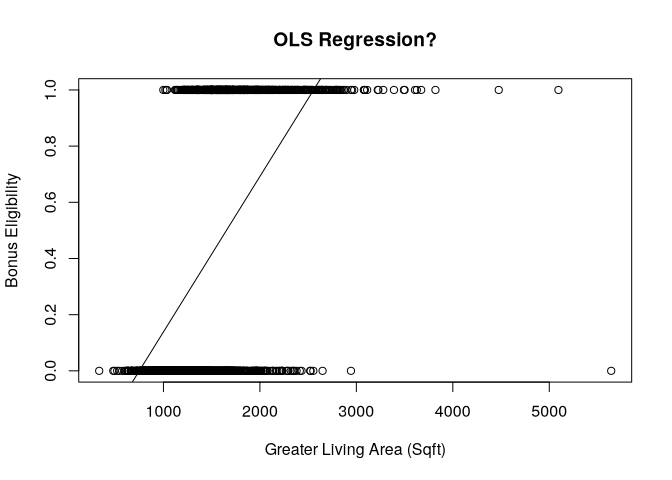
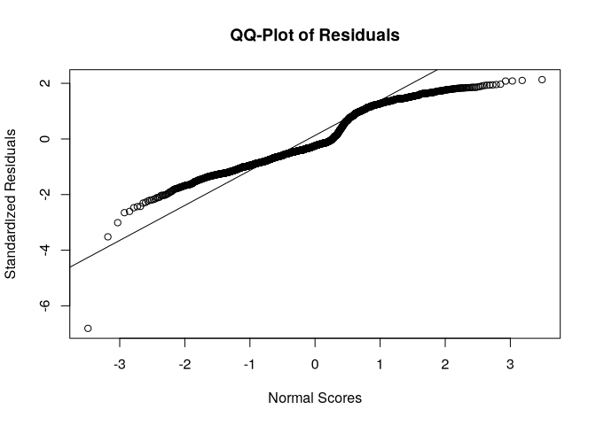
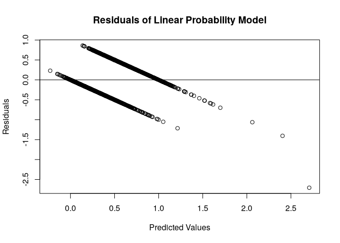
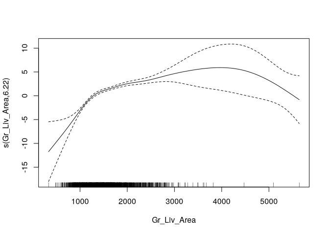
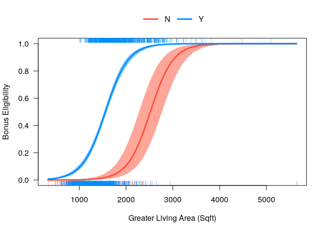

# Binary Logistic Regression


[Source](https://www.ariclabarr.com/logistic-regression/part_2_binary.html)

``` r
library(AmesHousing)
library(tidyverse)
library(car)
library(mgcv)
library(visreg)
```

``` r
ames <- make_ordinal_ames() %>% 
  mutate(Bonus = if_else(Sale_Price > 175000, 1, 0))

set.seed(123)
ames <- ames %>% 
  mutate(id = row_number())

train <- ames %>% 
  sample_frac(0.7)

test <- anti_join(
  ames, train, by = "id"
)
```

# Linear Model

Not widely used since probabilities don’t tend to be linear inrelation
to their predictors, and models can produce predictions outside of the
bounds of 0 and 1.

But let’s do it anyway.

``` r
lp_model <- lm(Bonus ~ Gr_Liv_Area, data = train)

with(
  train,
  plot(
    x = Gr_Liv_Area, y = Bonus,
    main = "OLS Regression?",
    xlab = "Greater Living Area (Sqft)",
    ylab = "Bonus Eligibility"
  )
)
abline(lp_model)
```



``` r
summary(lp_model)
```


    Call:
    lm(formula = Bonus ~ Gr_Liv_Area, data = train)

    Residuals:
         Min       1Q   Median       3Q      Max 
    -2.70766 -0.29160 -0.09983  0.39432  0.86198 

    Coefficients:
                  Estimate Std. Error t value Pr(>|t|)    
    (Intercept) -4.149e-01  2.776e-02  -14.94   <2e-16 ***
    Gr_Liv_Area  5.534e-04  1.765e-05   31.36   <2e-16 ***
    ---
    Signif. codes:  0 '***' 0.001 '**' 0.01 '*' 0.05 '.' 0.1 ' ' 1

    Residual standard error: 0.4044 on 2049 degrees of freedom
    Multiple R-squared:  0.3243,    Adjusted R-squared:  0.324 
    F-statistic: 983.6 on 1 and 2049 DF,  p-value: < 2.2e-16

``` r
qqnorm(rstandard(lp_model),
       ylab = "Standardized Residuals",
       xlab = "Normal Scores",
       main = "QQ-Plot of Residuals")
qqline(rstandard(lp_model))
```



``` r
plot(predict(lp_model), resid(lp_model),
     ylab="Residuals", xlab="Predicted Values", 
     main="Residuals of Linear Probability Model") 
abline(0, 0)
```



As we can see from the charts above, the assumptions of ordinary least
squares don’t really hold in this situation. Therefore, we should be
careful interpreting the results of the model.

# Binary Logistic Regression Model

The outcome of the logistic regression model is the probability of
getting a 1 in a binary variable, $E(y_i) = P(y_i = 1) = p_i$. That
probability is calculated as follows:

$$p_i = \frac{1}{1+e^{-(\beta_0 + \beta_1x_{1,i} + \cdots + \beta_k x_{k,i})}}$$

And follows a logistic curve.

The logit link function for logistic regression

$$logit(p_i) = \log(\frac{p_i}{1-p_i}) = \beta_0 + \beta_1x_{1,i} + \cdots + \beta_k x_{k,i}$$

Does not used ordinary least squares for coefficients because of the
lack of residuals. The target variable is binary, but the predictions
are probabilities. The Maximum likelihood estimation is used instead of
residuals. It maximizes the probability that the $\beta$ values produce
the data.

``` r
logit_model <- glm(Bonus ~ Gr_Liv_Area + factor(Central_Air),
                   data = train, family = binomial(link = "logit"))
summary(logit_model)
```


    Call:
    glm(formula = Bonus ~ Gr_Liv_Area + factor(Central_Air), family = binomial(link = "logit"), 
        data = train)

    Coefficients:
                           Estimate Std. Error z value Pr(>|z|)    
    (Intercept)          -1.035e+01  6.422e-01  -16.12  < 2e-16 ***
    Gr_Liv_Area           4.112e-03  1.962e-04   20.96  < 2e-16 ***
    factor(Central_Air)Y  3.952e+00  5.180e-01    7.63 2.35e-14 ***
    ---
    Signif. codes:  0 '***' 0.001 '**' 0.01 '*' 0.05 '.' 0.1 ' ' 1

    (Dispersion parameter for binomial family taken to be 1)

        Null deviance: 2775.8  on 2050  degrees of freedom
    Residual deviance: 1808.8  on 2048  degrees of freedom
    AIC: 1814.8

    Number of Fisher Scoring iterations: 6

Perform a Likelihood Ratio Test to see if any variables are significant
overall.

``` r
logit_model_r <- glm(Bonus ~ 1,
                     data = train, family = binomial(link = "logit"))

anova(logit_model, logit_model_r, test = "LRT")
```

    Analysis of Deviance Table

    Model 1: Bonus ~ Gr_Liv_Area + factor(Central_Air)
    Model 2: Bonus ~ 1
      Resid. Df Resid. Dev Df Deviance  Pr(>Chi)    
    1      2048     1808.8                          
    2      2050     2775.8 -2  -966.96 < 2.2e-16 ***
    ---
    Signif. codes:  0 '***' 0.001 '**' 0.01 '*' 0.05 '.' 0.1 ' ' 1

The above code creates a second model without any variables. It then
performs a Likelihood Ratio Test (LRT) on this model compared to the
original model. The results of this test show the usefulness of all the
variables.

``` r
logit_model_f <- glm(Bonus ~ Gr_Liv_Area + factor(Central_Air) + factor(Fireplaces),
                   data = train, family = binomial(link = "logit"))
car::Anova(logit_model_f, test = "LR", type = "III")
```

    Analysis of Deviance Table (Type III tests)

    Response: Bonus
                        LR Chisq Df Pr(>Chisq)    
    Gr_Liv_Area           565.89  1  < 2.2e-16 ***
    factor(Central_Air)    86.81  1  < 2.2e-16 ***
    factor(Fireplaces)     62.61  4  8.181e-13 ***
    ---
    Signif. codes:  0 '***' 0.001 '**' 0.01 '*' 0.05 '.' 0.1 ' ' 1

`car::Anova` performs a LRT comparing a model with and without a
variable, leaving every other variable in. `LR` gets the LRT, type 3
means the test only drops that specific variable when comparing to the
full model. The two models are significantly different (based on our
significance level) which implies that the Fireplaces variable (the only
difference between comparing a model with and without the Fireplaces
variable) is significant as a whole.

Calculate the odds ratios for each variable.

``` r
exp(cbind(coef(logit_model), confint(logit_model)))
```

    Waiting for profiling to be done...

                                             2.5 %       97.5 %
    (Intercept)          3.184558e-05 8.233966e-06 1.041852e-04
    Gr_Liv_Area          1.004121e+00 1.003745e+00 1.004517e+00
    factor(Central_Air)Y 5.203450e+01 2.058035e+01 1.620722e+02

This tells us that homes with central air are 52 times as likely (in
terms of odds) of being bonus eligible, on average, then homes without
central air. Every additional square foot of living area leads to the
home being 1.004 times as likely to be bonus eligible.

# Testing Assumptions

Logistic regression assumes the continuous predictor variables are
linearly related to the logit function. The is checked with Generalized
Additive Models (GAMs).

$$\log(\frac{p_i}{1-p_i}) = \beta_0 + f_1(x_1) + \cdots + f_k(x_k)$$

GAMs use spline functions for estimation. If a straight line is not
could one could:

1.  Use the GAM representation of the logistic regression model. It is
    less interpretable.
2.  Bin the continuous variables and treat them as ordinal.

`gam` is like `glm` but uses splines instead of lines.

``` r
fit_gam <- mgcv::gam(Bonus ~ s(Gr_Liv_Area) + factor(Central_Air),
                     data = train, family = binomial(link = "logit"),
                     method = "REML")
summary(fit_gam)
```


    Family: binomial 
    Link function: logit 

    Formula:
    Bonus ~ s(Gr_Liv_Area) + factor(Central_Air)

    Parametric coefficients:
                         Estimate Std. Error z value Pr(>|z|)    
    (Intercept)           -4.4616     0.5033  -8.864  < 2e-16 ***
    factor(Central_Air)Y   3.4882     0.4911   7.103 1.22e-12 ***
    ---
    Signif. codes:  0 '***' 0.001 '**' 0.01 '*' 0.05 '.' 0.1 ' ' 1

    Approximate significance of smooth terms:
                     edf Ref.df Chi.sq p-value    
    s(Gr_Liv_Area) 6.221  7.232  380.4  <2e-16 ***
    ---
    Signif. codes:  0 '***' 0.001 '**' 0.01 '*' 0.05 '.' 0.1 ' ' 1

    R-sq.(adj) =   0.43   Deviance explained =   39%
    -REML = 859.46  Scale est. = 1         n = 2051

The estimated degrees of freedom (6.221) are ideally 1, showing the best
spline was a linear relationship with the target. In this case, the
linearity assumption does not hold.

``` r
plot(fit_gam)
```



Are we close enough to 1? Can compare a model with a linear
representation to the spline version with an LRT.

``` r
anova(logit_model, fit_gam, test = "LRT")
```

    Analysis of Deviance Table

    Model 1: Bonus ~ Gr_Liv_Area + factor(Central_Air)
    Model 2: Bonus ~ s(Gr_Liv_Area) + factor(Central_Air)
      Resid. Df Resid. Dev     Df Deviance  Pr(>Chi)    
    1    2048.0     1808.8                              
    2    2042.8     1692.3 5.2212   116.58 < 2.2e-16 ***
    ---
    Signif. codes:  0 '***' 0.001 '**' 0.01 '*' 0.05 '.' 0.1 ' ' 1

The two models are not equal, meaning that `Gr_Liv_Area` cannot be
modeled linearly with the logit.

Create a bin variable. The graph suggests three areas with breaks at
1300 and 4000 sqft.

``` r
train <- train %>% 
  mutate(
    Gr_Liv_Area_BIN = cut(Gr_Liv_Area, breaks = c(-Inf, 1000, 1500, 3000, 4500, Inf))
  )

logit_model_bin <- glm(Bonus ~ factor(Gr_Liv_Area_BIN) + factor(Central_Air),
                       data = train, family = binomial(link = 'logit'))
summary(logit_model_bin)
```


    Call:
    glm(formula = Bonus ~ factor(Gr_Liv_Area_BIN) + factor(Central_Air), 
        family = binomial(link = "logit"), data = train)

    Coefficients:
                                           Estimate Std. Error z value Pr(>|z|)    
    (Intercept)                             -8.8210     1.1065  -7.972 1.56e-15 ***
    factor(Gr_Liv_Area_BIN)(1e+03,1.5e+03]   4.5121     1.0052   4.489 7.16e-06 ***
    factor(Gr_Liv_Area_BIN)(1.5e+03,3e+03]   6.6437     1.0049   6.611 3.81e-11 ***
    factor(Gr_Liv_Area_BIN)(3e+03,4.5e+03]  21.1646   363.8508   0.058  0.95361    
    factor(Gr_Liv_Area_BIN)(4.5e+03, Inf]    5.5986     1.7331   3.230  0.00124 ** 
    factor(Central_Air)Y                     3.2224     0.4734   6.807 9.95e-12 ***
    ---
    Signif. codes:  0 '***' 0.001 '**' 0.01 '*' 0.05 '.' 0.1 ' ' 1

    (Dispersion parameter for binomial family taken to be 1)

        Null deviance: 2775.8  on 2050  degrees of freedom
    Residual deviance: 1892.0  on 2045  degrees of freedom
    AIC: 1904

    Number of Fisher Scoring iterations: 14

From the above output, we can see that Gr_Liv_Area_BIN is still a
significant variable in our model. The nice part about using a
categorical representation for the variable instead of using the GAM for
predictions is that we still have some interpretability on this variable
using odds ratios for the categories.

# Predicted Values

``` r
new_ames <- data.frame(Gr_Liv_Area = c(1500, 2000, 2250, 2500, 3500),
                       Central_Air = c("N", "Y", "Y", "N", "Y"))

new_ames <- 
  data.frame(new_ames,
             'Pred' = predict(logit_model, newdata = new_ames,
                              type = "response"))
```

``` r
visreg(logit_model, "Gr_Liv_Area",
  by = "Central_Air",
  scale = "response", overlay = TRUE,
  xlab = "Greater Living Area (Sqft)",
  ylab = "Bonus Eligibility"
)
```



``` r
new_ames
```

      Gr_Liv_Area Central_Air       Pred
    1        1500           N 0.01498152
    2        2000           Y 0.86084436
    3        2250           Y 0.94534188
    4        2500           N 0.48167577
    5        3500           Y 0.99966165
