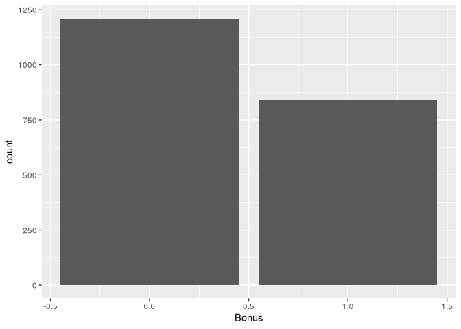
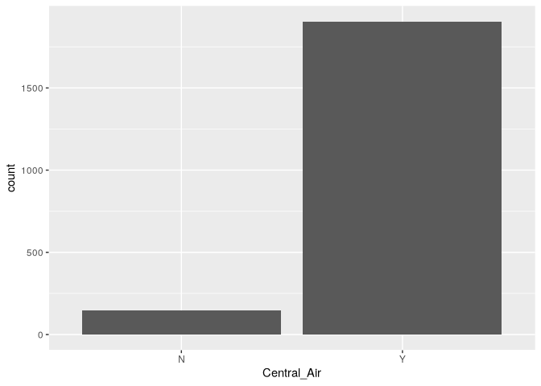
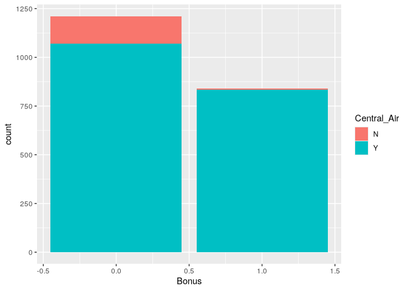

# Categorical Association Analysis


[Source](https://www.ariclabarr.com/logistic-regression/part_1_cat.html)

``` r
library(AmesHousing)
library(tidyverse)
library(gmodels)
library(vcd)
library(vcdExtra)
library(DescTools)
```

# Exploratory Data Analysis

For this analysis we are going to the popular Ames housing dataset. This
dataset contains information on home values for a sample of nearly 3,000
houses in Ames, Iowa in the early 2000s.

``` r
(ames <- make_ordinal_ames())
```

    # A tibble: 2,930 × 81
       MS_SubClass            MS_Zoning Lot_Frontage Lot_Area Street Alley Lot_Shape
       <fct>                  <fct>            <dbl>    <int> <fct>  <fct> <ord>    
     1 One_Story_1946_and_Ne… Resident…          141    31770 Pave   No_A… Slightly…
     2 One_Story_1946_and_Ne… Resident…           80    11622 Pave   No_A… Regular  
     3 One_Story_1946_and_Ne… Resident…           81    14267 Pave   No_A… Slightly…
     4 One_Story_1946_and_Ne… Resident…           93    11160 Pave   No_A… Regular  
     5 Two_Story_1946_and_Ne… Resident…           74    13830 Pave   No_A… Slightly…
     6 Two_Story_1946_and_Ne… Resident…           78     9978 Pave   No_A… Slightly…
     7 One_Story_PUD_1946_an… Resident…           41     4920 Pave   No_A… Regular  
     8 One_Story_PUD_1946_an… Resident…           43     5005 Pave   No_A… Slightly…
     9 One_Story_PUD_1946_an… Resident…           39     5389 Pave   No_A… Slightly…
    10 Two_Story_1946_and_Ne… Resident…           60     7500 Pave   No_A… Regular  
    # ℹ 2,920 more rows
    # ℹ 74 more variables: Land_Contour <ord>, Utilities <ord>, Lot_Config <fct>,
    #   Land_Slope <ord>, Neighborhood <fct>, Condition_1 <fct>, Condition_2 <fct>,
    #   Bldg_Type <fct>, House_Style <fct>, Overall_Qual <ord>, Overall_Cond <ord>,
    #   Year_Built <int>, Year_Remod_Add <int>, Roof_Style <fct>, Roof_Matl <fct>,
    #   Exterior_1st <fct>, Exterior_2nd <fct>, Mas_Vnr_Type <fct>,
    #   Mas_Vnr_Area <dbl>, Exter_Qual <ord>, Exter_Cond <ord>, Foundation <fct>, …

Imagine you worked for a real estate agency and got a bonus check if you
sold a house above \$175,000 in value. Let’s create this variable in our
data:

``` r
ames <- ames %>% 
  mutate(Bonus = if_else(Sale_Price > 175000, 1, 0))
```

Split training data.

``` r
set.seed(123)
ames <- ames %>% 
  mutate(id = row_number())

train <- ames %>% 
  sample_frac(0.7)

test <- anti_join(
  ames, train, by = "id"
)
```

What are the variables associated with obtain a higher chance of
receiving a bonus? To understand the distribution of categorical
variables, we need to look at frequency tables.

``` r
table(train$Bonus)
```


       0    1 
    1211  840 

``` r
ggplot(train, aes(x = Bonus)) +
  geom_bar()
```



``` r
table(train$Central_Air)
```


       N    Y 
     147 1904 

``` r
ggplot(data = train) +
  geom_bar(mapping = aes(x = Central_Air))
```



Let’s again examine bonus eligibility, but this time across levels of
central air. Again, we can use the table function. The prop.table
function allows us to compare two variables in terms of proportions
instead of frequencies.

``` r
table(train$Central_Air, train$Bonus)
```

       
           0    1
      N  142    5
      Y 1069  835

``` r
prop.table(table(train$Central_Air, train$Bonus))
```

       
                  0           1
      N 0.069234520 0.002437835
      Y 0.521209166 0.407118479

``` r
ggplot(data = train) +
  geom_bar(mapping = aes(x = Bonus, fill = Central_Air))
```



From the above output we can see that 147 homes have no central air with
only 5 of them being bonus eligible. However, there are 1904 homes that
have central air with 835 of them being bonus eligible. For an even more
detailed breakdown we can use the CrossTable function.

``` r
gmodels::CrossTable(
  train$Central_Air, train$Bonus,
  prop.chisq = F, expected = T
)
```


     
       Cell Contents
    |-------------------------|
    |                       N |
    |              Expected N |
    |           N / Row Total |
    |           N / Col Total |
    |         N / Table Total |
    |-------------------------|

     
    Total Observations in Table:  2051 

     
                      | train$Bonus 
    train$Central_Air |         0 |         1 | Row Total | 
    ------------------|-----------|-----------|-----------|
                    N |       142 |         5 |       147 | 
                      |    86.795 |    60.205 |           | 
                      |     0.966 |     0.034 |     0.072 | 
                      |     0.117 |     0.006 |           | 
                      |     0.069 |     0.002 |           | 
    ------------------|-----------|-----------|-----------|
                    Y |      1069 |       835 |      1904 | 
                      |  1124.205 |   779.795 |           | 
                      |     0.561 |     0.439 |     0.928 | 
                      |     0.883 |     0.994 |           | 
                      |     0.521 |     0.407 |           | 
    ------------------|-----------|-----------|-----------|
         Column Total |      1211 |       840 |      2051 | 
                      |     0.590 |     0.410 |           | 
    ------------------|-----------|-----------|-----------|

     
    Statistics for All Table Factors


    Pearson's Chi-squared test 
    ------------------------------------------------------------
    Chi^2 =  92.35121     d.f. =  1     p =  7.258146e-22 

    Pearson's Chi-squared test with Yates' continuity correction 
    ------------------------------------------------------------
    Chi^2 =  90.68591     d.f. =  1     p =  1.683884e-21 

     

# Tests of Association

The null hypothesis is no association. The alternative is an association
between the two variables. The tests follow a $\chi^2$-distribution.

- bounded below by 0
- right skewed
- one set of degrees of freedom


**Pearson $\chi^2$**

$$
\chi^2_P = \sum_{i=1}^R \sum_{j=1}^C \frac{(Obs_{i,j} - Exp_{i,j})^2}{Exp_{i,j}}
$$

**Likelihood Ratio test**

$$
\chi^2_L = 2 \times \sum_{i=1}^R \sum_{j=1}^C Obs_{i,j} \times \log(\frac{Obs_{i,j}}{Exp_{i,j}})
$$

The p-value comes from a $\chi^2$-distribution with degrees of freedom
that equal the product of the number of rows minus one and the number of
columns minus one. Both of the above tests have a sample size
requirement. The sample size requirement is 80% or more of the cells in
the cross-tabulation table need expected counts larger than 5. For
smaller samples, use Fisher’s exact test.

The tests compare the observed count of observations in each cell to
their expected count *if* there was no relationship. The greater the
difference, the more evidence of a relationship between the variables.

For ordinal variables, can determine a *linear* association with

**Mantel-Haenszel $\chi^2$ test**

$$
\chi^2_{MH} = (n-1)r^2
$$

where $r^2$ is the Pearson correlation between the column and row
variables. This test follows a $\chi^2$-distribution with only one
degree of freedom.

For smaller samples, use

**Fisher’s exact test**

$$
\chi^2 = \frac{\sum(O_i-E_i)^2}{E_i}\\
O_i: \text{Observed value} \\
E_i: \text{Expected value}
$$

$$
E_i = \frac{row total \times column total}{Sample\ size} 
$$

Assumptions:

- random samples
- mutually exclusive categories
- independent observations
- expected frequency count for each category is at least 5

``` r
assocstats(table(train$Central_Air, train$Bonus))
```

                         X^2 df P(> X^2)
    Likelihood Ratio 121.499  1        0
    Pearson           92.351  1        0

    Phi-Coefficient   : 0.212 
    Contingency Coeff.: 0.208 
    Cramer's V        : 0.212 

The p-value comes from a -distribution with degrees of freedom that
equal the product of the number of rows minus one and the number of
columns minus one.

Since binary variables are ordinal, can use Mantel-Haenszel.

``` r
CMHtest(table(train$Central_Air, train$Bonus))$table[1,]
```

           Chisq           Df         Prob 
    9.230619e+01 1.000000e+00 7.425180e-22 

While unnecessary here, the Fisher test:

``` r
fisher.test(table(train$Central_Air, train$Bonus))
```


        Fisher's Exact Test for Count Data

    data:  table(train$Central_Air, train$Bonus)
    p-value < 2.2e-16
    alternative hypothesis: true odds ratio is not equal to 1
    95 percent confidence interval:
      9.213525 69.646380
    sample estimates:
    odds ratio 
      22.16545 

# Measures of Association

- **Odds ratio**: For 2 binary variables
- **Cramer’s V**: Nominal variables with any number of categories
- **Searman’s Correlation**: Ordinal variables with any number of
  categories

**Odds ratio**

Let’s look at the row without central air. The probability that a home
without central air is not bonus eligible is 96.6%. That implies that
the odds of not being bonus eligible in homes without central air is
28.41 (= 0.966/0.034). For homes with central air, the odds of not being
bonus eligible are 1.28 (= 0.561/0.439). The odds ratio between these
two would be approximately 22.2 (= 28.41/1.28). In other words, homes
without central air are 22.2 times as likely (in terms of odds) to not
be bonus eligible as compared to homes with central air.

**Cramer’s V**

$$
V = \sqrt{\frac{\chi^2_P/n}{\min(Rows-1, Columns-1)}}
$$

Bounded between 0 and 1 (-1 and 1 for binary variables). The further
from 0, the stronger the correlation.

**Spearman’s Correlation**

$$
r = \frac{Cov(X,Y)}{\sqrt{\text{Var}(X) \cdot \text{Var}(Y)}}
$$ The range is (-1,1), 1 being strong positive, 0 being no correlation.
In order to determine if the number is significant, must test.

``` r
OddsRatio(table(train$Central_Air, train$Bonus))
```

    [1] 22.18335

This is the odds ratio of the left column odds in the top row over the
left column odds in the bottom row. This means that homes without
central air are 22.2 times as likely (in terms of odds) to not be bonus
eligible as compared to homes with central air.

``` r
assocstats(table(train$Central_Air, train$Bonus))
```

                         X^2 df P(> X^2)
    Likelihood Ratio 121.499  1        0
    Pearson           92.351  1        0

    Phi-Coefficient   : 0.212 
    Contingency Coeff.: 0.208 
    Cramer's V        : 0.212 

``` r
assocstats(table(train$Lot_Shape, train$Bonus))
```

                        X^2 df P(> X^2)
    Likelihood Ratio 197.36  3        0
    Pearson          197.07  3        0

    Phi-Coefficient   : NA 
    Contingency Coeff.: 0.296 
    Cramer's V        : 0.31 

The Cramer’s V value is 0.212. There is no good or bad value for
Cramer’s V. There is only better or worse when comparing to another
variable. For example, when looking at the relationship between the lot
shape of the home and bonus eligibility, the Cramer’s V is 0.31. This
would mean that lot shape has a stronger association with bonus
eligibility than central air.

``` r
cor.test(
  x = as.numeric(ordered(train$Central_Air)),
  y = as.numeric(ordered(train$Bonus)),
  method = "spearman"
)
```

    Warning in cor.test.default(x = as.numeric(ordered(train$Central_Air)), :
    Cannot compute exact p-value with ties


        Spearman's rank correlation rho

    data:  as.numeric(ordered(train$Central_Air)) and as.numeric(ordered(train$Bonus))
    S = 1132826666, p-value < 2.2e-16
    alternative hypothesis: true rho is not equal to 0
    sample estimates:
          rho 
    0.2121966 

``` r
cor.test(x = as.numeric(ordered(train$Fireplaces)), 
         y = as.numeric(ordered(train$Bonus)), 
         method = "spearman")
```

    Warning in cor.test.default(x = as.numeric(ordered(train$Fireplaces)), y =
    as.numeric(ordered(train$Bonus)), : Cannot compute exact p-value with ties


        Spearman's rank correlation rho

    data:  as.numeric(ordered(train$Fireplaces)) and as.numeric(ordered(train$Bonus))
    S = 824354870, p-value < 2.2e-16
    alternative hypothesis: true rho is not equal to 0
    sample estimates:
          rho 
    0.4267176 

Again, as with Cramer’s V, Spearman’s correlation is a comparison
metric, not a good vs. bad metric. For example, when looking at the
relationship between the number of fireplaces of the home and bonus
eligibility, the Spearman’s correlation is 0.43. This would mean that
fireplace count has a stronger association with bonus eligibility than
central air.
