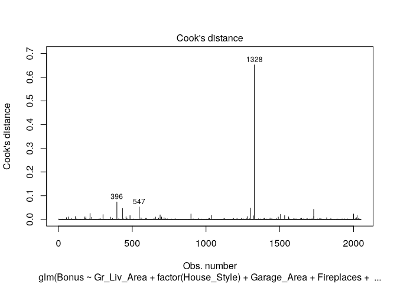
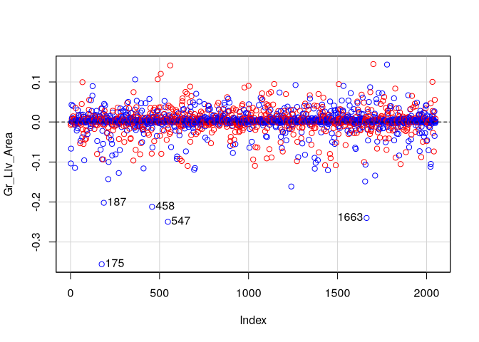
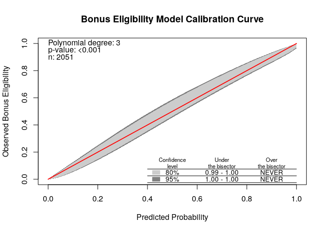

# LR Subset Selection and Diagnostics


[Source](https://www.ariclabarr.com/logistic-regression/part_4_subset.html)

``` r
library(AmesHousing)
library(tidyverse)
library(car)
library(givitiR)
```

``` r
ames <- make_ordinal_ames() %>% 
  mutate(Bonus = if_else(Sale_Price > 175000, 1, 0))

set.seed(123)
ames <- ames %>% 
  mutate(id = row_number())

train <- ames %>% 
  sample_frac(0.7)

test <- anti_join(
  ames, train, by = "id"
)
```

# Stepwise Regression

Three common methods: Forward, Backward, Stepwise. Selection criteria
inclue p-values or AIC/BIC.

p-values can be used, but the significance level should be adjusted by
sample size.

AIC is calculated

$$AIC = -2 \log(L) + 2p$$

where $L$ is the likelihood function and $p$ is the number of variables
being estimated in the model.

BIC is calculated

$$BIC = -2 \log(L) + p \times \log(n)$$

The significance level changes depending on sample size.

## Stepwise Selection

1.  Initial model is empty
2.  Each variable is tested for significance based on AIC/BIC or
    specified p-value
3.  The most significant is added
4.  All variables are tested, and insignificant ones are dropped
5.  Remain variables are retested, the most significant being added
6.  Repeat until no more significant variables

`step` uses AIC or BIC. Must specify empty and full models.

``` r
full_model <- glm(
  Bonus ~ Gr_Liv_Area + factor(House_Style) + Garage_Area +
    Fireplaces + factor(Full_Bath) + factor(Half_Bath) + Lot_Area +
    factor(Central_Air) + Second_Flr_SF + TotRms_AbvGrd + First_Flr_SF,
  data = train, family = binomial(link = "logit")
)
empty_model <- glm(
  Bonus ~ 1, data = train, family = binomial(link = "logit"))


step_model <- step(empty_model,
                   scope = list(lower = formula(empty_model),
                                upper = formula(full_model)),
                   direction = "both")
```

    Start:  AIC=2777.81
    Bonus ~ 1

                          Df Deviance    AIC
    + factor(Full_Bath)    4   1911.5 1921.5
    + Gr_Liv_Area          1   1926.4 1930.4
    + Garage_Area          1   2135.4 2139.4
    + First_Flr_SF         1   2294.1 2298.1
    + Fireplaces           1   2423.7 2427.7
    + TotRms_AbvGrd        1   2449.7 2453.7
    + factor(House_Style)  7   2542.1 2558.1
    + factor(Half_Bath)    2   2608.1 2614.1
    + Lot_Area             1   2621.9 2625.9
    + Second_Flr_SF        1   2631.8 2635.8
    + factor(Central_Air)  1   2654.3 2658.3
    <none>                     2775.8 2777.8

    Step:  AIC=1921.48
    Bonus ~ factor(Full_Bath)

                          Df Deviance    AIC
    + Garage_Area          1   1616.3 1628.3
    + Fireplaces           1   1659.5 1671.5
    + Gr_Liv_Area          1   1665.7 1677.7
    + First_Flr_SF         1   1711.7 1723.7
    + Lot_Area             1   1811.5 1823.5
    + factor(Half_Bath)    2   1812.2 1826.2
    + factor(Central_Air)  1   1827.6 1839.6
    + factor(House_Style)  7   1822.3 1846.3
    + TotRms_AbvGrd        1   1885.6 1897.6
    + Second_Flr_SF        1   1908.2 1920.2
    <none>                     1911.5 1921.5
    - factor(Full_Bath)    4   2775.8 2777.8

    Step:  AIC=1628.26
    Bonus ~ factor(Full_Bath) + Garage_Area

                          Df Deviance    AIC
    + Fireplaces           1   1440.9 1454.9
    + Gr_Liv_Area          1   1481.3 1495.3
    + First_Flr_SF         1   1540.6 1554.6
    + factor(Half_Bath)    2   1546.5 1562.5
    + factor(House_Style)  7   1571.5 1597.5
    + factor(Central_Air)  1   1585.6 1599.6
    + Lot_Area             1   1589.0 1603.0
    + TotRms_AbvGrd        1   1606.6 1620.6
    + Second_Flr_SF        1   1608.7 1622.7
    <none>                     1616.3 1628.3
    - Garage_Area          1   1911.5 1921.5
    - factor(Full_Bath)    4   2135.4 2139.4

    Step:  AIC=1454.86
    Bonus ~ factor(Full_Bath) + Garage_Area + Fireplaces

                          Df Deviance    AIC
    + Gr_Liv_Area          1   1381.5 1397.5
    + factor(Half_Bath)    2   1389.8 1407.8
    + factor(House_Style)  7   1386.2 1414.2
    + First_Flr_SF         1   1413.8 1429.8
    + factor(Central_Air)  1   1426.2 1442.2
    + Lot_Area             1   1435.1 1451.1
    + Second_Flr_SF        1   1436.5 1452.5
    <none>                     1440.9 1454.9
    + TotRms_AbvGrd        1   1440.3 1456.3
    - Fireplaces           1   1616.3 1628.3
    - Garage_Area          1   1659.5 1671.5
    - factor(Full_Bath)    4   1943.5 1949.5

    Step:  AIC=1397.55
    Bonus ~ factor(Full_Bath) + Garage_Area + Fireplaces + Gr_Liv_Area

                          Df Deviance    AIC
    + factor(House_Style)  7   1310.0 1340.0
    + TotRms_AbvGrd        1   1335.1 1353.1
    + factor(Central_Air)  1   1354.3 1372.3
    + factor(Half_Bath)    2   1356.4 1376.4
    + First_Flr_SF         1   1368.2 1386.2
    + Second_Flr_SF        1   1370.7 1388.7
    <none>                     1381.5 1397.5
    + Lot_Area             1   1381.2 1399.2
    - Gr_Liv_Area          1   1440.9 1454.9
    - Fireplaces           1   1481.3 1495.3
    - Garage_Area          1   1546.1 1560.1
    - factor(Full_Bath)    4   1626.6 1634.6

    Step:  AIC=1339.99
    Bonus ~ factor(Full_Bath) + Garage_Area + Fireplaces + Gr_Liv_Area + 
        factor(House_Style)

                          Df Deviance    AIC
    + factor(Half_Bath)    2   1261.2 1295.2
    + TotRms_AbvGrd        1   1268.8 1300.8
    + factor(Central_Air)  1   1288.2 1320.2
    <none>                     1310.0 1340.0
    + Lot_Area             1   1309.7 1341.7
    + Second_Flr_SF        1   1309.9 1341.9
    + First_Flr_SF         1   1309.9 1341.9
    - factor(House_Style)  7   1381.5 1397.5
    - Gr_Liv_Area          1   1386.2 1414.2
    - Fireplaces           1   1394.8 1422.8
    - Garage_Area          1   1403.9 1431.9
    - factor(Full_Bath)    4   1511.2 1533.2

    Step:  AIC=1295.15
    Bonus ~ factor(Full_Bath) + Garage_Area + Fireplaces + Gr_Liv_Area + 
        factor(House_Style) + factor(Half_Bath)

                          Df Deviance    AIC
    + TotRms_AbvGrd        1   1228.3 1264.3
    + factor(Central_Air)  1   1248.4 1284.4
    + First_Flr_SF         1   1259.0 1295.0
    <none>                     1261.2 1295.2
    + Second_Flr_SF        1   1260.3 1296.3
    + Lot_Area             1   1260.7 1296.7
    - factor(Half_Bath)    2   1310.0 1340.0
    - Gr_Liv_Area          1   1331.8 1363.8
    - Fireplaces           1   1335.7 1367.7
    - Garage_Area          1   1336.7 1368.7
    - factor(House_Style)  7   1356.4 1376.4
    - factor(Full_Bath)    4   1490.6 1516.6

    Step:  AIC=1264.3
    Bonus ~ factor(Full_Bath) + Garage_Area + Fireplaces + Gr_Liv_Area + 
        factor(House_Style) + factor(Half_Bath) + TotRms_AbvGrd

                          Df Deviance    AIC
    + factor(Central_Air)  1   1218.9 1256.9
    <none>                     1228.3 1264.3
    + First_Flr_SF         1   1226.7 1264.7
    + Lot_Area             1   1227.3 1265.3
    + Second_Flr_SF        1   1227.7 1265.7
    - TotRms_AbvGrd        1   1261.2 1295.2
    - factor(Half_Bath)    2   1268.8 1300.8
    - Fireplaces           1   1291.2 1325.2
    - Garage_Area          1   1294.7 1328.7
    - factor(House_Style)  7   1315.8 1337.8
    - Gr_Liv_Area          1   1330.3 1364.3
    - factor(Full_Bath)    4   1453.8 1481.8

    Step:  AIC=1256.88
    Bonus ~ factor(Full_Bath) + Garage_Area + Fireplaces + Gr_Liv_Area + 
        factor(House_Style) + factor(Half_Bath) + TotRms_AbvGrd + 
        factor(Central_Air)

                          Df Deviance    AIC
    <none>                     1218.9 1256.9
    + First_Flr_SF         1   1217.7 1257.7
    + Lot_Area             1   1218.0 1258.0
    + Second_Flr_SF        1   1218.5 1258.5
    - factor(Central_Air)  1   1228.3 1264.3
    - TotRms_AbvGrd        1   1248.4 1284.4
    - factor(Half_Bath)    2   1253.1 1287.1
    - Fireplaces           1   1272.7 1308.7
    - Garage_Area          1   1272.9 1308.9
    - factor(House_Style)  7   1300.0 1324.0
    - Gr_Liv_Area          1   1324.1 1360.1
    - factor(Full_Bath)    4   1428.7 1458.7

``` r
summary(step_model)
```


    Call:
    glm(formula = Bonus ~ factor(Full_Bath) + Garage_Area + Fireplaces + 
        Gr_Liv_Area + factor(House_Style) + factor(Half_Bath) + TotRms_AbvGrd + 
        factor(Central_Air), family = binomial(link = "logit"), data = train)

    Coefficients:
                                          Estimate Std. Error z value Pr(>|z|)    
    (Intercept)                         -1.041e+01  1.537e+00  -6.775 1.24e-11 ***
    factor(Full_Bath)1                  -6.860e-01  1.325e+00  -0.518  0.60469    
    factor(Full_Bath)2                   1.894e+00  1.341e+00   1.412  0.15785    
    factor(Full_Bath)3                   4.152e+00  1.610e+00   2.579  0.00991 ** 
    factor(Full_Bath)4                  -1.261e+00  2.493e+00  -0.506  0.61305    
    Garage_Area                          3.583e-03  5.187e-04   6.907 4.96e-12 ***
    Fireplaces                           9.142e-01  1.272e-01   7.186 6.67e-13 ***
    Gr_Liv_Area                          3.827e-03  4.033e-04   9.488  < 2e-16 ***
    factor(House_Style)One_and_Half_Unf -8.941e+00  3.682e+02  -0.024  0.98063    
    factor(House_Style)One_Story         2.396e+00  3.285e-01   7.295 2.99e-13 ***
    factor(House_Style)SFoyer            1.760e+00  6.382e-01   2.757  0.00583 ** 
    factor(House_Style)SLvl              1.105e+00  4.530e-01   2.438  0.01476 *  
    factor(House_Style)Two_and_Half_Fin -4.855e-01  6.945e+00  -0.070  0.94427    
    factor(House_Style)Two_and_Half_Unf  8.329e-01  8.891e-01   0.937  0.34890    
    factor(House_Style)Two_Story         9.801e-01  3.380e-01   2.900  0.00373 ** 
    factor(Half_Bath)1                   1.195e+00  2.153e-01   5.553 2.81e-08 ***
    factor(Half_Bath)2                  -1.301e-01  8.053e-01  -0.162  0.87163    
    TotRms_AbvGrd                       -4.322e-01  8.128e-02  -5.317 1.05e-07 ***
    factor(Central_Air)Y                 1.620e+00  5.866e-01   2.762  0.00575 ** 
    ---
    Signif. codes:  0 '***' 0.001 '**' 0.01 '*' 0.05 '.' 0.1 ' ' 1

    (Dispersion parameter for binomial family taken to be 1)

        Null deviance: 2775.8  on 2050  degrees of freedom
    Residual deviance: 1218.9  on 2032  degrees of freedom
    AIC: 1256.9

    Number of Fisher Scoring iterations: 14

## Backward Selection

Starts with a full model and iteratively drops the least significant
variable until no more insignificant variables are available.

``` r
full_model <- glm(
  Bonus ~ Gr_Liv_Area + factor(House_Style) + Garage_Area +
    Fireplaces + factor(Full_Bath) + factor(Half_Bath) + Lot_Area +
    factor(Central_Air) + Second_Flr_SF + TotRms_AbvGrd + First_Flr_SF,
  data = train, family = binomial(link = "logit")
)

back_model <- step(full_model, direction = "backward")
```

    Start:  AIC=1257.6
    Bonus ~ Gr_Liv_Area + factor(House_Style) + Garage_Area + Fireplaces + 
        factor(Full_Bath) + factor(Half_Bath) + Lot_Area + factor(Central_Air) + 
        Second_Flr_SF + TotRms_AbvGrd + First_Flr_SF

                          Df Deviance    AIC
    - Lot_Area             1   1214.2 1256.2
    - Gr_Liv_Area          1   1214.3 1256.3
    <none>                     1213.6 1257.6
    - Second_Flr_SF        1   1217.1 1259.1
    - First_Flr_SF         1   1217.8 1259.8
    - factor(Central_Air)  1   1222.3 1264.3
    - factor(House_Style)  7   1241.0 1271.0
    - TotRms_AbvGrd        1   1243.0 1285.0
    - factor(Half_Bath)    2   1248.1 1288.1
    - Garage_Area          1   1262.0 1304.0
    - Fireplaces           1   1262.7 1304.7
    - factor(Full_Bath)    4   1425.9 1461.9

    Step:  AIC=1256.18
    Bonus ~ Gr_Liv_Area + factor(House_Style) + Garage_Area + Fireplaces + 
        factor(Full_Bath) + factor(Half_Bath) + factor(Central_Air) + 
        Second_Flr_SF + TotRms_AbvGrd + First_Flr_SF

                          Df Deviance    AIC
    - Gr_Liv_Area          1   1214.9 1254.9
    <none>                     1214.2 1256.2
    - Second_Flr_SF        1   1217.7 1257.7
    - First_Flr_SF         1   1218.5 1258.5
    - factor(Central_Air)  1   1223.0 1263.0
    - factor(House_Style)  7   1241.1 1269.1
    - TotRms_AbvGrd        1   1243.2 1283.2
    - factor(Half_Bath)    2   1248.7 1286.7
    - Garage_Area          1   1264.2 1304.2
    - Fireplaces           1   1265.2 1305.2
    - factor(Full_Bath)    4   1425.9 1459.9

    Step:  AIC=1254.91
    Bonus ~ factor(House_Style) + Garage_Area + Fireplaces + factor(Full_Bath) + 
        factor(Half_Bath) + factor(Central_Air) + Second_Flr_SF + 
        TotRms_AbvGrd + First_Flr_SF

                          Df Deviance    AIC
    <none>                     1214.9 1254.9
    - factor(Central_Air)  1   1223.8 1261.8
    - factor(House_Style)  7   1243.0 1269.0
    - TotRms_AbvGrd        1   1244.7 1282.7
    - Second_Flr_SF        1   1245.5 1283.5
    - factor(Half_Bath)    2   1249.4 1285.4
    - Garage_Area          1   1265.8 1303.8
    - Fireplaces           1   1266.0 1304.0
    - First_Flr_SF         1   1313.4 1351.4
    - factor(Full_Bath)    4   1426.0 1458.0

``` r
summary(back_model)
```


    Call:
    glm(formula = Bonus ~ factor(House_Style) + Garage_Area + Fireplaces + 
        factor(Full_Bath) + factor(Half_Bath) + factor(Central_Air) + 
        Second_Flr_SF + TotRms_AbvGrd + First_Flr_SF, family = binomial(link = "logit"), 
        data = train)

    Coefficients:
                                          Estimate Std. Error z value Pr(>|z|)    
    (Intercept)                         -1.028e+01  1.541e+00  -6.673 2.51e-11 ***
    factor(House_Style)One_and_Half_Unf -9.208e+00  3.686e+02  -0.025  0.98007    
    factor(House_Style)One_Story         2.062e+00  4.945e-01   4.171 3.04e-05 ***
    factor(House_Style)SFoyer            1.464e+00  7.213e-01   2.030  0.04234 *  
    factor(House_Style)SLvl              9.390e-01  4.891e-01   1.920  0.05489 .  
    factor(House_Style)Two_and_Half_Fin  1.085e+00  6.908e+00   0.157  0.87524    
    factor(House_Style)Two_and_Half_Unf  8.376e-01  8.904e-01   0.941  0.34687    
    factor(House_Style)Two_Story         1.010e+00  3.498e-01   2.886  0.00390 ** 
    Garage_Area                          3.499e-03  5.210e-04   6.716 1.87e-11 ***
    Fireplaces                           8.965e-01  1.279e-01   7.010 2.39e-12 ***
    factor(Full_Bath)1                  -6.540e-01  1.330e+00  -0.492  0.62302    
    factor(Full_Bath)2                   1.930e+00  1.347e+00   1.433  0.15196    
    factor(Full_Bath)3                   4.355e+00  1.618e+00   2.691  0.00712 ** 
    factor(Full_Bath)4                  -1.073e+00  2.436e+00  -0.440  0.65971    
    factor(Half_Bath)1                   1.228e+00  2.215e-01   5.545 2.94e-08 ***
    factor(Half_Bath)2                  -6.069e-02  8.103e-01  -0.075  0.94030    
    factor(Central_Air)Y                 1.590e+00  5.909e-01   2.690  0.00715 ** 
    Second_Flr_SF                        3.466e-03  6.632e-04   5.226 1.73e-07 ***
    TotRms_AbvGrd                       -4.339e-01  8.142e-02  -5.329 9.86e-08 ***
    First_Flr_SF                         4.011e-03  4.351e-04   9.220  < 2e-16 ***
    ---
    Signif. codes:  0 '***' 0.001 '**' 0.01 '*' 0.05 '.' 0.1 ' ' 1

    (Dispersion parameter for binomial family taken to be 1)

        Null deviance: 2775.8  on 2050  degrees of freedom
    Residual deviance: 1214.9  on 2031  degrees of freedom
    AIC: 1254.9

    Number of Fisher Scoring iterations: 14

## Forward with interactions

Least used. Like stepwise but without the removal check at each step.
The main use is to test higher order terms and interactions.

To test two-way interactions, create a model with and without
interactions.

``` r
main_model <- glm(
  Bonus ~ Gr_Liv_Area + factor(House_Style) + Garage_Area +
    factor(Fireplaces) + factor(Full_Bath) + factor(Half_Bath) + 
    Lot_Area + factor(Central_Air) + Second_Flr_SF + 
    TotRms_AbvGrd + First_Flr_SF,
  data = train, family = binomial(link = "logit")
)

int_model <- glm(
  Bonus ~ Gr_Liv_Area + factor(House_Style) + Garage_Area +
    Fireplaces + factor(Full_Bath) + factor(Half_Bath) + 
    Lot_Area + factor(Central_Air) + Second_Flr_SF + 
    TotRms_AbvGrd + First_Flr_SF +
    Gr_Liv_Area * factor(House_Style) + 
    TotRms_AbvGrd * factor(House_Style) +
    Gr_Liv_Area * factor(Fireplaces),
  data = train, family = binomial(link = "logit")
)
```

    Warning: glm.fit: fitted probabilities numerically 0 or 1 occurred

``` r
for_model <- step(
  main_model,
  scope = list(lower = formula(main_model),
               upper = formula(int_model)),
  direction = "forward"
)
```

    Start:  AIC=1259.21
    Bonus ~ Gr_Liv_Area + factor(House_Style) + Garage_Area + factor(Fireplaces) + 
        factor(Full_Bath) + factor(Half_Bath) + Lot_Area + factor(Central_Air) + 
        Second_Flr_SF + TotRms_AbvGrd + First_Flr_SF

    Warning: glm.fit: fitted probabilities numerically 0 or 1 occurred

                                        Df Deviance    AIC
    + Gr_Liv_Area:factor(Fireplaces)     3   1159.0 1215.0
    + factor(House_Style):TotRms_AbvGrd  7   1180.8 1244.8
    <none>                                   1209.2 1259.2
    + Gr_Liv_Area:factor(House_Style)    7   1202.5 1266.5

    Step:  AIC=1215.05
    Bonus ~ Gr_Liv_Area + factor(House_Style) + Garage_Area + factor(Fireplaces) + 
        factor(Full_Bath) + factor(Half_Bath) + Lot_Area + factor(Central_Air) + 
        Second_Flr_SF + TotRms_AbvGrd + First_Flr_SF + Gr_Liv_Area:factor(Fireplaces)

                                        Df Deviance    AIC
    + factor(House_Style):TotRms_AbvGrd  7   1125.4 1195.4
    <none>                                   1159.0 1215.0
    + Gr_Liv_Area:factor(House_Style)    7   1154.9 1224.9

    Step:  AIC=1195.42
    Bonus ~ Gr_Liv_Area + factor(House_Style) + Garage_Area + factor(Fireplaces) + 
        factor(Full_Bath) + factor(Half_Bath) + Lot_Area + factor(Central_Air) + 
        Second_Flr_SF + TotRms_AbvGrd + First_Flr_SF + Gr_Liv_Area:factor(Fireplaces) + 
        factor(House_Style):TotRms_AbvGrd

    Warning: glm.fit: fitted probabilities numerically 0 or 1 occurred

                                      Df Deviance    AIC
    + Gr_Liv_Area:factor(House_Style)  7   1107.3 1191.3
    <none>                                 1125.4 1195.4

    Warning: glm.fit: fitted probabilities numerically 0 or 1 occurred


    Step:  AIC=1191.27
    Bonus ~ Gr_Liv_Area + factor(House_Style) + Garage_Area + factor(Fireplaces) + 
        factor(Full_Bath) + factor(Half_Bath) + Lot_Area + factor(Central_Air) + 
        Second_Flr_SF + TotRms_AbvGrd + First_Flr_SF + Gr_Liv_Area:factor(Fireplaces) + 
        factor(House_Style):TotRms_AbvGrd + Gr_Liv_Area:factor(House_Style)

    Warning: glm.fit: fitted probabilities numerically 0 or 1 occurred
    Warning: glm.fit: fitted probabilities numerically 0 or 1 occurred

           Df Deviance    AIC
    <none>      1107.3 1191.3

``` r
summary(for_model)
```


    Call:
    glm(formula = Bonus ~ Gr_Liv_Area + factor(House_Style) + Garage_Area + 
        factor(Fireplaces) + factor(Full_Bath) + factor(Half_Bath) + 
        Lot_Area + factor(Central_Air) + Second_Flr_SF + TotRms_AbvGrd + 
        First_Flr_SF + Gr_Liv_Area:factor(Fireplaces) + factor(House_Style):TotRms_AbvGrd + 
        Gr_Liv_Area:factor(House_Style), family = binomial(link = "logit"), 
        data = train)

    Coefficients: (1 not defined because of singularities)
                                                        Estimate Std. Error z value
    (Intercept)                                       -1.065e+01  2.681e+00  -3.974
    Gr_Liv_Area                                       -2.722e-03  4.630e-03  -0.588
    factor(House_Style)One_and_Half_Unf               -9.155e+00  8.116e+03  -0.001
    factor(House_Style)One_Story                       5.159e+00  2.206e+00   2.339
    factor(House_Style)SFoyer                          7.133e-01  4.242e+00   0.168
    factor(House_Style)SLvl                            7.311e+00  3.179e+00   2.300
    factor(House_Style)Two_and_Half_Fin               -4.598e+01  7.473e+03  -0.006
    factor(House_Style)Two_and_Half_Unf               -6.236e+00  9.834e+00  -0.634
    factor(House_Style)Two_Story                       1.964e+00  2.230e+00   0.881
    Garage_Area                                        3.792e-03  5.795e-04   6.544
    factor(Fireplaces)1                               -3.668e-01  8.616e-01  -0.426
    factor(Fireplaces)2                               -4.988e+00  2.253e+00  -2.214
    factor(Fireplaces)3                                1.112e+01  2.542e+00   4.373
    factor(Fireplaces)4                                1.533e+01  2.400e+03   0.006
    factor(Full_Bath)1                                -2.696e+00  1.507e+00  -1.788
    factor(Full_Bath)2                                 8.578e-02  1.518e+00   0.057
    factor(Full_Bath)3                                 2.610e+00  1.771e+00   1.474
    factor(Full_Bath)4                                -3.617e+00  4.630e+00  -0.781
    factor(Half_Bath)1                                 1.336e+00  2.463e-01   5.423
    factor(Half_Bath)2                                -1.039e+00  9.610e-01  -1.081
    Lot_Area                                           1.607e-05  1.781e-05   0.902
    factor(Central_Air)Y                               1.974e+00  6.645e-01   2.971
    Second_Flr_SF                                      8.073e-03  4.603e-03   1.754
    TotRms_AbvGrd                                     -7.848e-01  3.849e-01  -2.039
    First_Flr_SF                                       9.010e-03  4.597e-03   1.960
    Gr_Liv_Area:factor(Fireplaces)1                    8.676e-04  5.610e-04   1.546
    Gr_Liv_Area:factor(Fireplaces)2                    4.200e-03  1.421e-03   2.955
    Gr_Liv_Area:factor(Fireplaces)3                   -4.849e-03  1.058e-03  -4.582
    Gr_Liv_Area:factor(Fireplaces)4                           NA         NA      NA
    factor(House_Style)One_and_Half_Unf:TotRms_AbvGrd  1.290e+00  1.300e+03   0.001
    factor(House_Style)One_Story:TotRms_AbvGrd        -2.019e-01  4.063e-01  -0.497
    factor(House_Style)SFoyer:TotRms_AbvGrd            2.357e+00  8.592e-01   2.743
    factor(House_Style)SLvl:TotRms_AbvGrd             -5.524e-01  7.252e-01  -0.762
    factor(House_Style)Two_and_Half_Fin:TotRms_AbvGrd  2.603e+00  8.382e+02   0.003
    factor(House_Style)Two_and_Half_Unf:TotRms_AbvGrd  1.204e+00  1.008e+00   1.194
    factor(House_Style)Two_Story:TotRms_AbvGrd         8.543e-01  4.068e-01   2.100
    Gr_Liv_Area:factor(House_Style)One_and_Half_Unf   -5.634e-03  7.159e+00  -0.001
    Gr_Liv_Area:factor(House_Style)One_Story          -9.365e-04  1.937e-03  -0.483
    Gr_Liv_Area:factor(House_Style)SFoyer             -9.801e-03  3.068e-03  -3.194
    Gr_Liv_Area:factor(House_Style)SLvl               -1.487e-03  2.512e-03  -0.592
    Gr_Liv_Area:factor(House_Style)Two_and_Half_Fin    6.811e-03  1.973e+00   0.003
    Gr_Liv_Area:factor(House_Style)Two_and_Half_Unf   -1.516e-03  5.340e-03  -0.284
    Gr_Liv_Area:factor(House_Style)Two_Story          -3.911e-03  1.862e-03  -2.100
                                                      Pr(>|z|)    
    (Intercept)                                       7.07e-05 ***
    Gr_Liv_Area                                        0.55662    
    factor(House_Style)One_and_Half_Unf                0.99910    
    factor(House_Style)One_Story                       0.01934 *  
    factor(House_Style)SFoyer                          0.86645    
    factor(House_Style)SLvl                            0.02146 *  
    factor(House_Style)Two_and_Half_Fin                0.99509    
    factor(House_Style)Two_and_Half_Unf                0.52598    
    factor(House_Style)Two_Story                       0.37850    
    Garage_Area                                       5.98e-11 ***
    factor(Fireplaces)1                                0.67034    
    factor(Fireplaces)2                                0.02685 *  
    factor(Fireplaces)3                               1.22e-05 ***
    factor(Fireplaces)4                                0.99490    
    factor(Full_Bath)1                                 0.07370 .  
    factor(Full_Bath)2                                 0.95492    
    factor(Full_Bath)3                                 0.14052    
    factor(Full_Bath)4                                 0.43468    
    factor(Half_Bath)1                                5.86e-08 ***
    factor(Half_Bath)2                                 0.27962    
    Lot_Area                                           0.36696    
    factor(Central_Air)Y                               0.00297 ** 
    Second_Flr_SF                                      0.07948 .  
    TotRms_AbvGrd                                      0.04145 *  
    First_Flr_SF                                       0.05001 .  
    Gr_Liv_Area:factor(Fireplaces)1                    0.12202    
    Gr_Liv_Area:factor(Fireplaces)2                    0.00313 ** 
    Gr_Liv_Area:factor(Fireplaces)3                   4.61e-06 ***
    Gr_Liv_Area:factor(Fireplaces)4                         NA    
    factor(House_Style)One_and_Half_Unf:TotRms_AbvGrd  0.99921    
    factor(House_Style)One_Story:TotRms_AbvGrd         0.61913    
    factor(House_Style)SFoyer:TotRms_AbvGrd            0.00608 ** 
    factor(House_Style)SLvl:TotRms_AbvGrd              0.44621    
    factor(House_Style)Two_and_Half_Fin:TotRms_AbvGrd  0.99752    
    factor(House_Style)Two_and_Half_Unf:TotRms_AbvGrd  0.23258    
    factor(House_Style)Two_Story:TotRms_AbvGrd         0.03573 *  
    Gr_Liv_Area:factor(House_Style)One_and_Half_Unf    0.99937    
    Gr_Liv_Area:factor(House_Style)One_Story           0.62877    
    Gr_Liv_Area:factor(House_Style)SFoyer              0.00140 ** 
    Gr_Liv_Area:factor(House_Style)SLvl                0.55389    
    Gr_Liv_Area:factor(House_Style)Two_and_Half_Fin    0.99724    
    Gr_Liv_Area:factor(House_Style)Two_and_Half_Unf    0.77654    
    Gr_Liv_Area:factor(House_Style)Two_Story           0.03575 *  
    ---
    Signif. codes:  0 '***' 0.001 '**' 0.01 '*' 0.05 '.' 0.1 ' ' 1

    (Dispersion parameter for binomial family taken to be 1)

        Null deviance: 2775.8  on 2050  degrees of freedom
    Residual deviance: 1107.3  on 2009  degrees of freedom
    AIC: 1191.3

    Number of Fisher Scoring iterations: 15

# Diagnostic Plots

Instead of residuals, can use **deviance residuals** and **Pearson
residuals**.

Deviance compares the model against a fully saturated (overfit) model.
Pearson residuals tell how much each observation changes the Pearson
Chi-squared test for the overall model.

Other measures include **DFBetas** and **Cook’s D**.

``` r
logit_model <- glm(
  Bonus ~ Gr_Liv_Area + factor(House_Style) + Garage_Area +
    Fireplaces + factor(Full_Bath) + Lot_Area + factor(Central_Air) +
    TotRms_AbvGrd + Gr_Liv_Area:Fireplaces,
  data = train, family = binomial(link = "logit")
)
summary(logit_model)
```


    Call:
    glm(formula = Bonus ~ Gr_Liv_Area + factor(House_Style) + Garage_Area + 
        Fireplaces + factor(Full_Bath) + Lot_Area + factor(Central_Air) + 
        TotRms_AbvGrd + Gr_Liv_Area:Fireplaces, family = binomial(link = "logit"), 
        data = train)

    Coefficients:
                                          Estimate Std. Error z value Pr(>|z|)    
    (Intercept)                         -1.118e+01  1.541e+00  -7.257 3.96e-13 ***
    Gr_Liv_Area                          4.348e-03  4.804e-04   9.051  < 2e-16 ***
    factor(House_Style)One_and_Half_Unf -9.494e+00  3.543e+02  -0.027 0.978620    
    factor(House_Style)One_Story         2.168e+00  3.242e-01   6.687 2.27e-11 ***
    factor(House_Style)SFoyer            1.320e+00  6.280e-01   2.102 0.035529 *  
    factor(House_Style)SLvl              1.248e+00  4.421e-01   2.823 0.004753 ** 
    factor(House_Style)Two_and_Half_Fin  1.999e-01  3.650e+00   0.055 0.956313    
    factor(House_Style)Two_and_Half_Unf  8.763e-01  8.879e-01   0.987 0.323696    
    factor(House_Style)Two_Story         1.656e+00  3.135e-01   5.284 1.27e-07 ***
    Garage_Area                          3.709e-03  5.076e-04   7.307 2.73e-13 ***
    Fireplaces                           1.817e+00  5.604e-01   3.242 0.001186 ** 
    factor(Full_Bath)1                  -4.051e-01  1.198e+00  -0.338 0.735165    
    factor(Full_Bath)2                   1.884e+00  1.198e+00   1.572 0.115958    
    factor(Full_Bath)3                   3.716e+00  1.510e+00   2.461 0.013854 *  
    factor(Full_Bath)4                  -2.103e+00  2.157e+00  -0.975 0.329563    
    Lot_Area                             9.787e-06  1.233e-05   0.794 0.427237    
    factor(Central_Air)Y                 2.087e+00  5.883e-01   3.547 0.000389 ***
    TotRms_AbvGrd                       -4.835e-01  8.142e-02  -5.939 2.88e-09 ***
    Gr_Liv_Area:Fireplaces              -5.791e-04  3.546e-04  -1.633 0.102470    
    ---
    Signif. codes:  0 '***' 0.001 '**' 0.01 '*' 0.05 '.' 0.1 ' ' 1

    (Dispersion parameter for binomial family taken to be 1)

        Null deviance: 2775.8  on 2050  degrees of freedom
    Residual deviance: 1250.0  on 2032  degrees of freedom
    AIC: 1288

    Number of Fisher Scoring iterations: 14

``` r
head(influence.measures(logit_model)$infmat)
```

            dfb.1_    dfb.Gr_L_A dfb.f(H_S)O__ dfb.f(H_S)O_S  dfb.f(H_S)SF
    1 -0.006680632 -0.0072246691  5.026970e-06   0.002671788 -0.0038064360
    2 -0.023071142 -0.1037195093  3.218790e-06   0.001777788 -0.0036062958
    3  0.041070300 -0.0666518890 -5.618110e-05  -0.043455201 -0.0126647628
    4 -0.003619157 -0.0045229884  4.163032e-06  -0.001883771 -0.0018893437
    5 -0.000551361  0.0004377925  1.408439e-06   0.001199072  0.0006253354
    6 -0.034257763  0.0431126015  2.029811e-05   0.022630715  0.0145381709
       dfb.f(H_S)SL dfb.f(H_S)T__H_F dfb.f(H_S)T__H_U dfb.f(H_S)T_S      dfb.Gr_A
    1 -0.0035911372     9.150748e-04     0.0002096029  -0.002443371  0.0267391996
    2 -0.0128525698    -3.377638e-03    -0.0078565055  -0.039414133  0.0158152975
    3 -0.0128002414    -6.632733e-04    -0.0006218637   0.001313573 -0.0169465086
    4 -0.0009298446    -1.285294e-04     0.0003646729   0.002090112  0.0182897403
    5  0.0008280739     9.525692e-05     0.0003348043   0.001098389  0.0003387675
    6  0.0107742453    -2.817776e-03    -0.0072876282  -0.020112955 -0.0238693611
           dfb.Frpl   dfb.f(F_B)1  dfb.f(F_B)2  dfb.f(F_B)3   dfb.f(F_B)4
    1  0.0069303163  1.354963e-03 3.559191e-03 0.0045678387  1.350209e-03
    2 -0.0054902484  7.121198e-03 4.333448e-03 0.0090488614  1.063928e-02
    3 -0.0280704158  3.696606e-03 2.393670e-04 0.0070170929  2.398969e-03
    4 -0.0014434218  6.992887e-04 8.272848e-04 0.0019502651 -1.236009e-03
    5  0.0004213386 -1.076991e-06 8.822963e-05 0.0001125045 -1.170066e-05
    6  0.0386676850  4.075327e-03 1.367289e-03 0.0011850399  1.774901e-03
           dfb.Lt_A      dfb.f(C_      dfb.TR_A   dfb.G_L_A:        dffit     cov.r
    1 -6.896558e-04 -7.322808e-04  1.031403e-02 -0.003533782  0.040004607 1.0092774
    2  3.005167e-02 -9.678781e-03  1.869810e-01  0.018362031 -0.232007770 0.9872442
    3 -8.319612e-02 -2.455195e-02  1.578453e-02  0.047761640 -0.175638448 0.9666979
    4 -2.522193e-03  2.814382e-04  6.476448e-03  0.002691227  0.021966934 1.0120976
    5  9.081321e-05 -3.547551e-05 -6.129572e-05 -0.000324238 -0.001609538 1.0096657
    6  1.083388e-02  5.567351e-03  2.724948e-02 -0.035826886 -0.117052324 1.0043255
            cook.d          hat
    1 2.765406e-05 0.0037996009
    2 1.650901e-03 0.0137632240
    3 1.233413e-03 0.0058384415
    4 7.966761e-06 0.0038368812
    5 4.200650e-08 0.0003381361
    6 2.814123e-04 0.0090119822

``` r
plot(logit_model, 4)
```



``` r
dfbetasPlots(logit_model, terms = "Gr_Liv_Area",
             id.n = 5, col = ifelse(logit_model$y == 1,
                                    "red", "blue"))
```



The DFBetas plots show the standardized impact of each observation on
the calculation of each of the parameters in the model. The main thing
to look for in these plots are points that are far away from the rest of
the observations.

These observations are not necessarily bad per se, but have a large
influence on the model. These points might need to be investigated
further to see if they are actually valid observations.

# Calibration Curves

Calibration measures how well predicted probabilities agree with actual
frequency counts of outcomes (estimated linearly across the data set).
These curves can help detect if predictions are consistently too high or
low in your model. A curve above the diagonal is predicting lower
probabilities than observed.

Best with larger sample sizes.

``` r
cali_curve <- givitiCalibrationBelt(
  o = train$Bonus,
  e = predict(logit_model, type = "response"),
  devel = "internal",
  maxDeg = 5
)

plot(cali_curve, main = "Bonus Eligibility Model Calibration Curve",
                 xlab = "Predicted Probability",
                 ylab = "Observed Bonus Eligibility")
```



    $m
    [1] 3

    $p.value
    [1] 0

Since the diagonal line is contained in the confidence interval for our
calibration curve, we do not notice any significant number of over or
under predictions.
