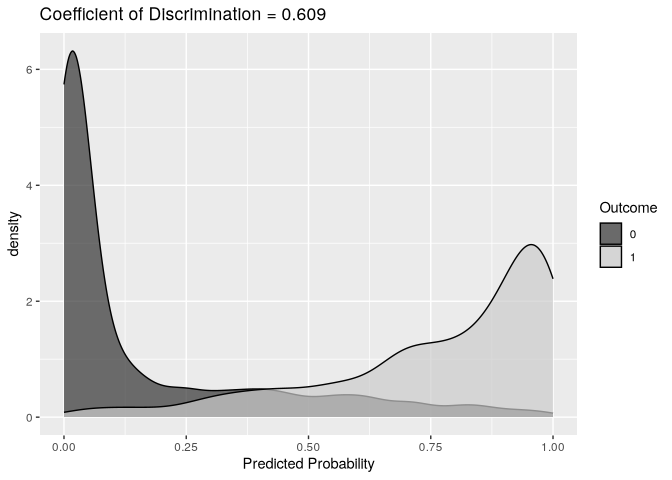
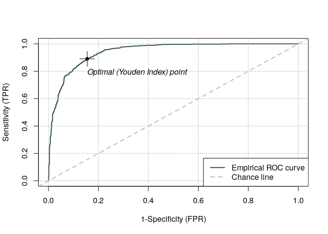
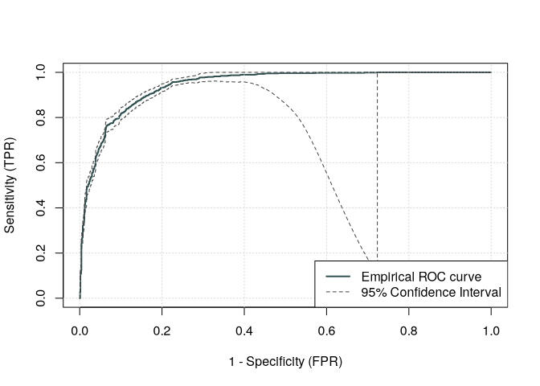
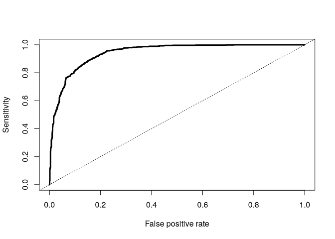
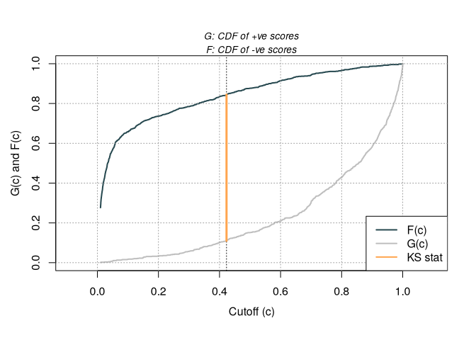
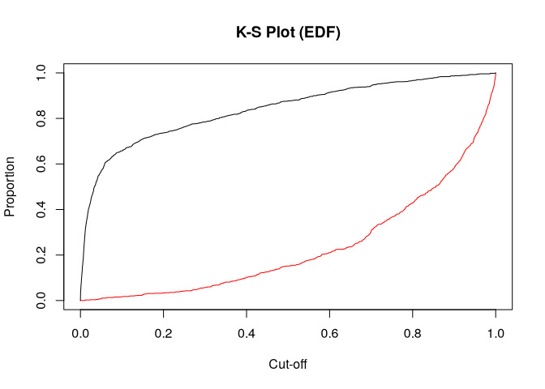
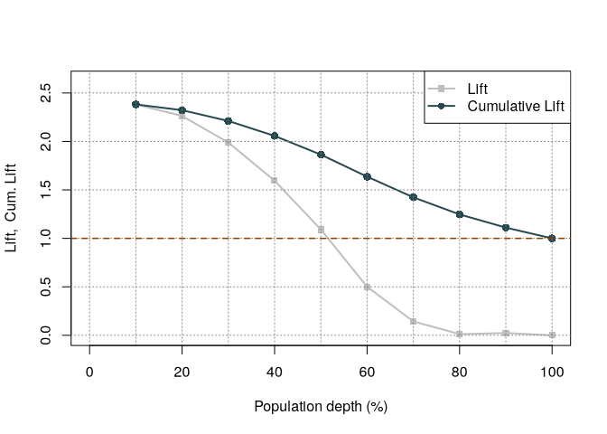
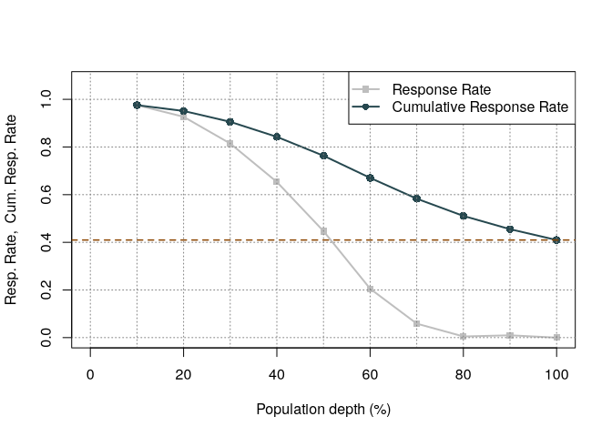
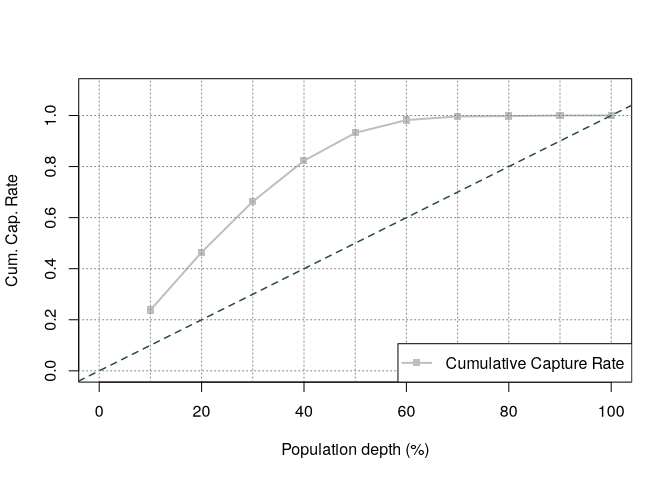
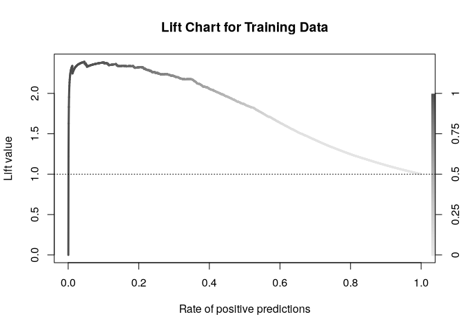

# Model Assessment


[Source](https://www.ariclabarr.com/logistic-regression/part_5_assess.html)

``` r
options(paged.print = FALSE)
```

``` r
library(AmesHousing)
library(tidyverse)
library(DescTools)
library(Hmisc)
library(ROCit)
library(ROCR)
```

``` r
ames <- make_ordinal_ames() %>% 
  mutate(Bonus = if_else(Sale_Price > 175000, 1, 0))

set.seed(123)
ames <- ames %>% 
  mutate(id = row_number())

train <- ames %>% 
  sample_frac(0.7)

test <- anti_join(
  ames, train, by = "id"
)
head(ames)
```

    # A tibble: 6 × 83
      MS_SubClass             MS_Zoning Lot_Frontage Lot_Area Street Alley Lot_Shape
      <fct>                   <fct>            <dbl>    <int> <fct>  <fct> <ord>    
    1 One_Story_1946_and_New… Resident…          141    31770 Pave   No_A… Slightly…
    2 One_Story_1946_and_New… Resident…           80    11622 Pave   No_A… Regular  
    3 One_Story_1946_and_New… Resident…           81    14267 Pave   No_A… Slightly…
    4 One_Story_1946_and_New… Resident…           93    11160 Pave   No_A… Regular  
    5 Two_Story_1946_and_New… Resident…           74    13830 Pave   No_A… Slightly…
    6 Two_Story_1946_and_New… Resident…           78     9978 Pave   No_A… Slightly…
    # ℹ 76 more variables: Land_Contour <ord>, Utilities <ord>, Lot_Config <fct>,
    #   Land_Slope <ord>, Neighborhood <fct>, Condition_1 <fct>, Condition_2 <fct>,
    #   Bldg_Type <fct>, House_Style <fct>, Overall_Qual <ord>, Overall_Cond <ord>,
    #   Year_Built <int>, Year_Remod_Add <int>, Roof_Style <fct>, Roof_Matl <fct>,
    #   Exterior_1st <fct>, Exterior_2nd <fct>, Mas_Vnr_Type <fct>,
    #   Mas_Vnr_Area <dbl>, Exter_Qual <ord>, Exter_Cond <ord>, Foundation <fct>,
    #   Bsmt_Qual <ord>, Bsmt_Cond <ord>, Bsmt_Exposure <ord>, …

# Comparing Models

Good is relative. Three common model metrics based on
deviance/likelihood are AIC, BIC and Generalized $R^2$. The AIC is a
crude, large sample approximation of leave-one-out cross validation. The
BIC on the other hand favors a smaller model than the AIC as it
penalizes model complexity more. Lower is better. For pseudo-$R^2$,
higher is better, but no interpretive value.

``` r
logit_model <- glm(
  Bonus ~ Gr_Liv_Area + factor(House_Style) + Garage_Area +
    Fireplaces + factor(Full_Bath) + Lot_Area + factor(Central_Air) +
    TotRms_AbvGrd + Gr_Liv_Area:Fireplaces,
  data = train, family = binomial(link = "logit")
)

AIC(logit_model)
```

    [1] 1287.964

``` r
BIC(logit_model)
```

    [1] 1394.86

``` r
PseudoR2(logit_model, which = "Nagelkerke")
```

    Nagelkerke 
     0.7075796 

R-squared is rescaled to be between 0 and 1.

# Probability Metrics

Logistic regression predicts the probability of an event, not the
occurrence of an event. It can be used for classification as well.
Models should do both, but the relative importance depends on the
problem.

## Coefficient of Discrimination

Difference in average predicted probabilies of actual events and
non-events. The larger the difference, the better the model separates
events from non-events.

$$D = \bar{\hat{p}}_1 - \bar{\hat{p}}_0$$

``` r
train$p_hat <- predict(logit_model, type = "response")

p1 <- train$p_hat[train$Bonus == 1]
p0 <- train$p_hat[train$Bonus == 0]

coef_discrim <- mean(p1) - mean(p0)

ggplot(train, aes(p_hat, fill = factor(Bonus))) +
  geom_density(alpha = 0.7) +
  scale_fill_grey() +
  labs(
    x = "Predicted Probability",
    fill = "Outcome",
    title = paste("Coefficient of Discrimination = ",
      round(coef_discrim, 3),
      sep = ""
    )
  )
```



## Rank-Order Statistics

Measures how well a model orders predicted probability. Every
combination of event and non-event are compared against each other. A
pair is either concordant (event has higher predicted probability than
non-event), discordant, or tied. Models with higher concordance are
better.

Three rank-statistics are the $c$-statistic, Somer’s D and Kendall’s
$\tau_\alpha$.

$$c = Concordance + 1/2\times Tied$$

$$D_{xy} = 2c - 1$$

$$\tau_\alpha = \frac{Condorant - discordant}{0.5*n*(n-1)}$$

``` r
somers2(train$p_hat, train$Bonus)
```

               C          Dxy            n      Missing 
       0.9428394    0.8856789 2051.0000000    0.0000000 

The model assigned the higher predicted probability to the observation
with the bonus eligible home 94.3% of the time (the C in the output).
These values are useful in comparing models. The c-statistic is the same
as the AUC.

# Classification Metrics

Many metrics try to balance different pieces of the confusion matrix.


## Sensitivity and Specificity

Sensitivity (recall) is true positive rate, specificity is true negative
rate.


Youden’s Index can be used to balance them providing an optimal cut-off
by maximizing $J=sensitivity+specificty-1$.

``` r
train <- train %>% 
  mutate(Bonus_hat = ifelse(p_hat > 0.5, 1, 0))

table(train$Bonus_hat, train$Bonus)
```

       
           0    1
      0 1062  127
      1  149  713

To looka at all cut-off values between 0 and 1, use `measureit`.

``` r
logit_meas <- measureit(
  train$p_hat, train$Bonus,
  measure = c("ACC", "SENS", "SPEC")
)
summary(logit_meas)
```

           Length Class  Mode   
    Cutoff 2031   -none- numeric
    Depth  2031   -none- numeric
    TP     2031   -none- numeric
    FP     2031   -none- numeric
    TN     2031   -none- numeric
    FN     2031   -none- numeric
    ACC    2031   -none- numeric
    SENS   2031   -none- numeric
    SPEC   2031   -none- numeric

``` r
youden_table <- data.frame(
  Cutoff = logit_meas$Cutoff,
  Sens = logit_meas$SENS,
  Spec = logit_meas$SPEC
)
head(youden_table)
```

         Cutoff        Sens      Spec
    1       Inf 0.000000000 1.0000000
    2 0.9999996 0.000000000 0.9991742
    3 0.9999963 0.001190476 0.9991742
    4 0.9999952 0.002380952 0.9991742
    5 0.9999786 0.003571429 0.9991742
    6 0.9999653 0.004761905 0.9991742

The calculation of the index is done with `rocit` below.

The ROC curve plots sensitivity vs specificity. AUC is the area under
this curve.

``` r
logit_roc <- rocit(train$p_hat, train$Bonus)
plot(logit_roc)$optimal
```



        value       FPR       TPR    cutoff 
    0.7352326 0.1552436 0.8904762 0.4229724 

``` r
summary(logit_roc)
```

                                
     Method used: empirical     
     Number of positive(s): 840 
     Number of negative(s): 1211
     Area under curve: 0.9428   

For confidence intervals:

``` r
ciAUC(logit_roc, level = 0.99)
```

                                                              
       estimated AUC : 0.942839447917895                      
       AUC estimation method : empirical                      
                                                              
       CI of AUC                                              
       confidence level = 99%                                 
       lower = 0.927916041014642     upper = 0.957762854821149

``` r
plot(ciROC(logit_roc))
```

    Warning in regularize.values(x, y, ties, missing(ties), na.rm = na.rm):
    collapsing to unique 'x' values



We can see that the highest Youden J statistic had a value of 0.7352.
This took place at a cut-off of 0.423. Therefore, according to the
Youden Index at least, the optimal cut-off for our model is 0.423. In
other words, if our model predicts a probability above 0.423 then we
should call this an event. Any predicted probability below 0.423 should
be called a non-event.

The `performance` function produces more plots.

``` r
pred <- prediction(train$p_hat, factor(train$Bonus))

perf <- performance(
  pred,
  measure = "sens", x.measure = "fpr"
)

plot(perf, lwd = 3, colorize = FALSE, colorkey = FALSE)
abline(a = 0, b = 1, lty = 3)
```



``` r
performance(pred, measure = "auc")@y.values
```

    [[1]]
    [1] 0.9428394

## K-S Statistic

Popular in finance and banking. Determines difference between the
cumulative distribution functions, here the predicted probability
distructions for the event and non-event group. KS $D$ is the maximimu
distance between the two curves. This is equavalent to maximizing the
Youden Index.

$$D = \max_{depth}{(TPR - FPR)} = \max_{depth}{(Sensitivity + Specificity - 1)}$$

``` r
ksplot(logit_roc)$`KS stat`
```



    [1] 0.7352326

``` r
ksplot(logit_roc)$`KS Cutoff`
```


    [1] 0.4229724

As we saw in the previous section, the optimal cut-off according to the
KS-statistic would be at 0.423. Therefore, according to the KS statistic
at least, the optimal cut-off for our model is 0.423. In other words, if
our model predicts a probability above 0.423 then we should call this an
event. Any predicted probability below 0.423 should be called a
non-event. The KS statistic is reported as 0.7352 which is equal to the
Youden’s Index value.

To calculate “by hand”

``` r
perf <- performance(pred, measure = "tpr", x.measure = "fpr")
KS <- max(perf@y.values[[1]] - perf@x.values[[1]])
cutoffAtKS <- unlist(perf@alpha.values)[
  which.max(perf@y.values[[1]] - perf@x.values[[1]])
  ]
print(c(KS, cutoffAtKS))
```

    [1] 0.7352326 0.4229724

``` r
perf_df <- data.frame(
  alpha = perf@alpha.values[[1]],
  x = perf@x.values[[1]],
  y = perf@y.values[[1]]
) %>% 
  mutate(diff = y - x)

perf_df %>% 
  filter(diff == max(diff))
```

          alpha         x         y      diff
    1 0.4229724 0.1552436 0.8904762 0.7352326

``` r
plot(x = perf_df$alpha, y = 1 - perf_df$y,
     type = "l", main = "K-S Plot (EDF)",
     xlab = "Cut-off", ylab = "Proportion", col = "red")
lines(x = perf_df$alpha, y = 1 - perf_df$x)
```



## Precision and Recall

Recall is sensitivity. Precision is the proportion of predicted events
that were actually events.


The optimal cut-off uses the **F1 Score**.

$$F_1 = 2\times \frac{precision \times recall}{precision + recall}$$

``` r
logit_meas <- measureit(
  train$p_hat, train$Bonus, 
  measure = c("PREC", "REC", "FSCR"))
summary(logit_meas)
```

           Length Class  Mode   
    Cutoff 2031   -none- numeric
    Depth  2031   -none- numeric
    TP     2031   -none- numeric
    FP     2031   -none- numeric
    TN     2031   -none- numeric
    FN     2031   -none- numeric
    PREC   2031   -none- numeric
    REC    2031   -none- numeric
    FSCR   2031   -none- numeric

``` r
f_score_df <- 
  data.frame(
    Cutoff = logit_meas$Cutoff, 
    FScore = logit_meas$FSCR
  )
head(arrange(f_score_df, desc(FScore)), n = 10)
```

          Cutoff    FScore
    1  0.4229724 0.8423423
    2  0.4113195 0.8421053
    3  0.4293401 0.8419263
    4  0.4225667 0.8418683
    5  0.4254168 0.8418079
    6  0.4306012 0.8417470
    7  0.4235192 0.8416901
    8  0.3918903 0.8416390
    9  0.4549082 0.8415614
    10 0.4029919 0.8415179

The optimal cut-off happens to be the same as Youden’s index, which is
not always so.

### Lift

The ratio of the precision to the population proportion of the event.

$$Lift = PPV/\pi_1$$

The interpretation of lift is really nice for explanation. Let’s imagine
that your lift was 3 and your population proportion of events was 0.2.
This means that in the top 20% of your customers, your model predicted 3
times the events as compared to you selecting people at random.
Sometimes people plot lift charts where they plot the precision at all
the different values of the population proportion (called depth).

``` r
logit_lift <- gainstable(logit_roc)
logit_lift
```

       Bucket Obs CObs Depth Resp CResp RespRate CRespRate CCapRate  Lift CLift
    1       1 205  205   0.1  200   200    0.976     0.976    0.238 2.382 2.382
    2       2 205  410   0.2  190   390    0.927     0.951    0.464 2.263 2.323
    3       3 205  615   0.3  167   557    0.815     0.906    0.663 1.989 2.211
    4       4 205  820   0.4  134   691    0.654     0.843    0.823 1.596 2.058
    5       5 206 1026   0.5   92   783    0.447     0.763    0.932 1.090 1.863
    6       6 205 1231   0.6   42   825    0.205     0.670    0.982 0.500 1.636
    7       7 205 1436   0.7   12   837    0.059     0.583    0.996 0.143 1.423
    8       8 205 1641   0.8    1   838    0.005     0.511    0.998 0.012 1.247
    9       9 205 1846   0.9    2   840    0.010     0.455    1.000 0.024 1.111
    10     10 205 2051   1.0    0   840    0.000     0.410    1.000 0.000 1.000

The response rate of the first 10% of the data is .976 (97.6% target
value of 1). The original data had a total response rate of .41. This
means we did 2.382 (.976/.41) better than random with the top 10% of
customers. Had we randomly picked 10% of customers, we would have
expected 84 responses.

``` r
plot(logit_lift, type = 1)
```



``` r
plot(logit_lift, type = 2)
```



``` r
plot(logit_lift, type = 3)
```



``` r
(logit_lift <- gainstable(logit_roc, ngroup = 15))
```

       Bucket Obs CObs Depth Resp CResp RespRate CRespRate CCapRate  Lift CLift
    1       1 137  137 0.067  132   132    0.964     0.964    0.157 2.353 2.353
    2       2 136  273 0.133  132   264    0.971     0.967    0.314 2.370 2.361
    3       3 137  410 0.200  126   390    0.920     0.951    0.464 2.246 2.323
    4       4 137  547 0.267  111   501    0.810     0.916    0.596 1.978 2.236
    5       5 137  684 0.333  108   609    0.788     0.890    0.725 1.925 2.174
    6       6 136  820 0.400   82   691    0.603     0.843    0.823 1.472 2.058
    7       7 137  957 0.467   64   755    0.467     0.789    0.899 1.141 1.926
    8       8 137 1094 0.533   50   805    0.365     0.736    0.958 0.891 1.797
    9       9 137 1231 0.600   20   825    0.146     0.670    0.982 0.356 1.636
    10     10 136 1367 0.667    9   834    0.066     0.610    0.993 0.162 1.490
    11     11 137 1504 0.733    3   837    0.022     0.557    0.996 0.053 1.359
    12     12 137 1641 0.800    1   838    0.007     0.511    0.998 0.018 1.247
    13     13 137 1778 0.867    2   840    0.015     0.472    1.000 0.036 1.154
    14     14 136 1914 0.933    0   840    0.000     0.439    1.000 0.000 1.072
    15     15 137 2051 1.000    0   840    0.000     0.410    1.000 0.000 1.000

This can also be calculated with `performance`.

``` r
perf <- performance(
  pred, measure = "lift",
  x.measure = "rpp"
)
plot(perf, lwd = 3, colorize = TRUE, colorkey = TRUE,
     colorize.palette = rev(gray.colors(256)),
     main = "Lift Chart for Training Data")
abline(h = 1, lty = 3)
```



A common place to evaluate lift is at the population proportion. In our
example above, the population proportion is approximately 0.41. At that
point, we have a lift of approximately 2. In other words, if we were to
pick the top 41% of homes identified by our model, we would be 2 times
as likely to find a bonus eligible home as compared to randomly
selecting from the population.

## Accuracy and Error


In general, these metrics should not be used to determine a best model.

``` r
logit_meas <- measureit(train$p_hat, train$Bonus,
                        measure = c("ACC", "FSCR"))
summary(logit_meas)
```

           Length Class  Mode   
    Cutoff 2031   -none- numeric
    Depth  2031   -none- numeric
    TP     2031   -none- numeric
    FP     2031   -none- numeric
    TN     2031   -none- numeric
    FN     2031   -none- numeric
    ACC    2031   -none- numeric
    FSCR   2031   -none- numeric

``` r
acc_table <- data.frame(
  Cutoff = logit_meas$Cutoff,
  Acc = logit_meas$ACC
)
head(arrange(acc_table, desc(Acc)), n = 10)
```

          Cutoff       Acc
    1  0.5310044 0.8668942
    2  0.5625426 0.8664066
    3  0.5311089 0.8664066
    4  0.5306445 0.8664066
    5  0.5301028 0.8664066
    6  0.5641566 0.8659191
    7  0.5606633 0.8659191
    8  0.5596935 0.8659191
    9  0.5536701 0.8659191
    10 0.5311367 0.8659191

From the output we can see the accuracy is maximized at 86.69%. The
predicted probability that this occurs at (the optimal cut-off) is
defined as 0.531. In other words, if our model predicts a probability
above 0.531 then we should call this an event. Any predicted probability
below 0.531 should be called a non-event, according to the accuracy
metric.

This is not the best way.
