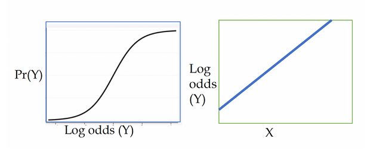

[Source](https://bookdown.org/sarahwerth2024/CategoricalBook/logistic-regression-r.html)

```{r}
#| echo: false
options(paged.print = FALSE)
```


```{r}
#| message: false
libraries <- list("tidyverse", "ggeffects", "janitor",
               "margins", "gtsummary", "car")
invisible(lapply(libraries, library, character.only = TRUE))
```

```{r}
nba_df <- read.csv("data/nba_rookie.csv") %>% 
  clean_names()
```

# Logistic Regression

Predicting log-odds. Binary outcomes. Binomial distribution.

The probability of an event occurring $P(Y=1)$ is

$$
P(Y=1) = \displaystyle \frac{e^{\beta_0 + \beta_1X_1 + ... \beta_kX_k}}{1 + e^{\beta_0 + \beta_1X_1 + ... \beta_kX_k}}
$$

$$
\ln(\displaystyle \frac{P}{1-P}) = \beta_0 + \beta_1X_1 + ... \beta_kX_k
$$

## Interpreting Log Odds

Use odds ratio. Odds ratio of 1.2 means the event is 1.2 times more likely to occur. To go from log odds to odds ratio, expenonentiate the coefficients.


## Model Assumptions

1. Binary outcome
2. Log-odds of the outcome and independent variable have a linear relationship



3. Errors are independent - No obvious clusters in the data.
4. No severe multicolinearity
    Run a VIF to detect correlation between independent variables, and perhaps dropping or combining them.

## Pros and Cons

Pros:

- You can interpret an odds ratio as how many more times someone is likely to experience the outcome (e.g., nba players with high scoring averages are 1.5 times more likely to have a career over five years).
- Logistic regression are the most common model used for binary outcomes.

Cons:

- Odds ratios and log-odds are not as straightforward to interpret as the outcomes of a linear probability model.
- It assumes linearity between log-odds outcome and explanatory variables.


# Running a logistic regression

We will be running a logistic regression to see what rookie characteristics are associated with an NBA career greater than 5 years. Here are the key variables:

- target_5yrs: a binary indicator of whether an NBA career lasted longer than 5 years.
- pts: Average points per game
- gp: Games played
- fg: Percentage of field goals made
- x3p: Percentage of three pointers made
- ast: Average assists per game
- blk: Average blocks per game

## Plot the outcome and key independent variable

To get a sense of the relationship.

```{r lrm-werth-1}
nba_df %>% 
  ggplot(aes(x = pts, y = target_5yrs)) +
  geom_point() +
  geom_smooth(method = "loess", se = F) +
  theme_classic()
```

## Run the models

```{r lrm-werth-2}
fit_basic <- glm(
  target_5yrs ~ pts, data = nba_df,
  family = binomial(link = logit)
)
tbl_regression(fit_basic, exp = TRUE)
```

Run full model

```{r lrm-werth-3}
fit_full <- glm(
  target_5yrs ~ pts + gp + fg + x3p + ast + blk,
  data = nba_df, family = binomial(link = logit)
)
tbl_regression(fit_full, exp = T)
```

## Interpret the model

### Odds Ratios

Each additional point per game makes a player 1.07 times more likely to have a career longer than 5 years. Each additional block increases the odds of an NBA career longer than 5 years by 71%

### Predicted Probability Plots

#### Holding all other variables at means

Choose an explanatory variable.


```{r}
(pp_atmeans <- ggpredict(fit_full, terms = "pts[0:25 by = 5]"))
```

```{r lrm-werth-4}
plot(pp_atmeans)
```

### Marginal Effects

#### Marginal effect of a one unit change in X at means

```{r}
nba_atm <- nba_df %>% 
  drop_na(pts, gp, fg, x3p, ast, blk) %>% 
  mutate(
    pts = mean(pts),
    gp = mean(gp),
    fg = mean(fg),
    x3p = mean(x3p),
    ast = mean(ast),
    blk = mean (blk)
  )
```

```{r}
margins(fit_full, data = nba_atm, variables = "pts")
```

Holding all varibles at the means, one unit increase in avg points per game is associated with a .015 increase in the probability that the career lasts beyond 5 years.

```{r}
margins(fit_full, data = nba_atm)
```

#### Using representative values

```{r}
margins(fit_full, variables = "pts",
        at = list(gp = 82, fg = 47.6, 
                  x3p = 32.8, ast = 3.5, blk = .4))
```

For a player with these stats in their rookie year, a one unit increase in avg points per game is associated with a 0.008 increase in the probability of an NBA career past 5 years.

#### Average marginal effects

Most common method.

```{r}
margins(fit_full, variables = "pts")
```

Holding all other variables at their observed values, on average a one unit increase in average points per game is associated with a 0.012 increase in the probability of an NBA career past 5 years.

## Check Assumptions

1. Binary outcome - yes
2. Log-odds of outcome and independent variable have a linear relationship


```{r}
nba_model <- nba_df %>% 
  select(pts, gp, fg, x3p, ast, blk) %>% 
  drop_na()

predictors <- names(nba_model)

nba_model$probabilities <- fit_full$fitted.values


nba_model <- nba_model %>%
  mutate(logit = log(probabilities / (1 - probabilities))) %>%
  select(-probabilities) %>%
  pivot_longer(
    cols = 1:6, names_to = "predictors", 
    values_to = "predictor_value"
  )
```

```{r lrm-werth-5}
ggplot(nba_model, aes(y = logit, x = predictor_value)) +
  geom_point(size = 0.5, alpha = 0.5) +
  geom_smooth(method = "loess") +
  theme_bw() +
  facet_wrap(~predictors, scales = "free_x")
```

fg might need to be transformed.

3. Independent errors

No clusters. Were team a variable, that would create clusters.

4. No severe multicolinearity

```{r}
vif(fit_full)
```

All are under 10 so ok.


