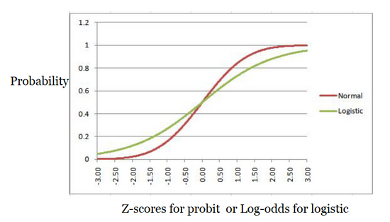

[Source](https://bookdown.org/sarahwerth2024/CategoricalBook/probit-regression-r.html)

```{r}
#| echo: false
options(paged.print = FALSE)
```


```{r}
#| message: false
libraries <- list(
  "tidyverse", "car", "janitor",
  "ggeffects", "margins"
)
invisible(lapply(libraries, library, character.only = TRUE))
```

```{r}
nba <- read.csv("data/nba_rookie.csv") %>% 
  clean_names()
```

# Probit Regression

Probit uses the cumulative normal distribution curve rather than the logistic curve.



$$
P(Y=1) = \Phi(\beta_0 + \beta_1X_1 + ... \beta_kX_k)
$$
or

$$
\Phi^{-1}(P(Y = 1)) = \beta_0 + \beta_1X_1 + ... \beta_kX_k
$$

Where $\Phi$ is the cumulative normal distribution function. The result is a z-score. Since there are no odds ratio, the z-score can be turned into probabilities.

## Assumpations

1. Binary outcome
2. Z-score and independent variables have linear relationship
3. Normally distributed errors, ok to violate if large sample size (> 20)
4. Errors are independent (no clusters)
5. No severe multicolinearity (VIF, consider dropping, combining variables)

# Running a probit regression

What rookie characteristics are associated with a career greater than 5 years?

## Plot the outcome and key variables

```{r werth-probit-1}
ggplot(nba, aes(x = pts, y = target_5yrs)) +
  geom_point() +
  geom_smooth(method = "loess", se = F) +
  theme_classic()
```

## Run the models

Start with a basic model

```{r}
fit_basic <- glm(target_5yrs ~ pts, data = nba,
                 family = binomial(link = "probit"))
summary(fit_basic)
```

```{r}
names(nba)
```


```{r}
fit_full <- glm(target_5yrs ~ pts + gp + fg + x3p + ast + blk,
                data = nba, family = binomial(link = probit))
summary(fit_full)
```

## Interpret

The estimate represents the change in z-score. eg. for each additional point scored per game, there is a .037 increase in the z-score of having a career longer than 5 years.

### Marginal effects

Can use at means, at representative values, or average marginal effects. This is the average marginal effects method.

```{r}
margins(fit_full, variables = "pts")
```

Each additional point scored per game is associated with a 1.2% increase in the probability of having a career longer than 5 years.

```{r}
margins(fit_full, variables = "blk")
```

### Predicted probability plots

```{r werth-probit-2}
ggpredict(fit_full, terms = "pts[0:25 by = 5]") %>% 
  plot()
```

```{r werth-probit-3}
ggpredict(fit_full, terms = "blk[0:4 by = 0.75]") %>% 
  plot()
```

```{r}
summary(fit_full$data$blk)
```

## Check assumptions

1. Binary outcome
2. z-score outcome and x variables have linear relationship

Predict the probit and plot against independent variables.

```{r}
nba_model <- nba %>% 
  select(pts, gp, fg, x3p, ast, blk) %>% 
  drop_na()
predictors <- names(nba_model)
nba_model$probabilities <- fit_full$fitted.values
nba_model <- nba_model %>% 
  mutate(probit = qnorm(probabilities)) %>% 
  select(-probabilities) %>% 
  pivot_longer(cols = 1:6,
               names_to = "predictors",
               values_to = "predictor_value")
```

```{r werth-probit-4}
ggplot(nba_model, aes(y = probit, x = predictor_value))+
    geom_point(size = 0.5, alpha = 0.5) +
    geom_smooth(method = "loess") +
    theme_bw() +
    facet_wrap(~predictors, scales = "free_x")
```

`fg` should probably be squared.

3. Normally distributed errors

```{r werth-probit-5}
plot(fit_full, which = 2)
```

Some non-linearity, but ok due to sample size.

4. Independent errors

Tere is no clustering.

5. Multicolinearity

```{r}
vif(fit_full)
```

None are over 10


