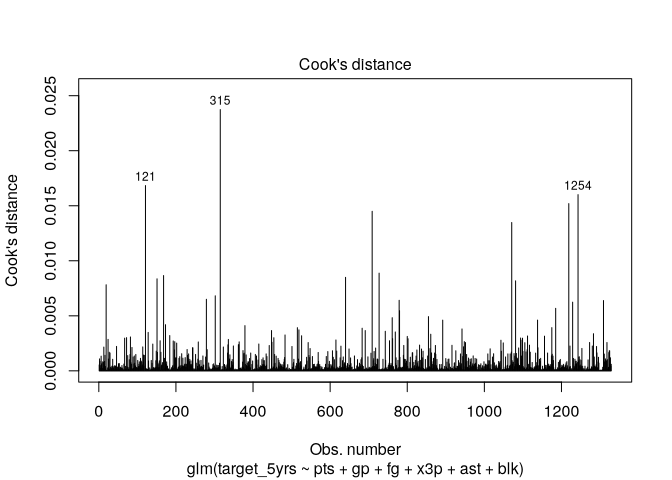
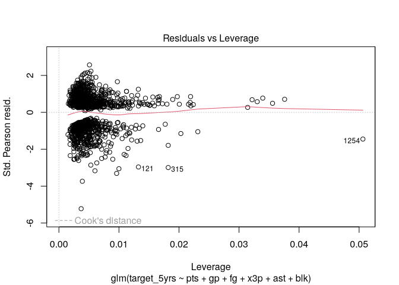

# Influential Observations


[Source](https://bookdown.org/sarahwerth2024/CategoricalBook/handling-influential-observations-r.html)

``` r
libraries <- list(
  "tidyverse", "huxtable", "janitor"
)
invisible(lapply(libraries, library, character.only = TRUE))
```

``` r
nba <- read_csv("data/nba_rookie.csv") %>% 
  clean_names() %>% 
  rename_with(~ str_remove(.x, "_percent$"),
              cols = everything())
```

# Cook’s Distance

A measure of how much influence an observation has on a model. The score
tells how much the coefficients were changed if the observation were
removed. Higher means more influence.

The threshold for “too high” is not clear. Could be 1, could be 4/N,
could be 3 \* mean. R uses .5 and 1.

``` r
model <- glm(target_5yrs ~ pts + gp + fg + x3p + ast + blk,
              data = nba, family = binomial(link = logit))
```

## Plot the distrubution oc Cook’s Distance

The fourth built-in diagnostic plots. `id.n` specifies the number of
points to label.

``` r
plot(model, which = 4, id.n = 3)
```



## Plot Residuals vs Leverage

Leverage is a measure of how far the values of the independent variables
for an observation are from values the other observations.

``` r
plot(model, which = 5)
```



No values are beyond the .5 threshold, so the dashed line does not show
for that cutoff.

## List the influential observations

``` r
nba %>% 
  slice(c(315, 1254, 121)) %>% 
  select(name, pts, blk)
```

    Warning in knit_print.huxtable(ht): Unrecognized output format "commonmark". Using `to_screen` to print huxtables.
    Set options("huxtable.knitr_output_format") manually to "latex", "html", "rtf", "docx", "pptx", "md" or "screen".

                       ┌───────────────────────────────┐
                       │ name              pts     blk │
                       ├───────────────────────────────┤
                       │ Patrick Ewing    20       2.1 │
                       │ Eric Mobley       3.9     0.6 │
                       │ Tim Hardaway     14.7     0.1 │
                       └───────────────────────────────┘

Column names: name, pts, blk

## Run regression without the observations

``` r
model2 <- glm(target_5yrs ~ pts + gp + fg + x3p + ast + blk,
              data = nba %>% slice(-c(315, 1254, 121)),
              family = binomial(link = "logit"))
```

``` r
models <- list(model, model2)
huxreg(models)
```

    Warning in huxreg(models): Unrecognized statistics: r.squared
    Try setting `statistics` explicitly in the call to `huxreg()`

    Warning in knit_print.huxtable(x, ...): Unrecognized output format "commonmark". Using `to_screen` to print huxtables.
    Set options("huxtable.knitr_output_format") manually to "latex", "html", "rtf", "docx", "pptx", "md" or "screen".

              ────────────────────────────────────────────────────
                                      (1)              (2)        
                               ───────────────────────────────────
                (Intercept)          -4.007 ***       -4.109 ***  
                                     (0.555)          (0.563)     
                pts                   0.066 *          0.067 *    
                                     (0.026)          (0.026)     
                gp                    0.036 ***        0.034 ***  
                                     (0.004)          (0.004)     
                fg                    0.039 **         0.041 ***  
                                     (0.012)          (0.012)     
                x3p                   0.002            0.002      
                                     (0.004)          (0.004)     
                ast                   0.052            0.072      
                                     (0.064)          (0.066)     
                blk                   0.539 *          0.617 **   
                                     (0.229)          (0.235)     
                               ───────────────────────────────────
                N                  1329             1326          
                logLik             -747.391         -741.557      
                AIC                1508.781         1497.114      
              ────────────────────────────────────────────────────
                *** p < 0.001; ** p < 0.01; * p < 0.05.           

Column names: names, model1, model2

Since the differences are not large, and none were past the .5
threshold, the recommendation is to not include them.
