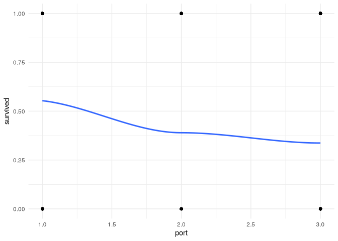
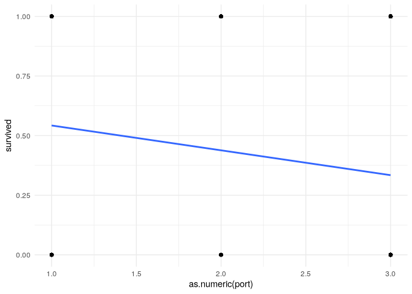
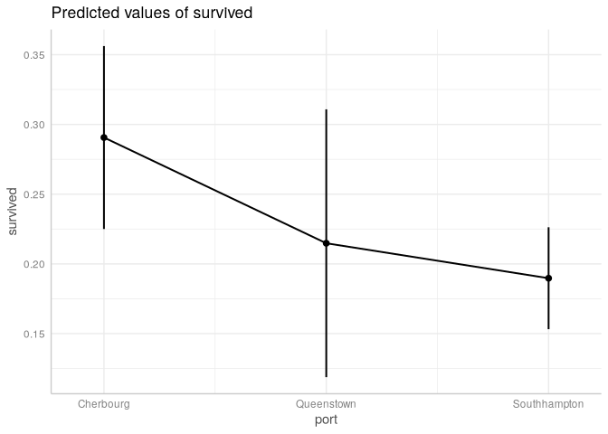
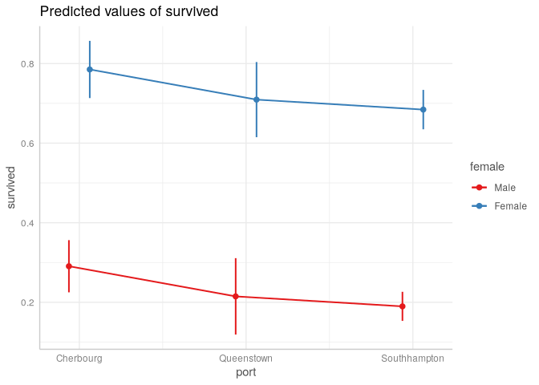
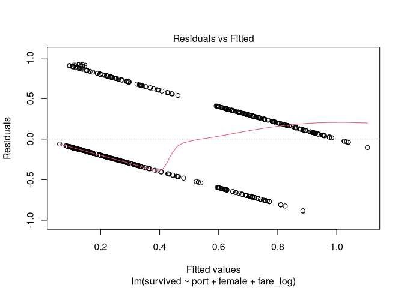
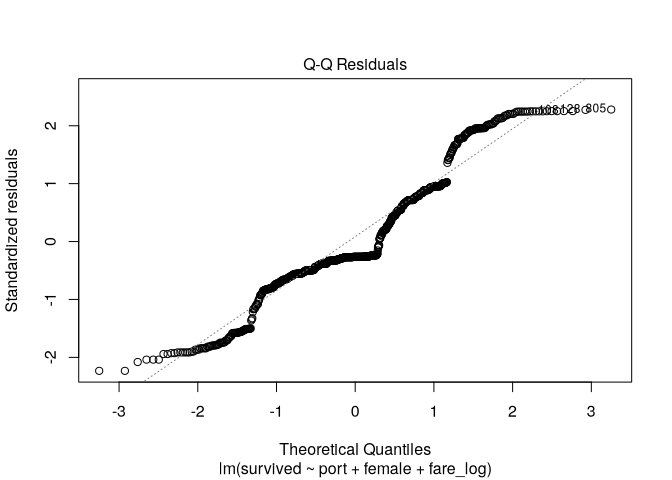
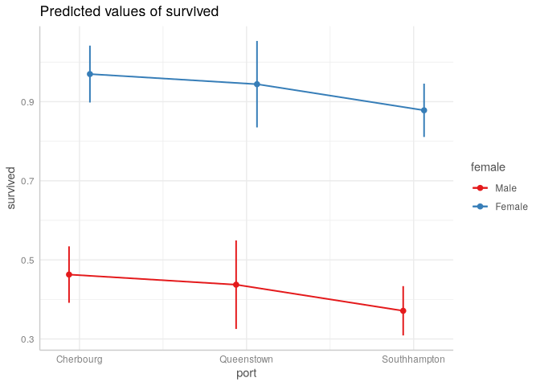

# Linear Probability Models


[Source](https://bookdown.org/sarahwerth2024/CategoricalBook/linear-probability-models-r.html)

``` r
libraries <- list("tidyverse", "ggeffects",
               "lmtest", "sandwich")
invisible(lapply(libraries, library, character.only = TRUE))
```

# Linear Probability Model

Alternative to logistic regression or probit regression.

- uses least squares regression with a binary outcome rather than
  continuous
- target outcome coded 0 for non-event (not present), 1 for event
  (present)
- coefficients refer to probability that an outcome occurs
- probabilities are always between 0 and 1, but LPMs sometimes give \> 1

$$P(Yi = 1|Xi) = \beta_0 \ + \ \beta_1X_{i,1} \ + \ \beta_2X_{i,2} + ... \beta_kX_{i,k} + \epsilon$$

- $P(Yi = 1|Xi)$: The probability that the outcome is present (1 =
  present / 0 = not present)
- That probability is predicted as a linear function (meaning the
  effects of each coefficient are just added together to get the outcome
  probability).
  - $\beta_0$ - the intercept (or probability of all coefficients are
    0).
  - $\beta_k$ - the probability associated with any covariate
  - $X_k$ - the value of the covariate
  - $\epsilon$ - the error (aka the difference between the predicted
    probability and the actual outcome \[0/1\])

## Model Assumptions and considerations

- **Violation of the linearity assumption** - LPM knowingly violates the
  assumption that there is a linear relationship between the outcome and
  the covariates. If you run a lowess line, it often looks s-shaped.
- **Violation of the homoskedasticity assumption** - Errors in a linear
  probability model will by nature have systematic heteroskedasticity.
  You can account for this by automatically using robust standard
  errors.
- **Normally distributed errors** - Errors follow a normal distribution.
  This assumption only matters if you have a very small sample size.
- **Errors are independent** - There is no potential clustering within
  your data. Examples would be data collected from withing a set of
  schools, within a set of cities, from different years, and so on.
- **X is not invariant** - The covariates that you choose can’t all be
  the same value! You want variation so you can test to see how the
  outcome changes when the x value changes.
- **X is independent of the error term** - There are no glaring
  instances of confounding in your model. This assumption is about
  unmeasured or unobserved variables that you might reasonably expect
  would be associated with your covariates and outcome. You can never
  fully rule this violation out, but you should familiarize yourself
  with other studies in your area to know what major covariates you
  should include.
- **Errors have a mean of 0 (at every level of X)** - If the mean is
  positive, your model is UNDER-estimating the outcome (more of the
  errors are positive). If the mean is negative, your model is
  OVER-estimating the outcome.

## Pros and Cons

Pros:

    The LPM is simple to run if you already know how to run a linear regression.
    It is easy to interpret as a change in the probability of the outcome ocurring.

Cons:

    It violates two of the main assumptions of normal linear regression.
    You’ll get predict probabilities that can’t exist (i.e., they are above 1 or below 0).

# Running an LPM

``` r
titanic_df <- read.csv("data/titanic_df.csv") %>% 
  as_tibble()
```

``` r
titanic_df %>% 
  drop_na(port) %>% 
  ggplot(aes(x = port, y = survived)) +
  geom_point() +
  geom_smooth(method = "loess", se = F) +
  theme_minimal()
```



## Run Basic Model

``` r
titanic_df <- titanic_df %>% 
  mutate(
    port = factor(port, 
                  labels = c("Cherbourg", "Queenstown", "Southhampton")),
    female = factor(female, labels = c("Male", "Female")),
    pclass = factor(
      pclass, 
      labels = c("1st (Upper)", "2nd (Middle)", "3rd (Lower)")),
    fare_log = if_else(fare == 0, NA, log(fare)))

basic_fit <- lm(survived ~ port, data = titanic_df)

(basic_fit_robust <- coeftest(
  basic_fit, vcov = vcovHC(basic_fit, type = "HC1")
))
```


    t test of coefficients:

                      Estimate Std. Error t value  Pr(>|t|)    
    (Intercept)       0.553571   0.038419 14.4089 < 2.2e-16 ***
    portQueenstown   -0.163961   0.067638 -2.4241   0.01555 *  
    portSouthhampton -0.216615   0.042709 -5.0718 4.799e-07 ***
    ---
    Signif. codes:  0 '***' 0.001 '**' 0.01 '*' 0.05 '.' 0.1 ' ' 1

## Run model with additional covariates.

``` r
full_fit <- lm(survived ~ port + female + fare_log,
               data = titanic_df)
(full_fit_robust <- coeftest(
  full_fit, vcov = vcovHC(full_fit, type = "HC1")
))
```


    t test of coefficients:

                       Estimate Std. Error t value  Pr(>|t|)    
    (Intercept)       0.0063477  0.0603885  0.1051   0.91631    
    portQueenstown   -0.0758104  0.0547168 -1.3855   0.16625    
    portSouthhampton -0.1008767  0.0367236 -2.7469   0.00614 ** 
    femaleFemale      0.4945555  0.0323122 15.3055 < 2.2e-16 ***
    fare_log          0.0966822  0.0156902  6.1620 1.098e-09 ***
    ---
    Signif. codes:  0 '***' 0.001 '**' 0.01 '*' 0.05 '.' 0.1 ' ' 1

``` r
map(2:5,
    \(x) full_fit$coefficients[x] * 100)
```

    [[1]]
    portQueenstown 
          -7.58104 

    [[2]]
    portSouthhampton 
           -10.08767 

    [[3]]
    femaleFemale 
        49.45555 

    [[4]]
    fare_log 
    9.668217 

A person bording in Queenstown had a 7.6% decreased probability of
surviving compared to someone boarding in Cherbourg, not statistically
significant. A person bording in Sourhhampton had a 10.1% decreased
probability of surviving compared to someone boarding in Cherbourg.
Female passengers had a 49.5% increased probability of survival. A 1%
increase in ticket fare is associated with a 9.7% increased probability
of surviving.

## Plot regression line

``` r
ggplot(titanic_df %>% drop_na(port),
       aes(x = as.numeric(port), y = survived)) +
  geom_point() +
  geom_smooth(method = "lm", se = F) +
  theme_minimal()
```

    `geom_smooth()` using formula = 'y ~ x'



## Plot probabilities in margins plot

``` r
ggpredict(full_fit, terms = "port", 
          vcov.fun = "vcovHC", vcov.type = "HC0") %>%
  plot(connect_lines = T)
```



``` r
ggpredict(full_fit, terms = c("port", "female"), 
          vcov.fun = "vcovHC", vcov.type = "HC0") %>%
  plot(connect_lines = T)
```



## Check Assumptions

1.  Linearity is violated as expected

2.  Check the violation of heteroskedasticity assumption

``` r
plot(full_fit, which = 1)
```



3.  Normally distributed errors

``` r
plot(full_fit, which = 2)
```



This is not normal, but ok due to sample size

4.  Uncorrelated errors - no natural clusters

5.  X is not invariant - x variables tak more than one value

6.  X is independent of error term

There are confounding variables, some may be big enough to change the
results.

``` r
full_fit_p <- lm(survived ~ port + female + pclass,
               data = titanic_df)
(full_fit_robust_p <- coeftest(
  full_fit_p, vcov = vcovHC(full_fit_p, type = "HC1")
))
```


    t test of coefficients:

                        Estimate Std. Error t value  Pr(>|t|)    
    (Intercept)         0.462847   0.040257 11.4974 < 2.2e-16 ***
    portQueenstown     -0.025584   0.054977 -0.4654  0.641789    
    portSouthhampton   -0.091617   0.036908 -2.4823  0.013239 *  
    femaleFemale        0.506927   0.029495 17.1871 < 2.2e-16 ***
    pclass2nd (Middle) -0.117328   0.039010 -3.0077  0.002707 ** 
    pclass3rd (Lower)  -0.299537   0.036282 -8.2559 5.469e-16 ***
    ---
    Signif. codes:  0 '***' 0.001 '**' 0.01 '*' 0.05 '.' 0.1 ' ' 1

``` r
ggpredict(full_fit_p, terms = c("port", "female"), 
          vcov.fun = "vcovHC", vcov.type = "HC0") %>%
  plot(connect_lines = T)
```


