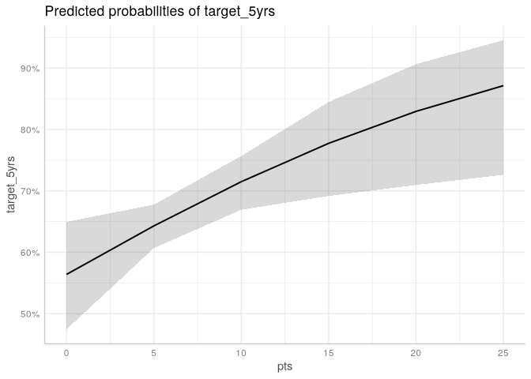
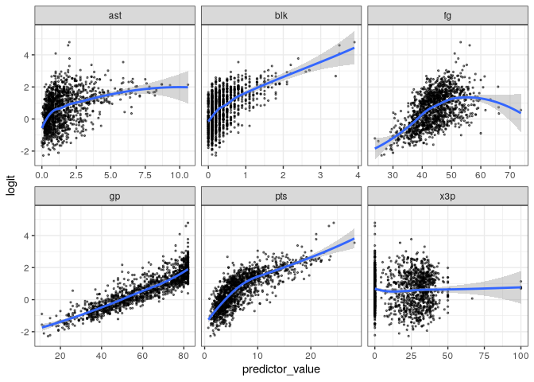

# Logistic Regression Models


[Source](https://bookdown.org/sarahwerth2024/CategoricalBook/logistic-regression-r.html)

``` r
libraries <- list("tidyverse", "ggeffects", "janitor",
               "margins", "gtsummary", "car")
invisible(lapply(libraries, library, character.only = TRUE))
```

``` r
nba_df <- read.csv("data/nba_rookie.csv") %>% 
  clean_names()
```

# Logistic Regression

Predicting log-odds. Binary outcomes. Binomial distribution.

The probability of an event occurring $P(Y=1)$ is

$$P(Y=1) = \displaystyle \frac{e^{\beta_0 + \beta_1X_1 + ... \beta_kX_k}}{1 + e^{\beta_0 + \beta_1X_1 + ... \beta_kX_k}}$$

$$\ln(\displaystyle \frac{P}{1-P}) = \beta_0 + \beta_1X_1 + ... \beta_kX_k$$

## Interpreting Log Odds

Use odds ratio. Odds ratio of 1.2 means the event is 1.2 times more
likely to occur. To go from log odds to odds ratio, expenonentiate the
coefficients.

## Model Assumptions

1.  Binary outcome
2.  Log-odds of the outcome and independent variable have a linear
    relationship


3.  Errors are independent - No obvious clusters in the data.
4.  No severe multicolinearity Run a VIF to detect correlation between
    independent variables, and perhaps dropping or combining them.

## Pros and Cons

Pros:

- You can interpret an odds ratio as how many more times someone is
  likely to experience the outcome (e.g., nba players with high scoring
  averages are 1.5 times more likely to have a career over five years).
- Logistic regression are the most common model used for binary
  outcomes.

Cons:

- Odds ratios and log-odds are not as straightforward to interpret as
  the outcomes of a linear probability model.
- It assumes linearity between log-odds outcome and explanatory
  variables.

# Running a logistic regression

We will be running a logistic regression to see what rookie
characteristics are associated with an NBA career greater than 5 years.
Here are the key variables:

- target_5yrs: a binary indicator of whether an NBA career lasted longer
  than 5 years.
- pts: Average points per game
- gp: Games played
- fg: Percentage of field goals made
- x3p: Percentage of three pointers made
- ast: Average assists per game
- blk: Average blocks per game

## Plot the outcome and key independent variable

To get a sense of the relationship.

``` r
nba_df %>% 
  ggplot(aes(x = pts, y = target_5yrs)) +
  geom_point() +
  geom_smooth(method = "loess", se = F) +
  theme_classic()
```

    `geom_smooth()` using formula = 'y ~ x'


## Run the models

``` r
fit_basic <- glm(
  target_5yrs ~ pts, data = nba_df,
  family = binomial(link = logit)
)
tbl_regression(fit_basic, exp = TRUE)
```

<div id="cetrkugflz" style="padding-left:0px;padding-right:0px;padding-top:10px;padding-bottom:10px;overflow-x:auto;overflow-y:auto;width:auto;height:auto;">
<style>#cetrkugflz table {
  font-family: system-ui, 'Segoe UI', Roboto, Helvetica, Arial, sans-serif, 'Apple Color Emoji', 'Segoe UI Emoji', 'Segoe UI Symbol', 'Noto Color Emoji';
  -webkit-font-smoothing: antialiased;
  -moz-osx-font-smoothing: grayscale;
}
&#10;#cetrkugflz thead, #cetrkugflz tbody, #cetrkugflz tfoot, #cetrkugflz tr, #cetrkugflz td, #cetrkugflz th {
  border-style: none;
}
&#10;#cetrkugflz p {
  margin: 0;
  padding: 0;
}
&#10;#cetrkugflz .gt_table {
  display: table;
  border-collapse: collapse;
  line-height: normal;
  margin-left: auto;
  margin-right: auto;
  color: #333333;
  font-size: 16px;
  font-weight: normal;
  font-style: normal;
  background-color: #FFFFFF;
  width: auto;
  border-top-style: solid;
  border-top-width: 2px;
  border-top-color: #A8A8A8;
  border-right-style: none;
  border-right-width: 2px;
  border-right-color: #D3D3D3;
  border-bottom-style: solid;
  border-bottom-width: 2px;
  border-bottom-color: #A8A8A8;
  border-left-style: none;
  border-left-width: 2px;
  border-left-color: #D3D3D3;
}
&#10;#cetrkugflz .gt_caption {
  padding-top: 4px;
  padding-bottom: 4px;
}
&#10;#cetrkugflz .gt_title {
  color: #333333;
  font-size: 125%;
  font-weight: initial;
  padding-top: 4px;
  padding-bottom: 4px;
  padding-left: 5px;
  padding-right: 5px;
  border-bottom-color: #FFFFFF;
  border-bottom-width: 0;
}
&#10;#cetrkugflz .gt_subtitle {
  color: #333333;
  font-size: 85%;
  font-weight: initial;
  padding-top: 3px;
  padding-bottom: 5px;
  padding-left: 5px;
  padding-right: 5px;
  border-top-color: #FFFFFF;
  border-top-width: 0;
}
&#10;#cetrkugflz .gt_heading {
  background-color: #FFFFFF;
  text-align: center;
  border-bottom-color: #FFFFFF;
  border-left-style: none;
  border-left-width: 1px;
  border-left-color: #D3D3D3;
  border-right-style: none;
  border-right-width: 1px;
  border-right-color: #D3D3D3;
}
&#10;#cetrkugflz .gt_bottom_border {
  border-bottom-style: solid;
  border-bottom-width: 2px;
  border-bottom-color: #D3D3D3;
}
&#10;#cetrkugflz .gt_col_headings {
  border-top-style: solid;
  border-top-width: 2px;
  border-top-color: #D3D3D3;
  border-bottom-style: solid;
  border-bottom-width: 2px;
  border-bottom-color: #D3D3D3;
  border-left-style: none;
  border-left-width: 1px;
  border-left-color: #D3D3D3;
  border-right-style: none;
  border-right-width: 1px;
  border-right-color: #D3D3D3;
}
&#10;#cetrkugflz .gt_col_heading {
  color: #333333;
  background-color: #FFFFFF;
  font-size: 100%;
  font-weight: normal;
  text-transform: inherit;
  border-left-style: none;
  border-left-width: 1px;
  border-left-color: #D3D3D3;
  border-right-style: none;
  border-right-width: 1px;
  border-right-color: #D3D3D3;
  vertical-align: bottom;
  padding-top: 5px;
  padding-bottom: 6px;
  padding-left: 5px;
  padding-right: 5px;
  overflow-x: hidden;
}
&#10;#cetrkugflz .gt_column_spanner_outer {
  color: #333333;
  background-color: #FFFFFF;
  font-size: 100%;
  font-weight: normal;
  text-transform: inherit;
  padding-top: 0;
  padding-bottom: 0;
  padding-left: 4px;
  padding-right: 4px;
}
&#10;#cetrkugflz .gt_column_spanner_outer:first-child {
  padding-left: 0;
}
&#10;#cetrkugflz .gt_column_spanner_outer:last-child {
  padding-right: 0;
}
&#10;#cetrkugflz .gt_column_spanner {
  border-bottom-style: solid;
  border-bottom-width: 2px;
  border-bottom-color: #D3D3D3;
  vertical-align: bottom;
  padding-top: 5px;
  padding-bottom: 5px;
  overflow-x: hidden;
  display: inline-block;
  width: 100%;
}
&#10;#cetrkugflz .gt_spanner_row {
  border-bottom-style: hidden;
}
&#10;#cetrkugflz .gt_group_heading {
  padding-top: 8px;
  padding-bottom: 8px;
  padding-left: 5px;
  padding-right: 5px;
  color: #333333;
  background-color: #FFFFFF;
  font-size: 100%;
  font-weight: initial;
  text-transform: inherit;
  border-top-style: solid;
  border-top-width: 2px;
  border-top-color: #D3D3D3;
  border-bottom-style: solid;
  border-bottom-width: 2px;
  border-bottom-color: #D3D3D3;
  border-left-style: none;
  border-left-width: 1px;
  border-left-color: #D3D3D3;
  border-right-style: none;
  border-right-width: 1px;
  border-right-color: #D3D3D3;
  vertical-align: middle;
  text-align: left;
}
&#10;#cetrkugflz .gt_empty_group_heading {
  padding: 0.5px;
  color: #333333;
  background-color: #FFFFFF;
  font-size: 100%;
  font-weight: initial;
  border-top-style: solid;
  border-top-width: 2px;
  border-top-color: #D3D3D3;
  border-bottom-style: solid;
  border-bottom-width: 2px;
  border-bottom-color: #D3D3D3;
  vertical-align: middle;
}
&#10;#cetrkugflz .gt_from_md > :first-child {
  margin-top: 0;
}
&#10;#cetrkugflz .gt_from_md > :last-child {
  margin-bottom: 0;
}
&#10;#cetrkugflz .gt_row {
  padding-top: 8px;
  padding-bottom: 8px;
  padding-left: 5px;
  padding-right: 5px;
  margin: 10px;
  border-top-style: solid;
  border-top-width: 1px;
  border-top-color: #D3D3D3;
  border-left-style: none;
  border-left-width: 1px;
  border-left-color: #D3D3D3;
  border-right-style: none;
  border-right-width: 1px;
  border-right-color: #D3D3D3;
  vertical-align: middle;
  overflow-x: hidden;
}
&#10;#cetrkugflz .gt_stub {
  color: #333333;
  background-color: #FFFFFF;
  font-size: 100%;
  font-weight: initial;
  text-transform: inherit;
  border-right-style: solid;
  border-right-width: 2px;
  border-right-color: #D3D3D3;
  padding-left: 5px;
  padding-right: 5px;
}
&#10;#cetrkugflz .gt_stub_row_group {
  color: #333333;
  background-color: #FFFFFF;
  font-size: 100%;
  font-weight: initial;
  text-transform: inherit;
  border-right-style: solid;
  border-right-width: 2px;
  border-right-color: #D3D3D3;
  padding-left: 5px;
  padding-right: 5px;
  vertical-align: top;
}
&#10;#cetrkugflz .gt_row_group_first td {
  border-top-width: 2px;
}
&#10;#cetrkugflz .gt_row_group_first th {
  border-top-width: 2px;
}
&#10;#cetrkugflz .gt_summary_row {
  color: #333333;
  background-color: #FFFFFF;
  text-transform: inherit;
  padding-top: 8px;
  padding-bottom: 8px;
  padding-left: 5px;
  padding-right: 5px;
}
&#10;#cetrkugflz .gt_first_summary_row {
  border-top-style: solid;
  border-top-color: #D3D3D3;
}
&#10;#cetrkugflz .gt_first_summary_row.thick {
  border-top-width: 2px;
}
&#10;#cetrkugflz .gt_last_summary_row {
  padding-top: 8px;
  padding-bottom: 8px;
  padding-left: 5px;
  padding-right: 5px;
  border-bottom-style: solid;
  border-bottom-width: 2px;
  border-bottom-color: #D3D3D3;
}
&#10;#cetrkugflz .gt_grand_summary_row {
  color: #333333;
  background-color: #FFFFFF;
  text-transform: inherit;
  padding-top: 8px;
  padding-bottom: 8px;
  padding-left: 5px;
  padding-right: 5px;
}
&#10;#cetrkugflz .gt_first_grand_summary_row {
  padding-top: 8px;
  padding-bottom: 8px;
  padding-left: 5px;
  padding-right: 5px;
  border-top-style: double;
  border-top-width: 6px;
  border-top-color: #D3D3D3;
}
&#10;#cetrkugflz .gt_last_grand_summary_row_top {
  padding-top: 8px;
  padding-bottom: 8px;
  padding-left: 5px;
  padding-right: 5px;
  border-bottom-style: double;
  border-bottom-width: 6px;
  border-bottom-color: #D3D3D3;
}
&#10;#cetrkugflz .gt_striped {
  background-color: rgba(128, 128, 128, 0.05);
}
&#10;#cetrkugflz .gt_table_body {
  border-top-style: solid;
  border-top-width: 2px;
  border-top-color: #D3D3D3;
  border-bottom-style: solid;
  border-bottom-width: 2px;
  border-bottom-color: #D3D3D3;
}
&#10;#cetrkugflz .gt_footnotes {
  color: #333333;
  background-color: #FFFFFF;
  border-bottom-style: none;
  border-bottom-width: 2px;
  border-bottom-color: #D3D3D3;
  border-left-style: none;
  border-left-width: 2px;
  border-left-color: #D3D3D3;
  border-right-style: none;
  border-right-width: 2px;
  border-right-color: #D3D3D3;
}
&#10;#cetrkugflz .gt_footnote {
  margin: 0px;
  font-size: 90%;
  padding-top: 4px;
  padding-bottom: 4px;
  padding-left: 5px;
  padding-right: 5px;
}
&#10;#cetrkugflz .gt_sourcenotes {
  color: #333333;
  background-color: #FFFFFF;
  border-bottom-style: none;
  border-bottom-width: 2px;
  border-bottom-color: #D3D3D3;
  border-left-style: none;
  border-left-width: 2px;
  border-left-color: #D3D3D3;
  border-right-style: none;
  border-right-width: 2px;
  border-right-color: #D3D3D3;
}
&#10;#cetrkugflz .gt_sourcenote {
  font-size: 90%;
  padding-top: 4px;
  padding-bottom: 4px;
  padding-left: 5px;
  padding-right: 5px;
}
&#10;#cetrkugflz .gt_left {
  text-align: left;
}
&#10;#cetrkugflz .gt_center {
  text-align: center;
}
&#10;#cetrkugflz .gt_right {
  text-align: right;
  font-variant-numeric: tabular-nums;
}
&#10;#cetrkugflz .gt_font_normal {
  font-weight: normal;
}
&#10;#cetrkugflz .gt_font_bold {
  font-weight: bold;
}
&#10;#cetrkugflz .gt_font_italic {
  font-style: italic;
}
&#10;#cetrkugflz .gt_super {
  font-size: 65%;
}
&#10;#cetrkugflz .gt_footnote_marks {
  font-size: 75%;
  vertical-align: 0.4em;
  position: initial;
}
&#10;#cetrkugflz .gt_asterisk {
  font-size: 100%;
  vertical-align: 0;
}
&#10;#cetrkugflz .gt_indent_1 {
  text-indent: 5px;
}
&#10;#cetrkugflz .gt_indent_2 {
  text-indent: 10px;
}
&#10;#cetrkugflz .gt_indent_3 {
  text-indent: 15px;
}
&#10;#cetrkugflz .gt_indent_4 {
  text-indent: 20px;
}
&#10;#cetrkugflz .gt_indent_5 {
  text-indent: 25px;
}
&#10;#cetrkugflz .katex-display {
  display: inline-flex !important;
  margin-bottom: 0.75em !important;
}
&#10;#cetrkugflz div.Reactable > div.rt-table > div.rt-thead > div.rt-tr.rt-tr-group-header > div.rt-th-group:after {
  height: 0px !important;
}
</style>

<table class="gt_table" data-quarto-postprocess="true"
data-quarto-disable-processing="false" data-quarto-bootstrap="false">
<thead>
<tr class="gt_col_headings">
<th id="label" class="gt_col_heading gt_columns_bottom_border gt_left"
data-quarto-table-cell-role="th"
scope="col"><strong>Characteristic</strong></th>
<th id="estimate"
class="gt_col_heading gt_columns_bottom_border gt_center"
data-quarto-table-cell-role="th" scope="col"><strong>OR</strong></th>
<th id="conf.low"
class="gt_col_heading gt_columns_bottom_border gt_center"
data-quarto-table-cell-role="th" scope="col"><strong>95%
CI</strong></th>
<th id="p.value"
class="gt_col_heading gt_columns_bottom_border gt_center"
data-quarto-table-cell-role="th"
scope="col"><strong>p-value</strong></th>
</tr>
</thead>
<tbody class="gt_table_body">
<tr>
<td class="gt_row gt_left" headers="label">pts</td>
<td class="gt_row gt_center" headers="estimate">1.23</td>
<td class="gt_row gt_center" headers="conf.low">1.18, 1.27</td>
<td class="gt_row gt_center" headers="p.value">&lt;0.001</td>
</tr>
</tbody><tfoot class="gt_sourcenotes">
<tr>
<td colspan="4" class="gt_sourcenote">Abbreviations: CI = Confidence
Interval, OR = Odds Ratio</td>
</tr>
</tfoot>
&#10;</table>

</div>

Run full model

``` r
fit_full <- glm(
  target_5yrs ~ pts + gp + fg + x3p + ast + blk,
  data = nba_df, family = binomial(link = logit)
)
tbl_regression(fit_full, exp = T)
```

<div id="ghwezvaytn" style="padding-left:0px;padding-right:0px;padding-top:10px;padding-bottom:10px;overflow-x:auto;overflow-y:auto;width:auto;height:auto;">
<style>#ghwezvaytn table {
  font-family: system-ui, 'Segoe UI', Roboto, Helvetica, Arial, sans-serif, 'Apple Color Emoji', 'Segoe UI Emoji', 'Segoe UI Symbol', 'Noto Color Emoji';
  -webkit-font-smoothing: antialiased;
  -moz-osx-font-smoothing: grayscale;
}
&#10;#ghwezvaytn thead, #ghwezvaytn tbody, #ghwezvaytn tfoot, #ghwezvaytn tr, #ghwezvaytn td, #ghwezvaytn th {
  border-style: none;
}
&#10;#ghwezvaytn p {
  margin: 0;
  padding: 0;
}
&#10;#ghwezvaytn .gt_table {
  display: table;
  border-collapse: collapse;
  line-height: normal;
  margin-left: auto;
  margin-right: auto;
  color: #333333;
  font-size: 16px;
  font-weight: normal;
  font-style: normal;
  background-color: #FFFFFF;
  width: auto;
  border-top-style: solid;
  border-top-width: 2px;
  border-top-color: #A8A8A8;
  border-right-style: none;
  border-right-width: 2px;
  border-right-color: #D3D3D3;
  border-bottom-style: solid;
  border-bottom-width: 2px;
  border-bottom-color: #A8A8A8;
  border-left-style: none;
  border-left-width: 2px;
  border-left-color: #D3D3D3;
}
&#10;#ghwezvaytn .gt_caption {
  padding-top: 4px;
  padding-bottom: 4px;
}
&#10;#ghwezvaytn .gt_title {
  color: #333333;
  font-size: 125%;
  font-weight: initial;
  padding-top: 4px;
  padding-bottom: 4px;
  padding-left: 5px;
  padding-right: 5px;
  border-bottom-color: #FFFFFF;
  border-bottom-width: 0;
}
&#10;#ghwezvaytn .gt_subtitle {
  color: #333333;
  font-size: 85%;
  font-weight: initial;
  padding-top: 3px;
  padding-bottom: 5px;
  padding-left: 5px;
  padding-right: 5px;
  border-top-color: #FFFFFF;
  border-top-width: 0;
}
&#10;#ghwezvaytn .gt_heading {
  background-color: #FFFFFF;
  text-align: center;
  border-bottom-color: #FFFFFF;
  border-left-style: none;
  border-left-width: 1px;
  border-left-color: #D3D3D3;
  border-right-style: none;
  border-right-width: 1px;
  border-right-color: #D3D3D3;
}
&#10;#ghwezvaytn .gt_bottom_border {
  border-bottom-style: solid;
  border-bottom-width: 2px;
  border-bottom-color: #D3D3D3;
}
&#10;#ghwezvaytn .gt_col_headings {
  border-top-style: solid;
  border-top-width: 2px;
  border-top-color: #D3D3D3;
  border-bottom-style: solid;
  border-bottom-width: 2px;
  border-bottom-color: #D3D3D3;
  border-left-style: none;
  border-left-width: 1px;
  border-left-color: #D3D3D3;
  border-right-style: none;
  border-right-width: 1px;
  border-right-color: #D3D3D3;
}
&#10;#ghwezvaytn .gt_col_heading {
  color: #333333;
  background-color: #FFFFFF;
  font-size: 100%;
  font-weight: normal;
  text-transform: inherit;
  border-left-style: none;
  border-left-width: 1px;
  border-left-color: #D3D3D3;
  border-right-style: none;
  border-right-width: 1px;
  border-right-color: #D3D3D3;
  vertical-align: bottom;
  padding-top: 5px;
  padding-bottom: 6px;
  padding-left: 5px;
  padding-right: 5px;
  overflow-x: hidden;
}
&#10;#ghwezvaytn .gt_column_spanner_outer {
  color: #333333;
  background-color: #FFFFFF;
  font-size: 100%;
  font-weight: normal;
  text-transform: inherit;
  padding-top: 0;
  padding-bottom: 0;
  padding-left: 4px;
  padding-right: 4px;
}
&#10;#ghwezvaytn .gt_column_spanner_outer:first-child {
  padding-left: 0;
}
&#10;#ghwezvaytn .gt_column_spanner_outer:last-child {
  padding-right: 0;
}
&#10;#ghwezvaytn .gt_column_spanner {
  border-bottom-style: solid;
  border-bottom-width: 2px;
  border-bottom-color: #D3D3D3;
  vertical-align: bottom;
  padding-top: 5px;
  padding-bottom: 5px;
  overflow-x: hidden;
  display: inline-block;
  width: 100%;
}
&#10;#ghwezvaytn .gt_spanner_row {
  border-bottom-style: hidden;
}
&#10;#ghwezvaytn .gt_group_heading {
  padding-top: 8px;
  padding-bottom: 8px;
  padding-left: 5px;
  padding-right: 5px;
  color: #333333;
  background-color: #FFFFFF;
  font-size: 100%;
  font-weight: initial;
  text-transform: inherit;
  border-top-style: solid;
  border-top-width: 2px;
  border-top-color: #D3D3D3;
  border-bottom-style: solid;
  border-bottom-width: 2px;
  border-bottom-color: #D3D3D3;
  border-left-style: none;
  border-left-width: 1px;
  border-left-color: #D3D3D3;
  border-right-style: none;
  border-right-width: 1px;
  border-right-color: #D3D3D3;
  vertical-align: middle;
  text-align: left;
}
&#10;#ghwezvaytn .gt_empty_group_heading {
  padding: 0.5px;
  color: #333333;
  background-color: #FFFFFF;
  font-size: 100%;
  font-weight: initial;
  border-top-style: solid;
  border-top-width: 2px;
  border-top-color: #D3D3D3;
  border-bottom-style: solid;
  border-bottom-width: 2px;
  border-bottom-color: #D3D3D3;
  vertical-align: middle;
}
&#10;#ghwezvaytn .gt_from_md > :first-child {
  margin-top: 0;
}
&#10;#ghwezvaytn .gt_from_md > :last-child {
  margin-bottom: 0;
}
&#10;#ghwezvaytn .gt_row {
  padding-top: 8px;
  padding-bottom: 8px;
  padding-left: 5px;
  padding-right: 5px;
  margin: 10px;
  border-top-style: solid;
  border-top-width: 1px;
  border-top-color: #D3D3D3;
  border-left-style: none;
  border-left-width: 1px;
  border-left-color: #D3D3D3;
  border-right-style: none;
  border-right-width: 1px;
  border-right-color: #D3D3D3;
  vertical-align: middle;
  overflow-x: hidden;
}
&#10;#ghwezvaytn .gt_stub {
  color: #333333;
  background-color: #FFFFFF;
  font-size: 100%;
  font-weight: initial;
  text-transform: inherit;
  border-right-style: solid;
  border-right-width: 2px;
  border-right-color: #D3D3D3;
  padding-left: 5px;
  padding-right: 5px;
}
&#10;#ghwezvaytn .gt_stub_row_group {
  color: #333333;
  background-color: #FFFFFF;
  font-size: 100%;
  font-weight: initial;
  text-transform: inherit;
  border-right-style: solid;
  border-right-width: 2px;
  border-right-color: #D3D3D3;
  padding-left: 5px;
  padding-right: 5px;
  vertical-align: top;
}
&#10;#ghwezvaytn .gt_row_group_first td {
  border-top-width: 2px;
}
&#10;#ghwezvaytn .gt_row_group_first th {
  border-top-width: 2px;
}
&#10;#ghwezvaytn .gt_summary_row {
  color: #333333;
  background-color: #FFFFFF;
  text-transform: inherit;
  padding-top: 8px;
  padding-bottom: 8px;
  padding-left: 5px;
  padding-right: 5px;
}
&#10;#ghwezvaytn .gt_first_summary_row {
  border-top-style: solid;
  border-top-color: #D3D3D3;
}
&#10;#ghwezvaytn .gt_first_summary_row.thick {
  border-top-width: 2px;
}
&#10;#ghwezvaytn .gt_last_summary_row {
  padding-top: 8px;
  padding-bottom: 8px;
  padding-left: 5px;
  padding-right: 5px;
  border-bottom-style: solid;
  border-bottom-width: 2px;
  border-bottom-color: #D3D3D3;
}
&#10;#ghwezvaytn .gt_grand_summary_row {
  color: #333333;
  background-color: #FFFFFF;
  text-transform: inherit;
  padding-top: 8px;
  padding-bottom: 8px;
  padding-left: 5px;
  padding-right: 5px;
}
&#10;#ghwezvaytn .gt_first_grand_summary_row {
  padding-top: 8px;
  padding-bottom: 8px;
  padding-left: 5px;
  padding-right: 5px;
  border-top-style: double;
  border-top-width: 6px;
  border-top-color: #D3D3D3;
}
&#10;#ghwezvaytn .gt_last_grand_summary_row_top {
  padding-top: 8px;
  padding-bottom: 8px;
  padding-left: 5px;
  padding-right: 5px;
  border-bottom-style: double;
  border-bottom-width: 6px;
  border-bottom-color: #D3D3D3;
}
&#10;#ghwezvaytn .gt_striped {
  background-color: rgba(128, 128, 128, 0.05);
}
&#10;#ghwezvaytn .gt_table_body {
  border-top-style: solid;
  border-top-width: 2px;
  border-top-color: #D3D3D3;
  border-bottom-style: solid;
  border-bottom-width: 2px;
  border-bottom-color: #D3D3D3;
}
&#10;#ghwezvaytn .gt_footnotes {
  color: #333333;
  background-color: #FFFFFF;
  border-bottom-style: none;
  border-bottom-width: 2px;
  border-bottom-color: #D3D3D3;
  border-left-style: none;
  border-left-width: 2px;
  border-left-color: #D3D3D3;
  border-right-style: none;
  border-right-width: 2px;
  border-right-color: #D3D3D3;
}
&#10;#ghwezvaytn .gt_footnote {
  margin: 0px;
  font-size: 90%;
  padding-top: 4px;
  padding-bottom: 4px;
  padding-left: 5px;
  padding-right: 5px;
}
&#10;#ghwezvaytn .gt_sourcenotes {
  color: #333333;
  background-color: #FFFFFF;
  border-bottom-style: none;
  border-bottom-width: 2px;
  border-bottom-color: #D3D3D3;
  border-left-style: none;
  border-left-width: 2px;
  border-left-color: #D3D3D3;
  border-right-style: none;
  border-right-width: 2px;
  border-right-color: #D3D3D3;
}
&#10;#ghwezvaytn .gt_sourcenote {
  font-size: 90%;
  padding-top: 4px;
  padding-bottom: 4px;
  padding-left: 5px;
  padding-right: 5px;
}
&#10;#ghwezvaytn .gt_left {
  text-align: left;
}
&#10;#ghwezvaytn .gt_center {
  text-align: center;
}
&#10;#ghwezvaytn .gt_right {
  text-align: right;
  font-variant-numeric: tabular-nums;
}
&#10;#ghwezvaytn .gt_font_normal {
  font-weight: normal;
}
&#10;#ghwezvaytn .gt_font_bold {
  font-weight: bold;
}
&#10;#ghwezvaytn .gt_font_italic {
  font-style: italic;
}
&#10;#ghwezvaytn .gt_super {
  font-size: 65%;
}
&#10;#ghwezvaytn .gt_footnote_marks {
  font-size: 75%;
  vertical-align: 0.4em;
  position: initial;
}
&#10;#ghwezvaytn .gt_asterisk {
  font-size: 100%;
  vertical-align: 0;
}
&#10;#ghwezvaytn .gt_indent_1 {
  text-indent: 5px;
}
&#10;#ghwezvaytn .gt_indent_2 {
  text-indent: 10px;
}
&#10;#ghwezvaytn .gt_indent_3 {
  text-indent: 15px;
}
&#10;#ghwezvaytn .gt_indent_4 {
  text-indent: 20px;
}
&#10;#ghwezvaytn .gt_indent_5 {
  text-indent: 25px;
}
&#10;#ghwezvaytn .katex-display {
  display: inline-flex !important;
  margin-bottom: 0.75em !important;
}
&#10;#ghwezvaytn div.Reactable > div.rt-table > div.rt-thead > div.rt-tr.rt-tr-group-header > div.rt-th-group:after {
  height: 0px !important;
}
</style>

<table class="gt_table" data-quarto-postprocess="true"
data-quarto-disable-processing="false" data-quarto-bootstrap="false">
<thead>
<tr class="gt_col_headings">
<th id="label" class="gt_col_heading gt_columns_bottom_border gt_left"
data-quarto-table-cell-role="th"
scope="col"><strong>Characteristic</strong></th>
<th id="estimate"
class="gt_col_heading gt_columns_bottom_border gt_center"
data-quarto-table-cell-role="th" scope="col"><strong>OR</strong></th>
<th id="conf.low"
class="gt_col_heading gt_columns_bottom_border gt_center"
data-quarto-table-cell-role="th" scope="col"><strong>95%
CI</strong></th>
<th id="p.value"
class="gt_col_heading gt_columns_bottom_border gt_center"
data-quarto-table-cell-role="th"
scope="col"><strong>p-value</strong></th>
</tr>
</thead>
<tbody class="gt_table_body">
<tr>
<td class="gt_row gt_left" headers="label">pts</td>
<td class="gt_row gt_center" headers="estimate">1.07</td>
<td class="gt_row gt_center" headers="conf.low">1.02, 1.12</td>
<td class="gt_row gt_center" headers="p.value">0.010</td>
</tr>
<tr>
<td class="gt_row gt_left" headers="label">gp</td>
<td class="gt_row gt_center" headers="estimate">1.04</td>
<td class="gt_row gt_center" headers="conf.low">1.03, 1.05</td>
<td class="gt_row gt_center" headers="p.value">&lt;0.001</td>
</tr>
<tr>
<td class="gt_row gt_left" headers="label">fg</td>
<td class="gt_row gt_center" headers="estimate">1.04</td>
<td class="gt_row gt_center" headers="conf.low">1.02, 1.07</td>
<td class="gt_row gt_center" headers="p.value">0.001</td>
</tr>
<tr>
<td class="gt_row gt_left" headers="label">x3p</td>
<td class="gt_row gt_center" headers="estimate">1.00</td>
<td class="gt_row gt_center" headers="conf.low">0.99, 1.01</td>
<td class="gt_row gt_center" headers="p.value">0.7</td>
</tr>
<tr>
<td class="gt_row gt_left" headers="label">ast</td>
<td class="gt_row gt_center" headers="estimate">1.05</td>
<td class="gt_row gt_center" headers="conf.low">0.93, 1.20</td>
<td class="gt_row gt_center" headers="p.value">0.4</td>
</tr>
<tr>
<td class="gt_row gt_left" headers="label">blk</td>
<td class="gt_row gt_center" headers="estimate">1.71</td>
<td class="gt_row gt_center" headers="conf.low">1.11, 2.72</td>
<td class="gt_row gt_center" headers="p.value">0.018</td>
</tr>
</tbody><tfoot class="gt_sourcenotes">
<tr>
<td colspan="4" class="gt_sourcenote">Abbreviations: CI = Confidence
Interval, OR = Odds Ratio</td>
</tr>
</tfoot>
&#10;</table>

</div>

## Interpret the model

### Odds Ratios

Each additional point per game makes a player 1.07 times more likely to
have a career longer than 5 years. Each additional block increases the
odds of an NBA career longer than 5 years by 71%

### Predicted Probability Plots

#### Holding all other variables at means

Choose an explanatory variable.

``` r
(pp_atmeans <- ggpredict(fit_full, terms = "pts[0:25 by = 5]"))
```

    # Predicted probabilities of target_5yrs

    pts | Predicted |     95% CI
    ----------------------------
      0 |      0.56 | 0.47, 0.65
      5 |      0.64 | 0.61, 0.68
     10 |      0.71 | 0.67, 0.76
     15 |      0.78 | 0.69, 0.84
     20 |      0.83 | 0.71, 0.91
     25 |      0.87 | 0.73, 0.95

    Adjusted for:
    *  gp = 63.00
    *  fg = 44.12
    * x3p = 19.31
    * ast =  1.56
    * blk =  0.37

``` r
plot(pp_atmeans)
```



### Marginal Effects

#### Marginal effect of a one unit change in X at means

``` r
nba_atm <- nba_df %>% 
  drop_na(pts, gp, fg, x3p, ast, blk) %>% 
  mutate(
    pts = mean(pts),
    gp = mean(gp),
    fg = mean(fg),
    x3p = mean(x3p),
    ast = mean(ast),
    blk = mean (blk)
  )
```

``` r
margins(fit_full, data = nba_atm, variables = "pts")
```

    Average marginal effects

    glm(formula = target_5yrs ~ pts + gp + fg + x3p + ast + blk,     family = binomial(link = logit), data = nba_df)

         pts
     0.01508

Holding all varibles at the means, one unit increase in avg points per
game is associated with a .015 increase in the probability that the
career lasts beyond 5 years.

``` r
margins(fit_full, data = nba_atm)
```

    Average marginal effects

    glm(formula = target_5yrs ~ pts + gp + fg + x3p + ast + blk,     family = binomial(link = logit), data = nba_df)

         pts       gp       fg     x3p     ast    blk
     0.01508 0.008098 0.008841 0.00036 0.01192 0.1228

#### Using representative values

``` r
margins(fit_full, variables = "pts",
        at = list(gp = 82, fg = 47.6, 
                  x3p = 32.8, ast = 3.5, blk = .4))
```

    Average marginal effects at specified values

    glm(formula = target_5yrs ~ pts + gp + fg + x3p + ast + blk,     family = binomial(link = logit), data = nba_df)

     at(gp) at(fg) at(x3p) at(ast) at(blk)      pts
         82   47.6    32.8     3.5     0.4 0.008969

For a player with these stats in their rookie year, a one unit increase
in avg points per game is associated with a 0.008 increase in the
probability of an NBA career past 5 years.

#### Average marginal effects

Most common method.

``` r
margins(fit_full, variables = "pts")
```

    Average marginal effects

    glm(formula = target_5yrs ~ pts + gp + fg + x3p + ast + blk,     family = binomial(link = logit), data = nba_df)

         pts
     0.01262

Holding all other variables at their observed values, on average a one
unit increase in average points per game is associated with a 0.012
increase in the probability of an NBA career past 5 years.

## Check Assumptions

1.  Binary outcome - yes
2.  Log-odds of outcome and independent variable have a linear
    relationship

``` r
nba_model <- nba_df %>% 
  select(pts, gp, fg, x3p, ast, blk) %>% 
  drop_na()

predictors <- names(nba_model)

nba_model$probabilities <- fit_full$fitted.values


nba_model <- nba_model %>%
  mutate(logit = log(probabilities / (1 - probabilities))) %>%
  select(-probabilities) %>%
  pivot_longer(
    cols = 1:6, names_to = "predictors", 
    values_to = "predictor_value"
  )
```

``` r
ggplot(nba_model, aes(y = logit, x = predictor_value)) +
  geom_point(size = 0.5, alpha = 0.5) +
  geom_smooth(method = "loess") +
  theme_bw() +
  facet_wrap(~predictors, scales = "free_x")
```

    `geom_smooth()` using formula = 'y ~ x'



fg might need to be transformed.

3.  Independent errors

No clusters. Were team a variable, that would create clusters.

4.  No severe multicolinearity

``` r
vif(fit_full)
```

         pts       gp       fg      x3p      ast      blk 
    2.113592 1.364052 1.357258 1.263372 1.805701 1.404371 

All are under 10 so ok.
