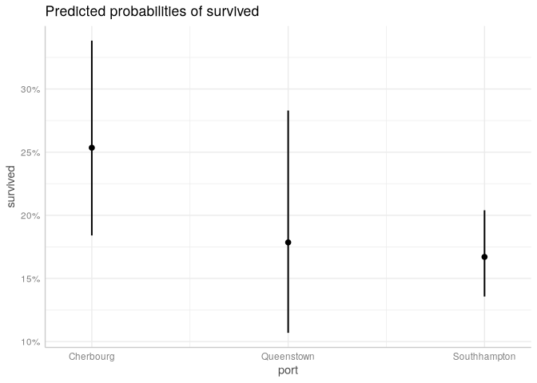
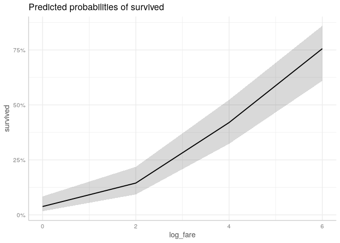
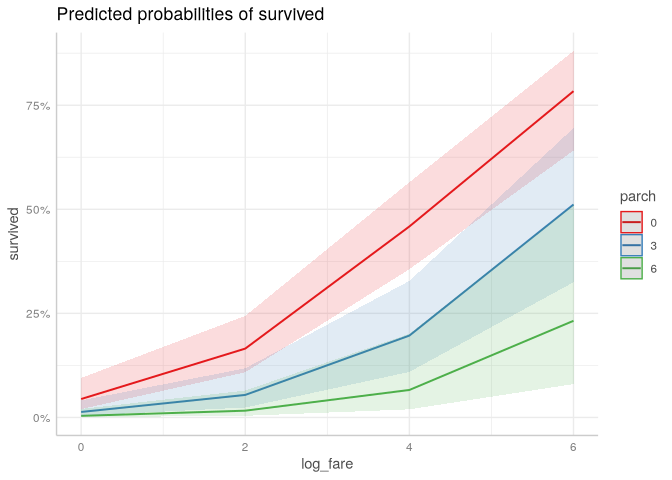
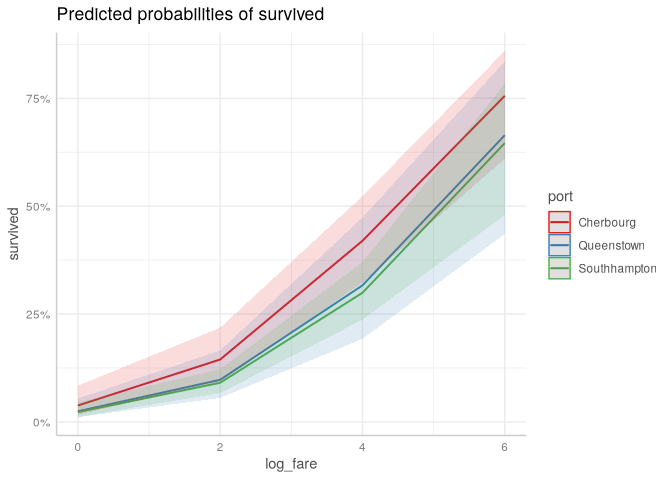
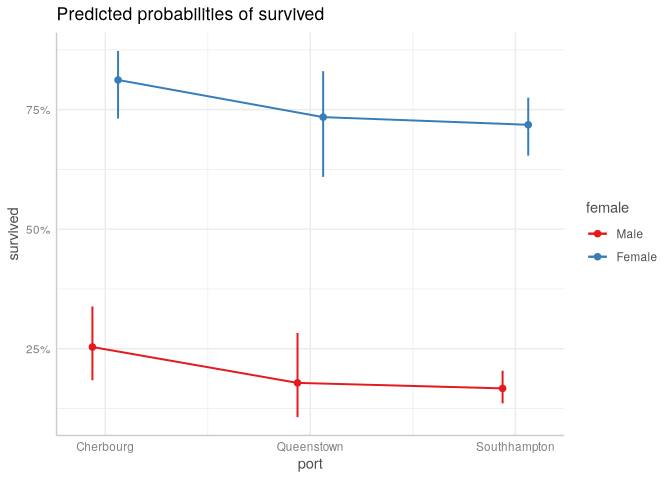
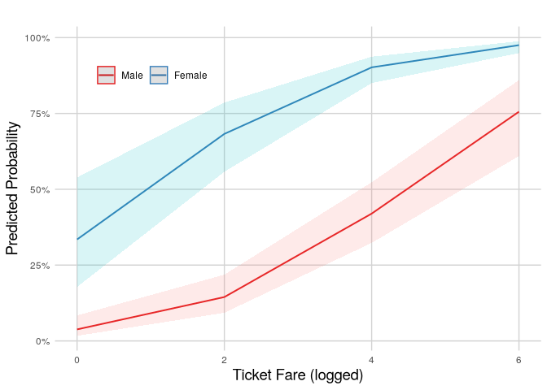

# Margins and Graph Design


[Source](https://bookdown.org/sarahwerth2024/CategoricalBook/review-margins-graph-design-r.html)

``` r
libraries <- list(
  "tidyverse", "ggeffects", 
  "janitor", "margins"
)
invisible(lapply(libraries, library, character.only = TRUE))
```

# Question

What characteristics of passengers is associated with survival?

# Margins

Margins refers to predicted values or marginal effects.

In regression with binary outcome, the predicted value is a predicted
probability. In regression with a count outcome, the predicted value is
a count. Can use `ggpredict`.

A marginal effect tells how much the outcome changes based on one unit
change in the variable. It is a slope, which may not be constant. Use
`margins`.

``` r
titanic_df <- read_csv("data/titanic_df.csv")
```

``` r
titanic <- titanic_df %>%
  mutate(
    port = factor(
      port,
      labels = c("Cherbourg", "Queenstown", "Southhampton")
    ),
    female = factor(female, labels = c("Male", "Female")),
    pclass = factor(pclass,
      labels = c("1st (Upper)", "2nd (Middle)", "3rd (Lower)")
    )
  )
```

``` r
fit1 <- glm(survived ~ port + female + log_fare + parch,
            data = titanic,
            family = binomial(link = "logit"))
```

# Predicted Values

Three decisions must be made:

## What is the variable of focus?

If categorical, include in terms. If continuous, must supply values for
the varible to plot.

``` r
ggpredict(fit1, terms = "port") %>% 
  plot()
```



``` r
ggpredict(fit1, terms = "log_fare[0, 2, 4, 6]") %>% 
  plot()
```



## Add additional variable?

More than two variables gets confusing.

``` r
ggpredict(fit1,
          terms = c("log_fare[0, 2, 4, 6]", "parch[0, 3, 6]")) %>% 
  plot()
```



``` r
ggpredict(fit1,
          terms = c("log_fare[0, 2, 4, 6]", "port")) %>% 
  plot()
```



``` r
ggpredict(fit1, terms = c("port", "female")) %>% 
  plot(connect_lines = TRUE)
```



## How to treat the other X variables

- Hold at means
- Use representative values
- Run with observed values and compute the average predicted
  value/effect

Means is the default.

``` r
ggpredict(fit1, terms = "port")
```

    # Predicted probabilities of survived

    port         | Predicted |     95% CI
    -------------------------------------
    Cherbourg    |      0.25 | 0.18, 0.34
    Queenstown   |      0.18 | 0.11, 0.28
    Southhampton |      0.17 | 0.14, 0.20

    Adjusted for:
    *   female = Male
    * log_fare = 2.96
    *    parch = 0.38

For representative values, use the `condition` argument.

``` r
ggpredict(fit1, terms = "port",
          condition = c(female = "Female", log_fare = 2, parch = 2))
```

    # Predicted probabilities of survived

    port         | Predicted |     95% CI
    -------------------------------------
    Cherbourg    |      0.52 | 0.37, 0.68
    Queenstown   |      0.41 | 0.26, 0.58
    Southhampton |      0.39 | 0.28, 0.51

``` r
predict_response(fit1, "port", margin = "empirical",
                 condition = c(female = "Female", log_fare = 2, parch = 2))
```

    # Average predicted probabilities of survived

    port         | Predicted |     95% CI
    -------------------------------------
    Cherbourg    |      0.52 | 0.37, 0.68
    Queenstown   |      0.41 | 0.26, 0.58
    Southhampton |      0.39 | 0.28, 0.51

``` r
predict_response(fit1, "port", margin = "marginaleffects",
                 condition = c(female = "Female", log_fare = 2, parch = 2))
```

    # Average predicted probabilities of survived

    port         | Predicted |     95% CI
    -------------------------------------
    Cherbourg    |      0.52 | 0.37, 0.68
    Queenstown   |      0.41 | 0.26, 0.58
    Southhampton |      0.39 | 0.28, 0.51

# Marginal Effects

Categorical example

``` r
margins(fit1, variables = "port")
```

    Average marginal effects

    glm(formula = survived ~ port + female + log_fare + parch, family = binomial(link = "logit"),     data = titanic)

     portQueenstown portSouthhampton
           -0.07146         -0.08379

Continuous example

``` r
margins(fit1, variables = "log_fare")
```

    Average marginal effects

    glm(formula = survived ~ port + female + log_fare + parch, family = binomial(link = "logit"),     data = titanic)

     log_fare
       0.1112

Continuous with specified values

``` r
margins(fit1, variables = "log_fare",
        at = list(log_fare = c(0, 2, 4, 6)))
```

    Average marginal effects at specified values

    glm(formula = survived ~ port + female + log_fare + parch, family = binomial(link = "logit"),     data = titanic)

     at(log_fare) log_fare
                0   0.0581
                2   0.1044
                4   0.1365
                6   0.1117

Handling the other variables.

Marginal effects at means

``` r
margins(fit1, variables = "port",
        at = list(
          female = "Male", log_fare = mean(fit1$data$log_fare),
          parch = mean(fit1$data$parch)
        ))
```

    Average marginal effects at specified values

    glm(formula = survived ~ port + female + log_fare + parch, family = binomial(link = "logit"),     data = titanic)

     at(female) at(log_fare) at(parch) portQueenstown portSouthhampton
           Male        2.962    0.3816        -0.0751         -0.08661

Marginal effects with representative values

``` r
margins(fit1, variables = "port",
        at = list(female = "Male", log_fare = 2, parch = 2))
```

    Average marginal effects at specified values

    glm(formula = survived ~ port + female + log_fare + parch, family = binomial(link = "logit"),     data = titanic)

     at(female) at(log_fare) at(parch) portQueenstown portSouthhampton
           Male            2         2       -0.02719         -0.03105

Average marginal effects

``` r
margins(fit1, variables = "port")
```

    Average marginal effects

    glm(formula = survived ~ port + female + log_fare + parch, family = binomial(link = "logit"),     data = titanic)

     portQueenstown portSouthhampton
           -0.07146         -0.08379

# Plot

``` r
ggpredict(fit1, terms = c("log_fare[0, 2, 4, 6]", "female")) %>%
    plot() +
    labs(
      x = "Ticket Fare (logged)",
      y = "Predicted Probability",
      title = ""
    ) +
    scale_color_brewer(palette = "Set1",
                       labels = c("Male", "Female")) +
    theme_minimal() +
    theme(
      axis.title = element_text(size = 14),
      panel.grid.minor = element_blank(),
      panel.grid.major = element_line(color = "lightgrey"),
      legend.position = c(.2,.85), 
      legend.title = element_blank(),
      legend.direction = "horizontal"
      )
```


