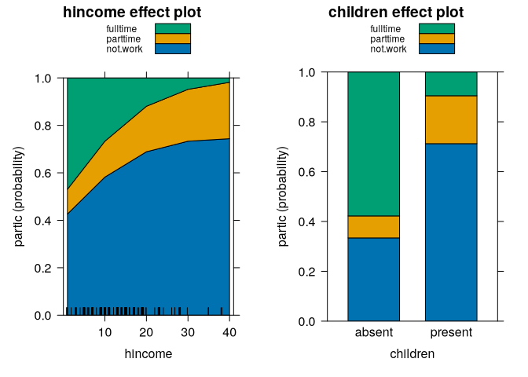
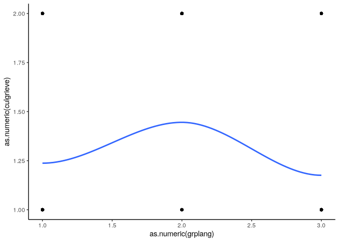
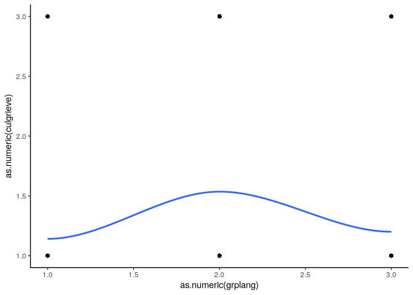
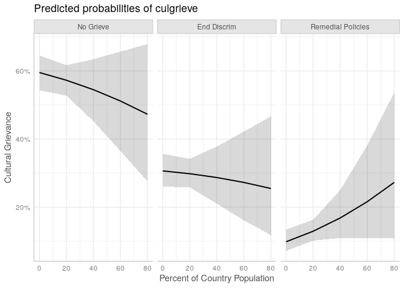
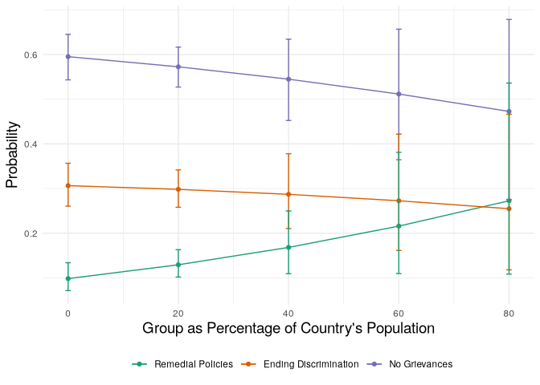
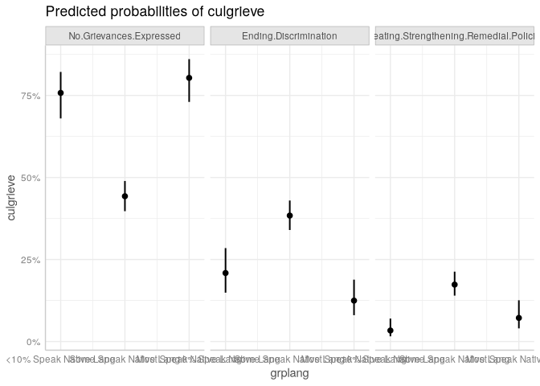
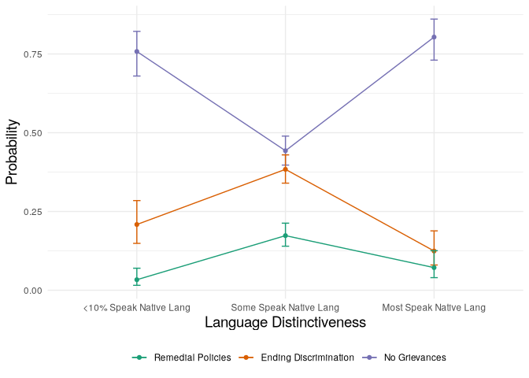

# Multinomial Logistic Regression


[Source](https://bookdown.org/sarahwerth2024/CategoricalBook/multinomial-logit-regression-r.html)

``` r
libraries <- list(
  "tidyverse", "nnet", "broom", "knitr",
  "kableExtra", "gtsummary", "ggeffects",
  "marginaleffects", "car", "gt"
)
invisible(lapply(libraries, library, character.only = TRUE))
```

``` r
data("Womenlf", package = "carData")
Womenlf <- Womenlf %>% 
  mutate(partic = factor(partic, levels=c('not.work', 'parttime', 'fulltime')))
```

``` r
wlf_multinom <- multinom(partic ~ hincome + children,
                         data = Womenlf, Hess = TRUE)
```

    # weights:  12 (6 variable)
    initial  value 288.935032 
    iter  10 value 211.454772
    final  value 211.440963 
    converged

``` r
summary(wlf_multinom, Wald = TRUE)
```

    Call:
    multinom(formula = partic ~ hincome + children, data = Womenlf, 
        Hess = TRUE)

    Coefficients:
             (Intercept)      hincome childrenpresent
    parttime   -1.432321  0.006893838      0.02145558
    fulltime    1.982842 -0.097232073     -2.55860537

    Std. Errors:
             (Intercept)    hincome childrenpresent
    parttime   0.5924627 0.02345484       0.4690352
    fulltime   0.4841789 0.02809599       0.3621999

    Value/SE (Wald statistics):
             (Intercept)    hincome childrenpresent
    parttime   -2.417573  0.2939197      0.04574407
    fulltime    4.095266 -3.4607098     -7.06407045

    Residual Deviance: 422.8819 
    AIC: 434.8819 

``` r
effects::allEffects(wlf_multinom) %>% 
  plot(style = "stacked")
```



``` r
mar_df <- read_csv("data/M.A.R_Cleaned.csv")
```

``` r
mar <- mar_df %>%
  mutate(
    culgrieve = factor(
      culgrieve,
      labels = c(
        "No Grievances Expressed",
        "Ending Discrimination",
        "Creating/Strengthening Remedial Policies"
      )
    ),
    legisrep = factor(
      legisrep,
      labels = c("No", "Yes")
    ),
    execrep = factor(
      execrep,
      labels = c("No", "Yes")
    ),
    grplang = factor(
      grplang,
      labels = c(
        "<10% Speak Native Lang",
        "Some Speak Native Lang",
        "Most Speak Native Lang"
      )
    ),
    trsntlkin = factor(
      trsntlkin,
      labels = c(
        "No Close Kindred",
        "Close Kindred/Not Adjoining Base",
        "Close Kindred, Adjoining Base",
        "Close Kindred, More than 1 Country"
      )
    ),
  )
```

# Multinomial Logit Regression

## Equation

Compares each category to a base category, and calculates the relative
log odds.

$$\ln\left(\frac{P_{categoryB}}{P_{categoryA}}\right)$$

$$\ln\left(\frac{P}{1-P}\right) = \beta_0 + \beta_1X_1 + ... \beta_kX_k$$

The base category is a matter requiring consideration.

## Interpretation

Four options:

1.  Relative Log Odds - Equivalent to log-odds
2.  Relative Ris Ratios - Equivalent to odds ratios. Calculated by
    $e^\beta$.
3.  Predicted Probabilities - As logistic regression, probability of
    falling into a specific category.
4.  Marginal Effects - As logistic regression, probability of failing
    into a specific category.

The latter two do not reference the base category. BUT if the
independent variable is categorical, no predicted probabilities for the
base category are produced.

The output provides coefficients tellint the relative log-odds or
relative risk of being in the category relative to the base category.

## Assumptions

1.  Independence of irrelevant alternatives

The likelihood of being in one category compared to the base should not
change with the addition of other categories. Decide if two options are
relatively similar compared to the others.

2.  Outcome is categorical
3.  Log-odds of outcome and independent variables have a linear
    relationship
4.  Errors are independent - no obvious clusters
5.  No severe multicolinearity

# Running a model

We will be running a multinomial logistic regression to see what
characteristics are associated with the types of cultural grievances
expressed by ethnocultural groups at risk. We will use the variable
‘culgrieve’ as our outcome, which represents the level of cultural
grievances expressed by ethnic groups at risk. This variable has three
values (the outcomes for our multinomial):

0 - No Grievances Expressed 1 - Ending Discrmination 2 -
Creating/Strengthening Remedial Policies

## Plot outcome and key independent variable

Category 0 compared to category 1

``` r
ggplot(mar %>% 
         filter(culgrieve == "No Grievances Expressed" |
                  culgrieve == "Ending Discrimination"),
       aes(x = as.numeric(grplang), y = as.numeric(culgrieve))) +
  geom_point() +
  geom_smooth(method = "loess", se = F) +
  theme_classic()
```



Category 0 to Category 2

``` r
ggplot(mar %>% filter(culgrieve == "No Grievances Expressed" | 
                        culgrieve == "Creating/Strengthening Remedial Policies"),
       aes(x = as.numeric(grplang), y = as.numeric(culgrieve))) +
  geom_point() +
  geom_smooth(method = "loess", se = FALSE) +
  theme_classic()
```



## Run models

``` r
fit_basic <- multinom(culgrieve ~ grplang, data = mar)
```

    # weights:  12 (6 variable)
    initial  value 931.623221 
    iter  10 value 776.021113
    final  value 775.917566 
    converged

### Display options for results

``` r
summary(fit_basic)
```

    Call:
    multinom(formula = culgrieve ~ grplang, data = mar)

    Coefficients:
                                             (Intercept)
    Ending Discrimination                      -1.168166
    Creating/Strengthening Remedial Policies   -2.581645
                                             grplangSome Speak Native Lang
    Ending Discrimination                                        0.9489541
    Creating/Strengthening Remedial Policies                     1.5751415
                                             grplangMost Speak Native Lang
    Ending Discrimination                                       -0.3786253
    Creating/Strengthening Remedial Policies                     0.3837751

    Std. Errors:
                                             (Intercept)
    Ending Discrimination                      0.1882289
    Creating/Strengthening Remedial Policies   0.3456718
                                             grplangSome Speak Native Lang
    Ending Discrimination                                        0.2108233
    Creating/Strengthening Remedial Policies                     0.3667327
                                             grplangMost Speak Native Lang
    Ending Discrimination                                        0.2969347
    Creating/Strengthening Remedial Policies                     0.4605736

    Residual Deviance: 1551.835 
    AIC: 1563.835 

``` r
tidy(fit_basic, conf.int = T)
```

    # A tibble: 6 × 8
      y.level         term  estimate std.error statistic  p.value conf.low conf.high
      <chr>           <chr>    <dbl>     <dbl>     <dbl>    <dbl>    <dbl>     <dbl>
    1 Ending Discrim… (Int…   -1.17      0.188    -6.21  5.43e-10   -1.54     -0.799
    2 Ending Discrim… grpl…    0.949     0.211     4.50  6.76e- 6    0.536     1.36 
    3 Ending Discrim… grpl…   -0.379     0.297    -1.28  2.02e- 1   -0.961     0.203
    4 Creating/Stren… (Int…   -2.58      0.346    -7.47  8.11e-14   -3.26     -1.90 
    5 Creating/Stren… grpl…    1.58      0.367     4.30  1.75e- 5    0.856     2.29 
    6 Creating/Stren… grpl…    0.384     0.461     0.833 4.05e- 1   -0.519     1.29 

``` r
tidy(fit_basic, conf.int = T) %>% 
  kable() %>% 
  kable_styling("basic", full_width = F)
```

``` r
tidy(fit_basic, conf.int = T) %>% 
  gt() %>% 
  fmt_number(decimals = 4)
```

<div id="csjskkjvdi" style="padding-left:0px;padding-right:0px;padding-top:10px;padding-bottom:10px;overflow-x:auto;overflow-y:auto;width:auto;height:auto;">
<style>#csjskkjvdi table {
  font-family: system-ui, 'Segoe UI', Roboto, Helvetica, Arial, sans-serif, 'Apple Color Emoji', 'Segoe UI Emoji', 'Segoe UI Symbol', 'Noto Color Emoji';
  -webkit-font-smoothing: antialiased;
  -moz-osx-font-smoothing: grayscale;
}
&#10;#csjskkjvdi thead, #csjskkjvdi tbody, #csjskkjvdi tfoot, #csjskkjvdi tr, #csjskkjvdi td, #csjskkjvdi th {
  border-style: none;
}
&#10;#csjskkjvdi p {
  margin: 0;
  padding: 0;
}
&#10;#csjskkjvdi .gt_table {
  display: table;
  border-collapse: collapse;
  line-height: normal;
  margin-left: auto;
  margin-right: auto;
  color: #333333;
  font-size: 16px;
  font-weight: normal;
  font-style: normal;
  background-color: #FFFFFF;
  width: auto;
  border-top-style: solid;
  border-top-width: 2px;
  border-top-color: #A8A8A8;
  border-right-style: none;
  border-right-width: 2px;
  border-right-color: #D3D3D3;
  border-bottom-style: solid;
  border-bottom-width: 2px;
  border-bottom-color: #A8A8A8;
  border-left-style: none;
  border-left-width: 2px;
  border-left-color: #D3D3D3;
}
&#10;#csjskkjvdi .gt_caption {
  padding-top: 4px;
  padding-bottom: 4px;
}
&#10;#csjskkjvdi .gt_title {
  color: #333333;
  font-size: 125%;
  font-weight: initial;
  padding-top: 4px;
  padding-bottom: 4px;
  padding-left: 5px;
  padding-right: 5px;
  border-bottom-color: #FFFFFF;
  border-bottom-width: 0;
}
&#10;#csjskkjvdi .gt_subtitle {
  color: #333333;
  font-size: 85%;
  font-weight: initial;
  padding-top: 3px;
  padding-bottom: 5px;
  padding-left: 5px;
  padding-right: 5px;
  border-top-color: #FFFFFF;
  border-top-width: 0;
}
&#10;#csjskkjvdi .gt_heading {
  background-color: #FFFFFF;
  text-align: center;
  border-bottom-color: #FFFFFF;
  border-left-style: none;
  border-left-width: 1px;
  border-left-color: #D3D3D3;
  border-right-style: none;
  border-right-width: 1px;
  border-right-color: #D3D3D3;
}
&#10;#csjskkjvdi .gt_bottom_border {
  border-bottom-style: solid;
  border-bottom-width: 2px;
  border-bottom-color: #D3D3D3;
}
&#10;#csjskkjvdi .gt_col_headings {
  border-top-style: solid;
  border-top-width: 2px;
  border-top-color: #D3D3D3;
  border-bottom-style: solid;
  border-bottom-width: 2px;
  border-bottom-color: #D3D3D3;
  border-left-style: none;
  border-left-width: 1px;
  border-left-color: #D3D3D3;
  border-right-style: none;
  border-right-width: 1px;
  border-right-color: #D3D3D3;
}
&#10;#csjskkjvdi .gt_col_heading {
  color: #333333;
  background-color: #FFFFFF;
  font-size: 100%;
  font-weight: normal;
  text-transform: inherit;
  border-left-style: none;
  border-left-width: 1px;
  border-left-color: #D3D3D3;
  border-right-style: none;
  border-right-width: 1px;
  border-right-color: #D3D3D3;
  vertical-align: bottom;
  padding-top: 5px;
  padding-bottom: 6px;
  padding-left: 5px;
  padding-right: 5px;
  overflow-x: hidden;
}
&#10;#csjskkjvdi .gt_column_spanner_outer {
  color: #333333;
  background-color: #FFFFFF;
  font-size: 100%;
  font-weight: normal;
  text-transform: inherit;
  padding-top: 0;
  padding-bottom: 0;
  padding-left: 4px;
  padding-right: 4px;
}
&#10;#csjskkjvdi .gt_column_spanner_outer:first-child {
  padding-left: 0;
}
&#10;#csjskkjvdi .gt_column_spanner_outer:last-child {
  padding-right: 0;
}
&#10;#csjskkjvdi .gt_column_spanner {
  border-bottom-style: solid;
  border-bottom-width: 2px;
  border-bottom-color: #D3D3D3;
  vertical-align: bottom;
  padding-top: 5px;
  padding-bottom: 5px;
  overflow-x: hidden;
  display: inline-block;
  width: 100%;
}
&#10;#csjskkjvdi .gt_spanner_row {
  border-bottom-style: hidden;
}
&#10;#csjskkjvdi .gt_group_heading {
  padding-top: 8px;
  padding-bottom: 8px;
  padding-left: 5px;
  padding-right: 5px;
  color: #333333;
  background-color: #FFFFFF;
  font-size: 100%;
  font-weight: initial;
  text-transform: inherit;
  border-top-style: solid;
  border-top-width: 2px;
  border-top-color: #D3D3D3;
  border-bottom-style: solid;
  border-bottom-width: 2px;
  border-bottom-color: #D3D3D3;
  border-left-style: none;
  border-left-width: 1px;
  border-left-color: #D3D3D3;
  border-right-style: none;
  border-right-width: 1px;
  border-right-color: #D3D3D3;
  vertical-align: middle;
  text-align: left;
}
&#10;#csjskkjvdi .gt_empty_group_heading {
  padding: 0.5px;
  color: #333333;
  background-color: #FFFFFF;
  font-size: 100%;
  font-weight: initial;
  border-top-style: solid;
  border-top-width: 2px;
  border-top-color: #D3D3D3;
  border-bottom-style: solid;
  border-bottom-width: 2px;
  border-bottom-color: #D3D3D3;
  vertical-align: middle;
}
&#10;#csjskkjvdi .gt_from_md > :first-child {
  margin-top: 0;
}
&#10;#csjskkjvdi .gt_from_md > :last-child {
  margin-bottom: 0;
}
&#10;#csjskkjvdi .gt_row {
  padding-top: 8px;
  padding-bottom: 8px;
  padding-left: 5px;
  padding-right: 5px;
  margin: 10px;
  border-top-style: solid;
  border-top-width: 1px;
  border-top-color: #D3D3D3;
  border-left-style: none;
  border-left-width: 1px;
  border-left-color: #D3D3D3;
  border-right-style: none;
  border-right-width: 1px;
  border-right-color: #D3D3D3;
  vertical-align: middle;
  overflow-x: hidden;
}
&#10;#csjskkjvdi .gt_stub {
  color: #333333;
  background-color: #FFFFFF;
  font-size: 100%;
  font-weight: initial;
  text-transform: inherit;
  border-right-style: solid;
  border-right-width: 2px;
  border-right-color: #D3D3D3;
  padding-left: 5px;
  padding-right: 5px;
}
&#10;#csjskkjvdi .gt_stub_row_group {
  color: #333333;
  background-color: #FFFFFF;
  font-size: 100%;
  font-weight: initial;
  text-transform: inherit;
  border-right-style: solid;
  border-right-width: 2px;
  border-right-color: #D3D3D3;
  padding-left: 5px;
  padding-right: 5px;
  vertical-align: top;
}
&#10;#csjskkjvdi .gt_row_group_first td {
  border-top-width: 2px;
}
&#10;#csjskkjvdi .gt_row_group_first th {
  border-top-width: 2px;
}
&#10;#csjskkjvdi .gt_summary_row {
  color: #333333;
  background-color: #FFFFFF;
  text-transform: inherit;
  padding-top: 8px;
  padding-bottom: 8px;
  padding-left: 5px;
  padding-right: 5px;
}
&#10;#csjskkjvdi .gt_first_summary_row {
  border-top-style: solid;
  border-top-color: #D3D3D3;
}
&#10;#csjskkjvdi .gt_first_summary_row.thick {
  border-top-width: 2px;
}
&#10;#csjskkjvdi .gt_last_summary_row {
  padding-top: 8px;
  padding-bottom: 8px;
  padding-left: 5px;
  padding-right: 5px;
  border-bottom-style: solid;
  border-bottom-width: 2px;
  border-bottom-color: #D3D3D3;
}
&#10;#csjskkjvdi .gt_grand_summary_row {
  color: #333333;
  background-color: #FFFFFF;
  text-transform: inherit;
  padding-top: 8px;
  padding-bottom: 8px;
  padding-left: 5px;
  padding-right: 5px;
}
&#10;#csjskkjvdi .gt_first_grand_summary_row {
  padding-top: 8px;
  padding-bottom: 8px;
  padding-left: 5px;
  padding-right: 5px;
  border-top-style: double;
  border-top-width: 6px;
  border-top-color: #D3D3D3;
}
&#10;#csjskkjvdi .gt_last_grand_summary_row_top {
  padding-top: 8px;
  padding-bottom: 8px;
  padding-left: 5px;
  padding-right: 5px;
  border-bottom-style: double;
  border-bottom-width: 6px;
  border-bottom-color: #D3D3D3;
}
&#10;#csjskkjvdi .gt_striped {
  background-color: rgba(128, 128, 128, 0.05);
}
&#10;#csjskkjvdi .gt_table_body {
  border-top-style: solid;
  border-top-width: 2px;
  border-top-color: #D3D3D3;
  border-bottom-style: solid;
  border-bottom-width: 2px;
  border-bottom-color: #D3D3D3;
}
&#10;#csjskkjvdi .gt_footnotes {
  color: #333333;
  background-color: #FFFFFF;
  border-bottom-style: none;
  border-bottom-width: 2px;
  border-bottom-color: #D3D3D3;
  border-left-style: none;
  border-left-width: 2px;
  border-left-color: #D3D3D3;
  border-right-style: none;
  border-right-width: 2px;
  border-right-color: #D3D3D3;
}
&#10;#csjskkjvdi .gt_footnote {
  margin: 0px;
  font-size: 90%;
  padding-top: 4px;
  padding-bottom: 4px;
  padding-left: 5px;
  padding-right: 5px;
}
&#10;#csjskkjvdi .gt_sourcenotes {
  color: #333333;
  background-color: #FFFFFF;
  border-bottom-style: none;
  border-bottom-width: 2px;
  border-bottom-color: #D3D3D3;
  border-left-style: none;
  border-left-width: 2px;
  border-left-color: #D3D3D3;
  border-right-style: none;
  border-right-width: 2px;
  border-right-color: #D3D3D3;
}
&#10;#csjskkjvdi .gt_sourcenote {
  font-size: 90%;
  padding-top: 4px;
  padding-bottom: 4px;
  padding-left: 5px;
  padding-right: 5px;
}
&#10;#csjskkjvdi .gt_left {
  text-align: left;
}
&#10;#csjskkjvdi .gt_center {
  text-align: center;
}
&#10;#csjskkjvdi .gt_right {
  text-align: right;
  font-variant-numeric: tabular-nums;
}
&#10;#csjskkjvdi .gt_font_normal {
  font-weight: normal;
}
&#10;#csjskkjvdi .gt_font_bold {
  font-weight: bold;
}
&#10;#csjskkjvdi .gt_font_italic {
  font-style: italic;
}
&#10;#csjskkjvdi .gt_super {
  font-size: 65%;
}
&#10;#csjskkjvdi .gt_footnote_marks {
  font-size: 75%;
  vertical-align: 0.4em;
  position: initial;
}
&#10;#csjskkjvdi .gt_asterisk {
  font-size: 100%;
  vertical-align: 0;
}
&#10;#csjskkjvdi .gt_indent_1 {
  text-indent: 5px;
}
&#10;#csjskkjvdi .gt_indent_2 {
  text-indent: 10px;
}
&#10;#csjskkjvdi .gt_indent_3 {
  text-indent: 15px;
}
&#10;#csjskkjvdi .gt_indent_4 {
  text-indent: 20px;
}
&#10;#csjskkjvdi .gt_indent_5 {
  text-indent: 25px;
}
&#10;#csjskkjvdi .katex-display {
  display: inline-flex !important;
  margin-bottom: 0.75em !important;
}
&#10;#csjskkjvdi div.Reactable > div.rt-table > div.rt-thead > div.rt-tr.rt-tr-group-header > div.rt-th-group:after {
  height: 0px !important;
}
</style>

| y.level | term | estimate | std.error | statistic | p.value | conf.low | conf.high |
|----|----|----|----|----|----|----|----|
| Ending Discrimination | (Intercept) | −1.1682 | 0.1882 | −6.2061 | 0.0000 | −1.5371 | −0.7992 |
| Ending Discrimination | grplangSome Speak Native Lang | 0.9490 | 0.2108 | 4.5012 | 0.0000 | 0.5357 | 1.3622 |
| Ending Discrimination | grplangMost Speak Native Lang | −0.3786 | 0.2969 | −1.2751 | 0.2023 | −0.9606 | 0.2034 |
| Creating/Strengthening Remedial Policies | (Intercept) | −2.5816 | 0.3457 | −7.4685 | 0.0000 | −3.2591 | −1.9041 |
| Creating/Strengthening Remedial Policies | grplangSome Speak Native Lang | 1.5751 | 0.3667 | 4.2951 | 0.0000 | 0.8564 | 2.2939 |
| Creating/Strengthening Remedial Policies | grplangMost Speak Native Lang | 0.3838 | 0.4606 | 0.8333 | 0.4047 | −0.5189 | 1.2865 |

</div>

``` r
fit_full <- multinom(culgrieve ~ grplang + trsntlkin + 
                       legisrep + execrep + pct_ctry, 
                     data = mar, Hess = TRUE)
```

    # weights:  30 (18 variable)
    initial  value 900.862077 
    iter  10 value 728.955975
    iter  20 value 714.153317
    final  value 713.961524 
    converged

``` r
tidy(fit_full)
```

    # A tibble: 18 × 6
       y.level                           term  estimate std.error statistic  p.value
       <chr>                             <chr>    <dbl>     <dbl>     <dbl>    <dbl>
     1 Ending Discrimination             (Int… -2.35e+0   0.378     -6.22   5.07e-10
     2 Ending Discrimination             grpl…  1.15e+0   0.242      4.73   2.22e- 6
     3 Ending Discrimination             grpl… -5.75e-1   0.329     -1.75   8.08e- 2
     4 Ending Discrimination             trsn…  1.30e+0   0.302      4.32   1.56e- 5
     5 Ending Discrimination             trsn…  1.05e+0   0.320      3.28   1.05e- 3
     6 Ending Discrimination             trsn…  8.77e-1   0.322      2.73   6.43e- 3
     7 Ending Discrimination             legi…  6.18e-1   0.203      3.04   2.39e- 3
     8 Ending Discrimination             exec… -8.26e-1   0.213     -3.87   1.07e- 4
     9 Ending Discrimination             pct_…  5.75e-4   0.00702    0.0819 9.35e- 1
    10 Creating/Strengthening Remedial … (Int… -3.82e+0   0.565     -6.77   1.30e-11
    11 Creating/Strengthening Remedial … grpl…  2.18e+0   0.420      5.20   2.03e- 7
    12 Creating/Strengthening Remedial … grpl…  7.05e-1   0.499      1.41   1.58e- 1
    13 Creating/Strengthening Remedial … trsn…  1.05e+0   0.354      2.98   2.88e- 3
    14 Creating/Strengthening Remedial … trsn…  7.40e-1   0.375      1.97   4.84e- 2
    15 Creating/Strengthening Remedial … trsn… -9.95e-1   0.504     -1.97   4.84e- 2
    16 Creating/Strengthening Remedial … legi…  3.12e-1   0.272      1.15   2.50e- 1
    17 Creating/Strengthening Remedial … exec… -2.52e-1   0.271     -0.928  3.53e- 1
    18 Creating/Strengthening Remedial … pct_…  1.56e-2   0.00883    1.77   7.68e- 2

### Relative risk ratios

Option 1 - exponentiate the coefficients with `tbl_regression` and make
a table.

``` r
tbl_regression(fit_full, exp = TRUE)
```

<div id="sucseheccl" style="padding-left:0px;padding-right:0px;padding-top:10px;padding-bottom:10px;overflow-x:auto;overflow-y:auto;width:auto;height:auto;">
<style>#sucseheccl table {
  font-family: system-ui, 'Segoe UI', Roboto, Helvetica, Arial, sans-serif, 'Apple Color Emoji', 'Segoe UI Emoji', 'Segoe UI Symbol', 'Noto Color Emoji';
  -webkit-font-smoothing: antialiased;
  -moz-osx-font-smoothing: grayscale;
}
&#10;#sucseheccl thead, #sucseheccl tbody, #sucseheccl tfoot, #sucseheccl tr, #sucseheccl td, #sucseheccl th {
  border-style: none;
}
&#10;#sucseheccl p {
  margin: 0;
  padding: 0;
}
&#10;#sucseheccl .gt_table {
  display: table;
  border-collapse: collapse;
  line-height: normal;
  margin-left: auto;
  margin-right: auto;
  color: #333333;
  font-size: 16px;
  font-weight: normal;
  font-style: normal;
  background-color: #FFFFFF;
  width: auto;
  border-top-style: solid;
  border-top-width: 2px;
  border-top-color: #A8A8A8;
  border-right-style: none;
  border-right-width: 2px;
  border-right-color: #D3D3D3;
  border-bottom-style: solid;
  border-bottom-width: 2px;
  border-bottom-color: #A8A8A8;
  border-left-style: none;
  border-left-width: 2px;
  border-left-color: #D3D3D3;
}
&#10;#sucseheccl .gt_caption {
  padding-top: 4px;
  padding-bottom: 4px;
}
&#10;#sucseheccl .gt_title {
  color: #333333;
  font-size: 125%;
  font-weight: initial;
  padding-top: 4px;
  padding-bottom: 4px;
  padding-left: 5px;
  padding-right: 5px;
  border-bottom-color: #FFFFFF;
  border-bottom-width: 0;
}
&#10;#sucseheccl .gt_subtitle {
  color: #333333;
  font-size: 85%;
  font-weight: initial;
  padding-top: 3px;
  padding-bottom: 5px;
  padding-left: 5px;
  padding-right: 5px;
  border-top-color: #FFFFFF;
  border-top-width: 0;
}
&#10;#sucseheccl .gt_heading {
  background-color: #FFFFFF;
  text-align: center;
  border-bottom-color: #FFFFFF;
  border-left-style: none;
  border-left-width: 1px;
  border-left-color: #D3D3D3;
  border-right-style: none;
  border-right-width: 1px;
  border-right-color: #D3D3D3;
}
&#10;#sucseheccl .gt_bottom_border {
  border-bottom-style: solid;
  border-bottom-width: 2px;
  border-bottom-color: #D3D3D3;
}
&#10;#sucseheccl .gt_col_headings {
  border-top-style: solid;
  border-top-width: 2px;
  border-top-color: #D3D3D3;
  border-bottom-style: solid;
  border-bottom-width: 2px;
  border-bottom-color: #D3D3D3;
  border-left-style: none;
  border-left-width: 1px;
  border-left-color: #D3D3D3;
  border-right-style: none;
  border-right-width: 1px;
  border-right-color: #D3D3D3;
}
&#10;#sucseheccl .gt_col_heading {
  color: #333333;
  background-color: #FFFFFF;
  font-size: 100%;
  font-weight: normal;
  text-transform: inherit;
  border-left-style: none;
  border-left-width: 1px;
  border-left-color: #D3D3D3;
  border-right-style: none;
  border-right-width: 1px;
  border-right-color: #D3D3D3;
  vertical-align: bottom;
  padding-top: 5px;
  padding-bottom: 6px;
  padding-left: 5px;
  padding-right: 5px;
  overflow-x: hidden;
}
&#10;#sucseheccl .gt_column_spanner_outer {
  color: #333333;
  background-color: #FFFFFF;
  font-size: 100%;
  font-weight: normal;
  text-transform: inherit;
  padding-top: 0;
  padding-bottom: 0;
  padding-left: 4px;
  padding-right: 4px;
}
&#10;#sucseheccl .gt_column_spanner_outer:first-child {
  padding-left: 0;
}
&#10;#sucseheccl .gt_column_spanner_outer:last-child {
  padding-right: 0;
}
&#10;#sucseheccl .gt_column_spanner {
  border-bottom-style: solid;
  border-bottom-width: 2px;
  border-bottom-color: #D3D3D3;
  vertical-align: bottom;
  padding-top: 5px;
  padding-bottom: 5px;
  overflow-x: hidden;
  display: inline-block;
  width: 100%;
}
&#10;#sucseheccl .gt_spanner_row {
  border-bottom-style: hidden;
}
&#10;#sucseheccl .gt_group_heading {
  padding-top: 8px;
  padding-bottom: 8px;
  padding-left: 5px;
  padding-right: 5px;
  color: #333333;
  background-color: #FFFFFF;
  font-size: 100%;
  font-weight: initial;
  text-transform: inherit;
  border-top-style: solid;
  border-top-width: 2px;
  border-top-color: #D3D3D3;
  border-bottom-style: solid;
  border-bottom-width: 2px;
  border-bottom-color: #D3D3D3;
  border-left-style: none;
  border-left-width: 1px;
  border-left-color: #D3D3D3;
  border-right-style: none;
  border-right-width: 1px;
  border-right-color: #D3D3D3;
  vertical-align: middle;
  text-align: left;
}
&#10;#sucseheccl .gt_empty_group_heading {
  padding: 0.5px;
  color: #333333;
  background-color: #FFFFFF;
  font-size: 100%;
  font-weight: initial;
  border-top-style: solid;
  border-top-width: 2px;
  border-top-color: #D3D3D3;
  border-bottom-style: solid;
  border-bottom-width: 2px;
  border-bottom-color: #D3D3D3;
  vertical-align: middle;
}
&#10;#sucseheccl .gt_from_md > :first-child {
  margin-top: 0;
}
&#10;#sucseheccl .gt_from_md > :last-child {
  margin-bottom: 0;
}
&#10;#sucseheccl .gt_row {
  padding-top: 8px;
  padding-bottom: 8px;
  padding-left: 5px;
  padding-right: 5px;
  margin: 10px;
  border-top-style: solid;
  border-top-width: 1px;
  border-top-color: #D3D3D3;
  border-left-style: none;
  border-left-width: 1px;
  border-left-color: #D3D3D3;
  border-right-style: none;
  border-right-width: 1px;
  border-right-color: #D3D3D3;
  vertical-align: middle;
  overflow-x: hidden;
}
&#10;#sucseheccl .gt_stub {
  color: #333333;
  background-color: #FFFFFF;
  font-size: 100%;
  font-weight: initial;
  text-transform: inherit;
  border-right-style: solid;
  border-right-width: 2px;
  border-right-color: #D3D3D3;
  padding-left: 5px;
  padding-right: 5px;
}
&#10;#sucseheccl .gt_stub_row_group {
  color: #333333;
  background-color: #FFFFFF;
  font-size: 100%;
  font-weight: initial;
  text-transform: inherit;
  border-right-style: solid;
  border-right-width: 2px;
  border-right-color: #D3D3D3;
  padding-left: 5px;
  padding-right: 5px;
  vertical-align: top;
}
&#10;#sucseheccl .gt_row_group_first td {
  border-top-width: 2px;
}
&#10;#sucseheccl .gt_row_group_first th {
  border-top-width: 2px;
}
&#10;#sucseheccl .gt_summary_row {
  color: #333333;
  background-color: #FFFFFF;
  text-transform: inherit;
  padding-top: 8px;
  padding-bottom: 8px;
  padding-left: 5px;
  padding-right: 5px;
}
&#10;#sucseheccl .gt_first_summary_row {
  border-top-style: solid;
  border-top-color: #D3D3D3;
}
&#10;#sucseheccl .gt_first_summary_row.thick {
  border-top-width: 2px;
}
&#10;#sucseheccl .gt_last_summary_row {
  padding-top: 8px;
  padding-bottom: 8px;
  padding-left: 5px;
  padding-right: 5px;
  border-bottom-style: solid;
  border-bottom-width: 2px;
  border-bottom-color: #D3D3D3;
}
&#10;#sucseheccl .gt_grand_summary_row {
  color: #333333;
  background-color: #FFFFFF;
  text-transform: inherit;
  padding-top: 8px;
  padding-bottom: 8px;
  padding-left: 5px;
  padding-right: 5px;
}
&#10;#sucseheccl .gt_first_grand_summary_row {
  padding-top: 8px;
  padding-bottom: 8px;
  padding-left: 5px;
  padding-right: 5px;
  border-top-style: double;
  border-top-width: 6px;
  border-top-color: #D3D3D3;
}
&#10;#sucseheccl .gt_last_grand_summary_row_top {
  padding-top: 8px;
  padding-bottom: 8px;
  padding-left: 5px;
  padding-right: 5px;
  border-bottom-style: double;
  border-bottom-width: 6px;
  border-bottom-color: #D3D3D3;
}
&#10;#sucseheccl .gt_striped {
  background-color: rgba(128, 128, 128, 0.05);
}
&#10;#sucseheccl .gt_table_body {
  border-top-style: solid;
  border-top-width: 2px;
  border-top-color: #D3D3D3;
  border-bottom-style: solid;
  border-bottom-width: 2px;
  border-bottom-color: #D3D3D3;
}
&#10;#sucseheccl .gt_footnotes {
  color: #333333;
  background-color: #FFFFFF;
  border-bottom-style: none;
  border-bottom-width: 2px;
  border-bottom-color: #D3D3D3;
  border-left-style: none;
  border-left-width: 2px;
  border-left-color: #D3D3D3;
  border-right-style: none;
  border-right-width: 2px;
  border-right-color: #D3D3D3;
}
&#10;#sucseheccl .gt_footnote {
  margin: 0px;
  font-size: 90%;
  padding-top: 4px;
  padding-bottom: 4px;
  padding-left: 5px;
  padding-right: 5px;
}
&#10;#sucseheccl .gt_sourcenotes {
  color: #333333;
  background-color: #FFFFFF;
  border-bottom-style: none;
  border-bottom-width: 2px;
  border-bottom-color: #D3D3D3;
  border-left-style: none;
  border-left-width: 2px;
  border-left-color: #D3D3D3;
  border-right-style: none;
  border-right-width: 2px;
  border-right-color: #D3D3D3;
}
&#10;#sucseheccl .gt_sourcenote {
  font-size: 90%;
  padding-top: 4px;
  padding-bottom: 4px;
  padding-left: 5px;
  padding-right: 5px;
}
&#10;#sucseheccl .gt_left {
  text-align: left;
}
&#10;#sucseheccl .gt_center {
  text-align: center;
}
&#10;#sucseheccl .gt_right {
  text-align: right;
  font-variant-numeric: tabular-nums;
}
&#10;#sucseheccl .gt_font_normal {
  font-weight: normal;
}
&#10;#sucseheccl .gt_font_bold {
  font-weight: bold;
}
&#10;#sucseheccl .gt_font_italic {
  font-style: italic;
}
&#10;#sucseheccl .gt_super {
  font-size: 65%;
}
&#10;#sucseheccl .gt_footnote_marks {
  font-size: 75%;
  vertical-align: 0.4em;
  position: initial;
}
&#10;#sucseheccl .gt_asterisk {
  font-size: 100%;
  vertical-align: 0;
}
&#10;#sucseheccl .gt_indent_1 {
  text-indent: 5px;
}
&#10;#sucseheccl .gt_indent_2 {
  text-indent: 10px;
}
&#10;#sucseheccl .gt_indent_3 {
  text-indent: 15px;
}
&#10;#sucseheccl .gt_indent_4 {
  text-indent: 20px;
}
&#10;#sucseheccl .gt_indent_5 {
  text-indent: 25px;
}
&#10;#sucseheccl .katex-display {
  display: inline-flex !important;
  margin-bottom: 0.75em !important;
}
&#10;#sucseheccl div.Reactable > div.rt-table > div.rt-thead > div.rt-tr.rt-tr-group-header > div.rt-th-group:after {
  height: 0px !important;
}
</style>

<table class="gt_table" data-quarto-postprocess="true"
data-quarto-disable-processing="false" data-quarto-bootstrap="false">
<colgroup>
<col style="width: 25%" />
<col style="width: 25%" />
<col style="width: 25%" />
<col style="width: 25%" />
</colgroup>
<thead>
<tr class="gt_col_headings">
<th id="label" class="gt_col_heading gt_columns_bottom_border gt_left"
data-quarto-table-cell-role="th"
scope="col"><strong>Characteristic</strong></th>
<th id="estimate"
class="gt_col_heading gt_columns_bottom_border gt_center"
data-quarto-table-cell-role="th" scope="col"><strong>OR</strong></th>
<th id="conf.low"
class="gt_col_heading gt_columns_bottom_border gt_center"
data-quarto-table-cell-role="th" scope="col"><strong>95%
CI</strong></th>
<th id="p.value"
class="gt_col_heading gt_columns_bottom_border gt_center"
data-quarto-table-cell-role="th"
scope="col"><strong>p-value</strong></th>
</tr>
</thead>
<tbody class="gt_table_body">
<tr class="gt_group_heading_row">
<td colspan="4" id="Ending Discrimination" class="gt_group_heading"
data-quarto-table-cell-role="th" scope="colgroup">Ending
Discrimination</td>
</tr>
<tr class="gt_row_group_first">
<td class="gt_row gt_left"
headers="Ending Discrimination  label">grplang</td>
<td class="gt_row gt_center"
headers="Ending Discrimination  estimate"><br />
</td>
<td class="gt_row gt_center"
headers="Ending Discrimination  conf.low"><br />
</td>
<td class="gt_row gt_center"
headers="Ending Discrimination  p.value"><br />
</td>
</tr>
<tr>
<td class="gt_row gt_left"
headers="Ending Discrimination  label">    &lt;10% Speak Native
Lang</td>
<td class="gt_row gt_center"
headers="Ending Discrimination  estimate">—</td>
<td class="gt_row gt_center"
headers="Ending Discrimination  conf.low">—</td>
<td class="gt_row gt_center"
headers="Ending Discrimination  p.value"><br />
</td>
</tr>
<tr>
<td class="gt_row gt_left"
headers="Ending Discrimination  label">    Some Speak Native Lang</td>
<td class="gt_row gt_center"
headers="Ending Discrimination  estimate">3.15</td>
<td class="gt_row gt_center"
headers="Ending Discrimination  conf.low">1.96, 5.06</td>
<td class="gt_row gt_center"
headers="Ending Discrimination  p.value">&lt;0.001</td>
</tr>
<tr>
<td class="gt_row gt_left"
headers="Ending Discrimination  label">    Most Speak Native Lang</td>
<td class="gt_row gt_center"
headers="Ending Discrimination  estimate">0.56</td>
<td class="gt_row gt_center"
headers="Ending Discrimination  conf.low">0.30, 1.07</td>
<td class="gt_row gt_center"
headers="Ending Discrimination  p.value">0.081</td>
</tr>
<tr>
<td class="gt_row gt_left"
headers="Ending Discrimination  label">trsntlkin</td>
<td class="gt_row gt_center"
headers="Ending Discrimination  estimate"><br />
</td>
<td class="gt_row gt_center"
headers="Ending Discrimination  conf.low"><br />
</td>
<td class="gt_row gt_center"
headers="Ending Discrimination  p.value"><br />
</td>
</tr>
<tr>
<td class="gt_row gt_left" headers="Ending Discrimination  label">    No
Close Kindred</td>
<td class="gt_row gt_center"
headers="Ending Discrimination  estimate">—</td>
<td class="gt_row gt_center"
headers="Ending Discrimination  conf.low">—</td>
<td class="gt_row gt_center"
headers="Ending Discrimination  p.value"><br />
</td>
</tr>
<tr>
<td class="gt_row gt_left"
headers="Ending Discrimination  label">    Close Kindred/Not Adjoining
Base</td>
<td class="gt_row gt_center"
headers="Ending Discrimination  estimate">3.68</td>
<td class="gt_row gt_center"
headers="Ending Discrimination  conf.low">2.04, 6.65</td>
<td class="gt_row gt_center"
headers="Ending Discrimination  p.value">&lt;0.001</td>
</tr>
<tr>
<td class="gt_row gt_left"
headers="Ending Discrimination  label">    Close Kindred, Adjoining
Base</td>
<td class="gt_row gt_center"
headers="Ending Discrimination  estimate">2.86</td>
<td class="gt_row gt_center"
headers="Ending Discrimination  conf.low">1.52, 5.35</td>
<td class="gt_row gt_center"
headers="Ending Discrimination  p.value">0.001</td>
</tr>
<tr>
<td class="gt_row gt_left"
headers="Ending Discrimination  label">    Close Kindred, More than 1
Country</td>
<td class="gt_row gt_center"
headers="Ending Discrimination  estimate">2.40</td>
<td class="gt_row gt_center"
headers="Ending Discrimination  conf.low">1.28, 4.52</td>
<td class="gt_row gt_center"
headers="Ending Discrimination  p.value">0.006</td>
</tr>
<tr>
<td class="gt_row gt_left"
headers="Ending Discrimination  label">legisrep</td>
<td class="gt_row gt_center"
headers="Ending Discrimination  estimate"><br />
</td>
<td class="gt_row gt_center"
headers="Ending Discrimination  conf.low"><br />
</td>
<td class="gt_row gt_center"
headers="Ending Discrimination  p.value"><br />
</td>
</tr>
<tr>
<td class="gt_row gt_left"
headers="Ending Discrimination  label">    No</td>
<td class="gt_row gt_center"
headers="Ending Discrimination  estimate">—</td>
<td class="gt_row gt_center"
headers="Ending Discrimination  conf.low">—</td>
<td class="gt_row gt_center"
headers="Ending Discrimination  p.value"><br />
</td>
</tr>
<tr>
<td class="gt_row gt_left"
headers="Ending Discrimination  label">    Yes</td>
<td class="gt_row gt_center"
headers="Ending Discrimination  estimate">1.85</td>
<td class="gt_row gt_center"
headers="Ending Discrimination  conf.low">1.25, 2.76</td>
<td class="gt_row gt_center"
headers="Ending Discrimination  p.value">0.002</td>
</tr>
<tr>
<td class="gt_row gt_left"
headers="Ending Discrimination  label">execrep</td>
<td class="gt_row gt_center"
headers="Ending Discrimination  estimate"><br />
</td>
<td class="gt_row gt_center"
headers="Ending Discrimination  conf.low"><br />
</td>
<td class="gt_row gt_center"
headers="Ending Discrimination  p.value"><br />
</td>
</tr>
<tr>
<td class="gt_row gt_left"
headers="Ending Discrimination  label">    No</td>
<td class="gt_row gt_center"
headers="Ending Discrimination  estimate">—</td>
<td class="gt_row gt_center"
headers="Ending Discrimination  conf.low">—</td>
<td class="gt_row gt_center"
headers="Ending Discrimination  p.value"><br />
</td>
</tr>
<tr>
<td class="gt_row gt_left"
headers="Ending Discrimination  label">    Yes</td>
<td class="gt_row gt_center"
headers="Ending Discrimination  estimate">0.44</td>
<td class="gt_row gt_center"
headers="Ending Discrimination  conf.low">0.29, 0.67</td>
<td class="gt_row gt_center"
headers="Ending Discrimination  p.value">&lt;0.001</td>
</tr>
<tr>
<td class="gt_row gt_left"
headers="Ending Discrimination  label">pct_ctry</td>
<td class="gt_row gt_center"
headers="Ending Discrimination  estimate">1.00</td>
<td class="gt_row gt_center"
headers="Ending Discrimination  conf.low">0.99, 1.01</td>
<td class="gt_row gt_center"
headers="Ending Discrimination  p.value">&gt;0.9</td>
</tr>
<tr class="gt_group_heading_row">
<td colspan="4" id="Creating/Strengthening Remedial Policies"
class="gt_group_heading" data-quarto-table-cell-role="th"
scope="colgroup">Creating/Strengthening Remedial Policies</td>
</tr>
<tr class="gt_row_group_first">
<td class="gt_row gt_left"
headers="Creating/Strengthening Remedial Policies  label">grplang</td>
<td class="gt_row gt_center"
headers="Creating/Strengthening Remedial Policies  estimate"><br />
</td>
<td class="gt_row gt_center"
headers="Creating/Strengthening Remedial Policies  conf.low"><br />
</td>
<td class="gt_row gt_center"
headers="Creating/Strengthening Remedial Policies  p.value"><br />
</td>
</tr>
<tr>
<td class="gt_row gt_left"
headers="Creating/Strengthening Remedial Policies  label">    &lt;10%
Speak Native Lang</td>
<td class="gt_row gt_center"
headers="Creating/Strengthening Remedial Policies  estimate">—</td>
<td class="gt_row gt_center"
headers="Creating/Strengthening Remedial Policies  conf.low">—</td>
<td class="gt_row gt_center"
headers="Creating/Strengthening Remedial Policies  p.value"><br />
</td>
</tr>
<tr>
<td class="gt_row gt_left"
headers="Creating/Strengthening Remedial Policies  label">    Some Speak
Native Lang</td>
<td class="gt_row gt_center"
headers="Creating/Strengthening Remedial Policies  estimate">8.87</td>
<td class="gt_row gt_center"
headers="Creating/Strengthening Remedial Policies  conf.low">3.89,
20.2</td>
<td class="gt_row gt_center"
headers="Creating/Strengthening Remedial Policies  p.value">&lt;0.001</td>
</tr>
<tr>
<td class="gt_row gt_left"
headers="Creating/Strengthening Remedial Policies  label">    Most Speak
Native Lang</td>
<td class="gt_row gt_center"
headers="Creating/Strengthening Remedial Policies  estimate">2.02</td>
<td class="gt_row gt_center"
headers="Creating/Strengthening Remedial Policies  conf.low">0.76,
5.39</td>
<td class="gt_row gt_center"
headers="Creating/Strengthening Remedial Policies  p.value">0.2</td>
</tr>
<tr>
<td class="gt_row gt_left"
headers="Creating/Strengthening Remedial Policies  label">trsntlkin</td>
<td class="gt_row gt_center"
headers="Creating/Strengthening Remedial Policies  estimate"><br />
</td>
<td class="gt_row gt_center"
headers="Creating/Strengthening Remedial Policies  conf.low"><br />
</td>
<td class="gt_row gt_center"
headers="Creating/Strengthening Remedial Policies  p.value"><br />
</td>
</tr>
<tr>
<td class="gt_row gt_left"
headers="Creating/Strengthening Remedial Policies  label">    No Close
Kindred</td>
<td class="gt_row gt_center"
headers="Creating/Strengthening Remedial Policies  estimate">—</td>
<td class="gt_row gt_center"
headers="Creating/Strengthening Remedial Policies  conf.low">—</td>
<td class="gt_row gt_center"
headers="Creating/Strengthening Remedial Policies  p.value"><br />
</td>
</tr>
<tr>
<td class="gt_row gt_left"
headers="Creating/Strengthening Remedial Policies  label">    Close
Kindred/Not Adjoining Base</td>
<td class="gt_row gt_center"
headers="Creating/Strengthening Remedial Policies  estimate">2.87</td>
<td class="gt_row gt_center"
headers="Creating/Strengthening Remedial Policies  conf.low">1.43,
5.74</td>
<td class="gt_row gt_center"
headers="Creating/Strengthening Remedial Policies  p.value">0.003</td>
</tr>
<tr>
<td class="gt_row gt_left"
headers="Creating/Strengthening Remedial Policies  label">    Close
Kindred, Adjoining Base</td>
<td class="gt_row gt_center"
headers="Creating/Strengthening Remedial Policies  estimate">2.10</td>
<td class="gt_row gt_center"
headers="Creating/Strengthening Remedial Policies  conf.low">1.01,
4.37</td>
<td class="gt_row gt_center"
headers="Creating/Strengthening Remedial Policies  p.value">0.048</td>
</tr>
<tr>
<td class="gt_row gt_left"
headers="Creating/Strengthening Remedial Policies  label">    Close
Kindred, More than 1 Country</td>
<td class="gt_row gt_center"
headers="Creating/Strengthening Remedial Policies  estimate">0.37</td>
<td class="gt_row gt_center"
headers="Creating/Strengthening Remedial Policies  conf.low">0.14,
0.99</td>
<td class="gt_row gt_center"
headers="Creating/Strengthening Remedial Policies  p.value">0.048</td>
</tr>
<tr>
<td class="gt_row gt_left"
headers="Creating/Strengthening Remedial Policies  label">legisrep</td>
<td class="gt_row gt_center"
headers="Creating/Strengthening Remedial Policies  estimate"><br />
</td>
<td class="gt_row gt_center"
headers="Creating/Strengthening Remedial Policies  conf.low"><br />
</td>
<td class="gt_row gt_center"
headers="Creating/Strengthening Remedial Policies  p.value"><br />
</td>
</tr>
<tr>
<td class="gt_row gt_left"
headers="Creating/Strengthening Remedial Policies  label">    No</td>
<td class="gt_row gt_center"
headers="Creating/Strengthening Remedial Policies  estimate">—</td>
<td class="gt_row gt_center"
headers="Creating/Strengthening Remedial Policies  conf.low">—</td>
<td class="gt_row gt_center"
headers="Creating/Strengthening Remedial Policies  p.value"><br />
</td>
</tr>
<tr>
<td class="gt_row gt_left"
headers="Creating/Strengthening Remedial Policies  label">    Yes</td>
<td class="gt_row gt_center"
headers="Creating/Strengthening Remedial Policies  estimate">1.37</td>
<td class="gt_row gt_center"
headers="Creating/Strengthening Remedial Policies  conf.low">0.80,
2.33</td>
<td class="gt_row gt_center"
headers="Creating/Strengthening Remedial Policies  p.value">0.3</td>
</tr>
<tr>
<td class="gt_row gt_left"
headers="Creating/Strengthening Remedial Policies  label">execrep</td>
<td class="gt_row gt_center"
headers="Creating/Strengthening Remedial Policies  estimate"><br />
</td>
<td class="gt_row gt_center"
headers="Creating/Strengthening Remedial Policies  conf.low"><br />
</td>
<td class="gt_row gt_center"
headers="Creating/Strengthening Remedial Policies  p.value"><br />
</td>
</tr>
<tr>
<td class="gt_row gt_left"
headers="Creating/Strengthening Remedial Policies  label">    No</td>
<td class="gt_row gt_center"
headers="Creating/Strengthening Remedial Policies  estimate">—</td>
<td class="gt_row gt_center"
headers="Creating/Strengthening Remedial Policies  conf.low">—</td>
<td class="gt_row gt_center"
headers="Creating/Strengthening Remedial Policies  p.value"><br />
</td>
</tr>
<tr>
<td class="gt_row gt_left"
headers="Creating/Strengthening Remedial Policies  label">    Yes</td>
<td class="gt_row gt_center"
headers="Creating/Strengthening Remedial Policies  estimate">0.78</td>
<td class="gt_row gt_center"
headers="Creating/Strengthening Remedial Policies  conf.low">0.46,
1.32</td>
<td class="gt_row gt_center"
headers="Creating/Strengthening Remedial Policies  p.value">0.4</td>
</tr>
<tr>
<td class="gt_row gt_left"
headers="Creating/Strengthening Remedial Policies  label">pct_ctry</td>
<td class="gt_row gt_center"
headers="Creating/Strengthening Remedial Policies  estimate">1.02</td>
<td class="gt_row gt_center"
headers="Creating/Strengthening Remedial Policies  conf.low">1.00,
1.03</td>
<td class="gt_row gt_center"
headers="Creating/Strengthening Remedial Policies  p.value">0.077</td>
</tr>
</tbody><tfoot class="gt_sourcenotes">
<tr>
<td colspan="4" class="gt_sourcenote">Abbreviations: CI = Confidence
Interval, OR = Odds Ratio</td>
</tr>
</tfoot>
&#10;</table>

</div>

Option 2

``` r
tidy(fit_full, conf.int = T, exponentiate = T) %>% 
  gt() %>% 
  fmt_number(decimals = 4)
```

<div id="wzpxcgjsue" style="padding-left:0px;padding-right:0px;padding-top:10px;padding-bottom:10px;overflow-x:auto;overflow-y:auto;width:auto;height:auto;">
<style>#wzpxcgjsue table {
  font-family: system-ui, 'Segoe UI', Roboto, Helvetica, Arial, sans-serif, 'Apple Color Emoji', 'Segoe UI Emoji', 'Segoe UI Symbol', 'Noto Color Emoji';
  -webkit-font-smoothing: antialiased;
  -moz-osx-font-smoothing: grayscale;
}
&#10;#wzpxcgjsue thead, #wzpxcgjsue tbody, #wzpxcgjsue tfoot, #wzpxcgjsue tr, #wzpxcgjsue td, #wzpxcgjsue th {
  border-style: none;
}
&#10;#wzpxcgjsue p {
  margin: 0;
  padding: 0;
}
&#10;#wzpxcgjsue .gt_table {
  display: table;
  border-collapse: collapse;
  line-height: normal;
  margin-left: auto;
  margin-right: auto;
  color: #333333;
  font-size: 16px;
  font-weight: normal;
  font-style: normal;
  background-color: #FFFFFF;
  width: auto;
  border-top-style: solid;
  border-top-width: 2px;
  border-top-color: #A8A8A8;
  border-right-style: none;
  border-right-width: 2px;
  border-right-color: #D3D3D3;
  border-bottom-style: solid;
  border-bottom-width: 2px;
  border-bottom-color: #A8A8A8;
  border-left-style: none;
  border-left-width: 2px;
  border-left-color: #D3D3D3;
}
&#10;#wzpxcgjsue .gt_caption {
  padding-top: 4px;
  padding-bottom: 4px;
}
&#10;#wzpxcgjsue .gt_title {
  color: #333333;
  font-size: 125%;
  font-weight: initial;
  padding-top: 4px;
  padding-bottom: 4px;
  padding-left: 5px;
  padding-right: 5px;
  border-bottom-color: #FFFFFF;
  border-bottom-width: 0;
}
&#10;#wzpxcgjsue .gt_subtitle {
  color: #333333;
  font-size: 85%;
  font-weight: initial;
  padding-top: 3px;
  padding-bottom: 5px;
  padding-left: 5px;
  padding-right: 5px;
  border-top-color: #FFFFFF;
  border-top-width: 0;
}
&#10;#wzpxcgjsue .gt_heading {
  background-color: #FFFFFF;
  text-align: center;
  border-bottom-color: #FFFFFF;
  border-left-style: none;
  border-left-width: 1px;
  border-left-color: #D3D3D3;
  border-right-style: none;
  border-right-width: 1px;
  border-right-color: #D3D3D3;
}
&#10;#wzpxcgjsue .gt_bottom_border {
  border-bottom-style: solid;
  border-bottom-width: 2px;
  border-bottom-color: #D3D3D3;
}
&#10;#wzpxcgjsue .gt_col_headings {
  border-top-style: solid;
  border-top-width: 2px;
  border-top-color: #D3D3D3;
  border-bottom-style: solid;
  border-bottom-width: 2px;
  border-bottom-color: #D3D3D3;
  border-left-style: none;
  border-left-width: 1px;
  border-left-color: #D3D3D3;
  border-right-style: none;
  border-right-width: 1px;
  border-right-color: #D3D3D3;
}
&#10;#wzpxcgjsue .gt_col_heading {
  color: #333333;
  background-color: #FFFFFF;
  font-size: 100%;
  font-weight: normal;
  text-transform: inherit;
  border-left-style: none;
  border-left-width: 1px;
  border-left-color: #D3D3D3;
  border-right-style: none;
  border-right-width: 1px;
  border-right-color: #D3D3D3;
  vertical-align: bottom;
  padding-top: 5px;
  padding-bottom: 6px;
  padding-left: 5px;
  padding-right: 5px;
  overflow-x: hidden;
}
&#10;#wzpxcgjsue .gt_column_spanner_outer {
  color: #333333;
  background-color: #FFFFFF;
  font-size: 100%;
  font-weight: normal;
  text-transform: inherit;
  padding-top: 0;
  padding-bottom: 0;
  padding-left: 4px;
  padding-right: 4px;
}
&#10;#wzpxcgjsue .gt_column_spanner_outer:first-child {
  padding-left: 0;
}
&#10;#wzpxcgjsue .gt_column_spanner_outer:last-child {
  padding-right: 0;
}
&#10;#wzpxcgjsue .gt_column_spanner {
  border-bottom-style: solid;
  border-bottom-width: 2px;
  border-bottom-color: #D3D3D3;
  vertical-align: bottom;
  padding-top: 5px;
  padding-bottom: 5px;
  overflow-x: hidden;
  display: inline-block;
  width: 100%;
}
&#10;#wzpxcgjsue .gt_spanner_row {
  border-bottom-style: hidden;
}
&#10;#wzpxcgjsue .gt_group_heading {
  padding-top: 8px;
  padding-bottom: 8px;
  padding-left: 5px;
  padding-right: 5px;
  color: #333333;
  background-color: #FFFFFF;
  font-size: 100%;
  font-weight: initial;
  text-transform: inherit;
  border-top-style: solid;
  border-top-width: 2px;
  border-top-color: #D3D3D3;
  border-bottom-style: solid;
  border-bottom-width: 2px;
  border-bottom-color: #D3D3D3;
  border-left-style: none;
  border-left-width: 1px;
  border-left-color: #D3D3D3;
  border-right-style: none;
  border-right-width: 1px;
  border-right-color: #D3D3D3;
  vertical-align: middle;
  text-align: left;
}
&#10;#wzpxcgjsue .gt_empty_group_heading {
  padding: 0.5px;
  color: #333333;
  background-color: #FFFFFF;
  font-size: 100%;
  font-weight: initial;
  border-top-style: solid;
  border-top-width: 2px;
  border-top-color: #D3D3D3;
  border-bottom-style: solid;
  border-bottom-width: 2px;
  border-bottom-color: #D3D3D3;
  vertical-align: middle;
}
&#10;#wzpxcgjsue .gt_from_md > :first-child {
  margin-top: 0;
}
&#10;#wzpxcgjsue .gt_from_md > :last-child {
  margin-bottom: 0;
}
&#10;#wzpxcgjsue .gt_row {
  padding-top: 8px;
  padding-bottom: 8px;
  padding-left: 5px;
  padding-right: 5px;
  margin: 10px;
  border-top-style: solid;
  border-top-width: 1px;
  border-top-color: #D3D3D3;
  border-left-style: none;
  border-left-width: 1px;
  border-left-color: #D3D3D3;
  border-right-style: none;
  border-right-width: 1px;
  border-right-color: #D3D3D3;
  vertical-align: middle;
  overflow-x: hidden;
}
&#10;#wzpxcgjsue .gt_stub {
  color: #333333;
  background-color: #FFFFFF;
  font-size: 100%;
  font-weight: initial;
  text-transform: inherit;
  border-right-style: solid;
  border-right-width: 2px;
  border-right-color: #D3D3D3;
  padding-left: 5px;
  padding-right: 5px;
}
&#10;#wzpxcgjsue .gt_stub_row_group {
  color: #333333;
  background-color: #FFFFFF;
  font-size: 100%;
  font-weight: initial;
  text-transform: inherit;
  border-right-style: solid;
  border-right-width: 2px;
  border-right-color: #D3D3D3;
  padding-left: 5px;
  padding-right: 5px;
  vertical-align: top;
}
&#10;#wzpxcgjsue .gt_row_group_first td {
  border-top-width: 2px;
}
&#10;#wzpxcgjsue .gt_row_group_first th {
  border-top-width: 2px;
}
&#10;#wzpxcgjsue .gt_summary_row {
  color: #333333;
  background-color: #FFFFFF;
  text-transform: inherit;
  padding-top: 8px;
  padding-bottom: 8px;
  padding-left: 5px;
  padding-right: 5px;
}
&#10;#wzpxcgjsue .gt_first_summary_row {
  border-top-style: solid;
  border-top-color: #D3D3D3;
}
&#10;#wzpxcgjsue .gt_first_summary_row.thick {
  border-top-width: 2px;
}
&#10;#wzpxcgjsue .gt_last_summary_row {
  padding-top: 8px;
  padding-bottom: 8px;
  padding-left: 5px;
  padding-right: 5px;
  border-bottom-style: solid;
  border-bottom-width: 2px;
  border-bottom-color: #D3D3D3;
}
&#10;#wzpxcgjsue .gt_grand_summary_row {
  color: #333333;
  background-color: #FFFFFF;
  text-transform: inherit;
  padding-top: 8px;
  padding-bottom: 8px;
  padding-left: 5px;
  padding-right: 5px;
}
&#10;#wzpxcgjsue .gt_first_grand_summary_row {
  padding-top: 8px;
  padding-bottom: 8px;
  padding-left: 5px;
  padding-right: 5px;
  border-top-style: double;
  border-top-width: 6px;
  border-top-color: #D3D3D3;
}
&#10;#wzpxcgjsue .gt_last_grand_summary_row_top {
  padding-top: 8px;
  padding-bottom: 8px;
  padding-left: 5px;
  padding-right: 5px;
  border-bottom-style: double;
  border-bottom-width: 6px;
  border-bottom-color: #D3D3D3;
}
&#10;#wzpxcgjsue .gt_striped {
  background-color: rgba(128, 128, 128, 0.05);
}
&#10;#wzpxcgjsue .gt_table_body {
  border-top-style: solid;
  border-top-width: 2px;
  border-top-color: #D3D3D3;
  border-bottom-style: solid;
  border-bottom-width: 2px;
  border-bottom-color: #D3D3D3;
}
&#10;#wzpxcgjsue .gt_footnotes {
  color: #333333;
  background-color: #FFFFFF;
  border-bottom-style: none;
  border-bottom-width: 2px;
  border-bottom-color: #D3D3D3;
  border-left-style: none;
  border-left-width: 2px;
  border-left-color: #D3D3D3;
  border-right-style: none;
  border-right-width: 2px;
  border-right-color: #D3D3D3;
}
&#10;#wzpxcgjsue .gt_footnote {
  margin: 0px;
  font-size: 90%;
  padding-top: 4px;
  padding-bottom: 4px;
  padding-left: 5px;
  padding-right: 5px;
}
&#10;#wzpxcgjsue .gt_sourcenotes {
  color: #333333;
  background-color: #FFFFFF;
  border-bottom-style: none;
  border-bottom-width: 2px;
  border-bottom-color: #D3D3D3;
  border-left-style: none;
  border-left-width: 2px;
  border-left-color: #D3D3D3;
  border-right-style: none;
  border-right-width: 2px;
  border-right-color: #D3D3D3;
}
&#10;#wzpxcgjsue .gt_sourcenote {
  font-size: 90%;
  padding-top: 4px;
  padding-bottom: 4px;
  padding-left: 5px;
  padding-right: 5px;
}
&#10;#wzpxcgjsue .gt_left {
  text-align: left;
}
&#10;#wzpxcgjsue .gt_center {
  text-align: center;
}
&#10;#wzpxcgjsue .gt_right {
  text-align: right;
  font-variant-numeric: tabular-nums;
}
&#10;#wzpxcgjsue .gt_font_normal {
  font-weight: normal;
}
&#10;#wzpxcgjsue .gt_font_bold {
  font-weight: bold;
}
&#10;#wzpxcgjsue .gt_font_italic {
  font-style: italic;
}
&#10;#wzpxcgjsue .gt_super {
  font-size: 65%;
}
&#10;#wzpxcgjsue .gt_footnote_marks {
  font-size: 75%;
  vertical-align: 0.4em;
  position: initial;
}
&#10;#wzpxcgjsue .gt_asterisk {
  font-size: 100%;
  vertical-align: 0;
}
&#10;#wzpxcgjsue .gt_indent_1 {
  text-indent: 5px;
}
&#10;#wzpxcgjsue .gt_indent_2 {
  text-indent: 10px;
}
&#10;#wzpxcgjsue .gt_indent_3 {
  text-indent: 15px;
}
&#10;#wzpxcgjsue .gt_indent_4 {
  text-indent: 20px;
}
&#10;#wzpxcgjsue .gt_indent_5 {
  text-indent: 25px;
}
&#10;#wzpxcgjsue .katex-display {
  display: inline-flex !important;
  margin-bottom: 0.75em !important;
}
&#10;#wzpxcgjsue div.Reactable > div.rt-table > div.rt-thead > div.rt-tr.rt-tr-group-header > div.rt-th-group:after {
  height: 0px !important;
}
</style>

| y.level | term | estimate | std.error | statistic | p.value | conf.low | conf.high |
|----|----|----|----|----|----|----|----|
| Ending Discrimination | (Intercept) | 0.0957 | 0.3775 | −6.2169 | 0.0000 | 0.0456 | 0.2005 |
| Ending Discrimination | grplangSome Speak Native Lang | 3.1474 | 0.2423 | 4.7325 | 0.0000 | 1.9576 | 5.0602 |
| Ending Discrimination | grplangMost Speak Native Lang | 0.5627 | 0.3293 | −1.7461 | 0.0808 | 0.2952 | 1.0729 |
| Ending Discrimination | trsntlkinClose Kindred/Not Adjoining Base | 3.6797 | 0.3016 | 4.3200 | 0.0000 | 2.0375 | 6.6452 |
| Ending Discrimination | trsntlkinClose Kindred, Adjoining Base | 2.8571 | 0.3205 | 3.2761 | 0.0011 | 1.5246 | 5.3543 |
| Ending Discrimination | trsntlkinClose Kindred, More than 1 Country | 2.4037 | 0.3218 | 2.7251 | 0.0064 | 1.2792 | 4.5168 |
| Ending Discrimination | legisrepYes | 1.8549 | 0.2034 | 3.0373 | 0.0024 | 1.2450 | 2.7635 |
| Ending Discrimination | execrepYes | 0.4380 | 0.2131 | −3.8734 | 0.0001 | 0.2884 | 0.6651 |
| Ending Discrimination | pct_ctry | 1.0006 | 0.0070 | 0.0819 | 0.9348 | 0.9869 | 1.0144 |
| Creating/Strengthening Remedial Policies | (Intercept) | 0.0218 | 0.5651 | −6.7681 | 0.0000 | 0.0072 | 0.0661 |
| Creating/Strengthening Remedial Policies | grplangSome Speak Native Lang | 8.8688 | 0.4200 | 5.1969 | 0.0000 | 3.8939 | 20.1996 |
| Creating/Strengthening Remedial Policies | grplangMost Speak Native Lang | 2.0242 | 0.4995 | 1.4118 | 0.1580 | 0.7605 | 5.3880 |
| Creating/Strengthening Remedial Policies | trsntlkinClose Kindred/Not Adjoining Base | 2.8700 | 0.3538 | 2.9798 | 0.0029 | 1.4345 | 5.7417 |
| Creating/Strengthening Remedial Policies | trsntlkinClose Kindred, Adjoining Base | 2.0963 | 0.3750 | 1.9738 | 0.0484 | 1.0052 | 4.3719 |
| Creating/Strengthening Remedial Policies | trsntlkinClose Kindred, More than 1 Country | 0.3695 | 0.5044 | −1.9735 | 0.0484 | 0.1375 | 0.9932 |
| Creating/Strengthening Remedial Policies | legisrepYes | 1.3666 | 0.2716 | 1.1500 | 0.2501 | 0.8025 | 2.3271 |
| Creating/Strengthening Remedial Policies | execrepYes | 0.7775 | 0.2712 | −0.9281 | 0.3534 | 0.4570 | 1.3229 |
| Creating/Strengthening Remedial Policies | pct_ctry | 1.0157 | 0.0088 | 1.7697 | 0.0768 | 0.9983 | 1.0335 |

</div>

# Interpret the model

### Relative Log-Odds

Percent of population (pct_ctry):

- Category: Ending Discrimination A one unit increase in percent
  population is associated with a log(1.0006) or .0006 increase in the
  log-odds of an ethnocultural group wanting to end discrimination vs
  having no grievances. It is not statistically significant.
- Category: Creating/Strengthening Remedial Policies A one unit increase
  in percent population is associated with a log(1.01570) or .0156
  increase in the log-odds of an ethnocultural group wanting to create
  or strengthen remedial policies vs having no cultural grievances. It
  is not statistically significant.

Language distinctiveness:

- Category: Ending Discrimination
  - A group where some medium percentage of members speak the native
    language (compared to groups where \<10% speak the language) is
    associated with a 1.147 increase in the log-odds of a group wanting
    to end discrimination compared to having no cultural grievances.
  - A group where most members speak the native language (compared to
    groups where \<10% speak the language) is associated with a
    log(0.5627) or .575 decrease in the log-odds of a group wanting to
    end discrimination compared to having no cultural grievances. It is
    not statistically significant.
- Category: Creating/Strengthening Remedial Policies
  - A group where some medium percentage of members speak the native
    language (compared to groups where \<10% speak the language) is
    associated with a 2.182 increase in the log-odds of a group wanting
    to create/strengthen remedial policies compared to having no
    cultural grievances.
  - A group where most members speak the native language (compared to
    groups where \<10% speak the language) is associated with a .705
    decrease in the log-odds of a group wanting to create/strengthen
    remedial policies compared to having no cultural grievances. It is
    not statistically significant.

### Relative Risk Ratios

Percent of population:

- Category: Ending Discrimination
  - A one unit increase in percent population multiplies the odds of
    wanting to end discrimination vs having no grievances by 1.0006
    (basically 0%). It is not statistically significant.
- Category: Creating/Strengthening Remedial Policies
  - A one unit increase in percent population multiplies the odds of
    wanting to create or strengthen remedial policies vs having no
    cultural grievances by 1.016 (1.6%). It is not statistically
    signifcant.

Language distinctiveness:

- Category: Ending Discrimination
  - A group where some medium percentage of members speak the native
    language (compared to groups where \<10% speak the language) is
    multiplies the odds of wanting to end discrimination compared to
    having no cultural grievances by 3.15 (215%).
  - A group where most members speak the native language (compared to
    groups where \<10% speak the language) multiplies the odds of
    wanting to end discrimination compared to having no cultural
    grievances by .562 (-43.8%). It is not statistically significant.
- Category: Creating/Strengthening Remedial Policies
  - A group where some medium percentage of members speak the native
    language (compared to groups where \<10% speak the language)
    multiplies the odds of wanting to create/strengthen remedial
    policies compared to having no cultural grievances by 8.87 (786.8
    %).
  - A group where most members speak the native language (compared to
    groups where \<10% speak the language) multiplies the odds of
    wanting to create/strengthen remedial policies compared to having no
    cultural grievances by 2.02 (102%). It is not statistically
    significant.

### Marginal Effects

``` r
avg_comparisons(
  fit_full, type = "probs", 
  by = "group", variables = "pct_ctry") %>% 
  tidy()
```

    # A tibble: 3 × 10
      term     group  contrast estimate std.error statistic p.value s.value conf.low
      <chr>    <fct>  <chr>       <dbl>     <dbl>     <dbl>   <dbl>   <dbl>    <dbl>
    1 pct_ctry No Gr… +1       -1.10e-3  0.00131     -0.838  0.402    1.31  -3.67e-3
    2 pct_ctry Endin… +1       -6.15e-4  0.00132     -0.467  0.640    0.643 -3.19e-3
    3 pct_ctry Creat… +1        1.72e-3  0.000955     1.80   0.0726   3.78  -1.57e-4
    # ℹ 1 more variable: conf.high <dbl>

Category 1: No Grievances

A one unit increase in the percent the group represents in the total
population is associated with a .001 descrease in the probability that
the group has no grievances.

Category 2: Ending Discrimination

A one unit increase in the percent the group represents in the total
population is associated with a .0006 decrease in the probability that
the group wants to end discrimination.

Category 3: Creating/Strengthening Remedial Policies

A one unit increase in the percent the group represents in the total
population is associated with a .002 increase in the probability that
the group wants to create or strengthen remedial policies.

``` r
avg_comparisons(
  fit_full, type = "probs", 
  by = "group", variables = "grplang") %>% 
  tidy()
```

    # A tibble: 6 × 10
      term    group  contrast estimate std.error statistic  p.value s.value conf.low
      <chr>   <fct>  <chr>       <dbl>     <dbl>     <dbl>    <dbl>   <dbl>    <dbl>
    1 grplang No Gr… Most Sp…   0.0412    0.0499     0.826 4.09e- 1    1.29 -0.0566 
    2 grplang No Gr… Some Sp…  -0.307     0.0429    -7.17  7.56e-13   40.3  -0.391  
    3 grplang Endin… Most Sp…  -0.0870    0.0443    -1.96  4.95e- 2    4.34 -0.174  
    4 grplang Endin… Some Sp…   0.157     0.0414     3.79  1.52e- 4   12.7   0.0757 
    5 grplang Creat… Most Sp…   0.0458    0.0280     1.63  1.02e- 1    3.29 -0.00917
    6 grplang Creat… Some Sp…   0.150     0.0240     6.25  4.01e-10   31.2   0.103  
    # ℹ 1 more variable: conf.high <dbl>

Category 1: No Grievances

- A group where some medium percentage of members speak the native
  language (compared to groups where \<10% speak the language) is
  associated with a .307 decrease in the probability of having no
  grievances.
- A group where most members speak the native language (compared to
  groups where \<10% speak the language) is associated with a .041
  increase in the probability of having no grievances. It is not
  statistically significant.

Category 2: Ending Discrimination

- A group where some medium percentage of members speak the native
  language (compared to groups where \<10% speak the language) is
  associated with a .157 increase in the probability of wanting to end
  discrimination.
- A group where most members speak the native language (compared to
  groups where \<10% speak the language) is associated with a .087
  decrease in the probability of wanting to end discrimination. It is
  not statistically significant.

Category 3: Creating/Strengthening Remedial Policies

- A group where some medium percentage of members speak the native
  language (compared to groups where \<10% speak the language) is
  associated with a .150 increase in the probability of wanting to
  create or strengthen remedial policies.
- A group where most members speak the native language (compared to
  groups where \<10% speak the language) is associated with a .045
  increase in the probability of wanting to create/strengthen remedial
  policies. It is not statistically significant.

### Predicted Probabilities

``` r
response_labs <- c("No Grieve", "End Discrim", "Remedial Policies")
names(response_labs) <- c("No.Grievances.Expressed", "Ending.Discrimination",
                          "Creating.Strengthening.Remedial.Policies")

ggeffect(fit_full, terms = "pct_ctry[0:80 by = 20]") %>%
  plot() +
  facet_wrap(~ response.level,
             labeller = labeller(response.level = response_labs)) +
  labs(
    y = "Cultural Grievance",
    x = "Percent of Country Population"
  )
```



``` r
pprob_pct_ctry <- ggeffect(fit_full, 
                           terms = "pct_ctry[0:80 by = 20]")

ggplot(pprob_pct_ctry, aes(
  x = x, y = predicted,
  color = response.level, group = response.level
)) +
  geom_line() +
  geom_point() +
  geom_errorbar(
    aes(
      ymin = conf.low, ymax = conf.high,
      color = response.level, group = response.level
    ),
    width = 1
  ) +
  scale_color_brewer(
    palette = "Dark2",
    name = "",
    labels = c(
      "Remedial Policies",
      "Ending Discrimination",
      "No Grievances"
    )
  ) +
  labs(
    x = "Group as Percentage of Country's Population",
    y = "Probability"
  ) +
  theme_minimal() +
  theme(
    legend.position = "bottom",
    axis.title = element_text(size = 14)
  )
```



``` r
ggeffect(fit_full, terms = "grplang") %>% 
  plot()
```



``` r
pprob_grplang <- ggeffect(fit_full, 
                           terms = "grplang")

ggplot(pprob_grplang, aes(
  x = x, y = predicted,
  color = response.level, group = response.level
)) +
  geom_line() +
  geom_point() +
  geom_errorbar(
    aes(
      ymin = conf.low, ymax = conf.high,
      color = response.level, group = response.level
    ),
    width = .05
  ) +
  scale_color_brewer(
    palette = "Dark2",
    name = "",
    labels = c(
      "Remedial Policies",
      "Ending Discrimination",
      "No Grievances"
    )
  ) +
  labs(
    x = "Language Distinctiveness",
    y = "Probability"
  ) +
  theme_minimal() +
  theme(
    legend.position = "bottom",
    axis.title = element_text(size = 14)
  )
```



## Check Assumptions

# Wald Test for MLR

``` r
summary(fit_full, Wald = TRUE)
```

    Call:
    multinom(formula = culgrieve ~ grplang + trsntlkin + legisrep + 
        execrep + pct_ctry, data = mar, Hess = TRUE)

    Coefficients:
                                             (Intercept)
    Ending Discrimination                      -2.347042
    Creating/Strengthening Remedial Policies   -3.824512
                                             grplangSome Speak Native Lang
    Ending Discrimination                                         1.146561
    Creating/Strengthening Remedial Policies                      2.182542
                                             grplangMost Speak Native Lang
    Ending Discrimination                                       -0.5749323
    Creating/Strengthening Remedial Policies                     0.7051977
                                             trsntlkinClose Kindred/Not Adjoining Base
    Ending Discrimination                                                     1.302823
    Creating/Strengthening Remedial Policies                                  1.054295
                                             trsntlkinClose Kindred, Adjoining Base
    Ending Discrimination                                                 1.0498235
    Creating/Strengthening Remedial Policies                              0.7401936
                                             trsntlkinClose Kindred, More than 1 Country
    Ending Discrimination                                                      0.8770279
    Creating/Strengthening Remedial Policies                                  -0.9954818
                                             legisrepYes execrepYes     pct_ctry
    Ending Discrimination                      0.6178156 -0.8255464 0.0005750173
    Creating/Strengthening Remedial Policies   0.3123242 -0.2516610 0.0156195847

    Std. Errors:
                                             (Intercept)
    Ending Discrimination                       0.377527
    Creating/Strengthening Remedial Policies    0.565078
                                             grplangSome Speak Native Lang
    Ending Discrimination                                        0.2422761
    Creating/Strengthening Remedial Policies                     0.4199663
                                             grplangMost Speak Native Lang
    Ending Discrimination                                        0.3292604
    Creating/Strengthening Remedial Policies                     0.4994863
                                             trsntlkinClose Kindred/Not Adjoining Base
    Ending Discrimination                                                    0.3015762
    Creating/Strengthening Remedial Policies                                 0.3538105
                                             trsntlkinClose Kindred, Adjoining Base
    Ending Discrimination                                                 0.3204507
    Creating/Strengthening Remedial Policies                              0.3750092
                                             trsntlkinClose Kindred, More than 1 Country
    Ending Discrimination                                                      0.3218313
    Creating/Strengthening Remedial Policies                                   0.5044287
                                             legisrepYes execrepYes    pct_ctry
    Ending Discrimination                      0.2034079  0.2131296 0.007023725
    Creating/Strengthening Remedial Policies   0.2715894  0.2711577 0.008826351

    Value/SE (Wald statistics):
                                             (Intercept)
    Ending Discrimination                      -6.216886
    Creating/Strengthening Remedial Policies   -6.768114
                                             grplangSome Speak Native Lang
    Ending Discrimination                                         4.732457
    Creating/Strengthening Remedial Policies                      5.196945
                                             grplangMost Speak Native Lang
    Ending Discrimination                                        -1.746132
    Creating/Strengthening Remedial Policies                      1.411846
                                             trsntlkinClose Kindred/Not Adjoining Base
    Ending Discrimination                                                     4.320046
    Creating/Strengthening Remedial Policies                                  2.979830
                                             trsntlkinClose Kindred, Adjoining Base
    Ending Discrimination                                                  3.276084
    Creating/Strengthening Remedial Policies                               1.973801
                                             trsntlkinClose Kindred, More than 1 Country
    Ending Discrimination                                                       2.725117
    Creating/Strengthening Remedial Policies                                   -1.973484
                                             legisrepYes execrepYes   pct_ctry
    Ending Discrimination                       3.037324 -3.8734478 0.08186786
    Creating/Strengthening Remedial Policies    1.149987 -0.9280984 1.76965377

    Residual Deviance: 1427.923 
    AIC: 1463.923 

``` r
library(effects)
```

    lattice theme set by effectsTheme()
    See ?effectsTheme for details.

``` r
allEffects(fit_full)
```

     model: culgrieve ~ grplang + trsntlkin + legisrep + execrep + pct_ctry

    grplang effect (probability) for No Grievances Expressed
    grplang
    <10% Speak Native Lang Some Speak Native Lang Most Speak Native Lang 
                 0.7578344              0.4428076              0.8036360 

    grplang effect (probability) for Ending Discrimination
    grplang
    <10% Speak Native Lang Some Speak Native Lang Most Speak Native Lang 
                 0.2087099              0.3838212              0.1245484 

    grplang effect (probability) for Creating/Strengthening Remedial Policies
    grplang
    <10% Speak Native Lang Some Speak Native Lang Most Speak Native Lang 
                0.03345572             0.17337121             0.07181561 

    trsntlkin effect (probability) for No Grievances Expressed
    trsntlkin
                      No Close Kindred   Close Kindred/Not Adjoining Base 
                             0.7561369                          0.4804721 
         Close Kindred, Adjoining Base Close Kindred, More than 1 Country 
                             0.5487320                          0.6621112 

    trsntlkin effect (probability) for Ending Discrimination
    trsntlkin
                      No Close Kindred   Close Kindred/Not Adjoining Base 
                             0.1453907                          0.3399485 
         Close Kindred, Adjoining Base Close Kindred, More than 1 Country 
                             0.3014595                          0.3060239 

    trsntlkin effect (probability) for Creating/Strengthening Remedial Policies
    trsntlkin
                      No Close Kindred   Close Kindred/Not Adjoining Base 
                            0.09847239                         0.17957945 
         Close Kindred, Adjoining Base Close Kindred, More than 1 Country 
                            0.14980845                         0.03186491 

    legisrep effect (probability) for No Grievances Expressed
    legisrep
           No       Yes 
    0.6616305 0.5349915 

    legisrep effect (probability) for Ending Discrimination
    legisrep
           No       Yes 
    0.2307446 0.3460803 

    legisrep effect (probability) for Creating/Strengthening Remedial Policies
    legisrep
           No       Yes 
    0.1076250 0.1189283 

    execrep effect (probability) for No Grievances Expressed
    execrep
           No       Yes 
    0.5137300 0.6714255 

    execrep effect (probability) for Ending Discrimination
    execrep
           No       Yes 
    0.3731103 0.2135846 

    execrep effect (probability) for Creating/Strengthening Remedial Policies
    execrep
           No       Yes 
    0.1131597 0.1149899 

    pct_ctry effect (probability) for No Grievances Expressed
    pct_ctry
        0.007        20        40        60        80 
    0.5951584 0.5724783 0.5447576 0.5115034 0.4725983 

    pct_ctry effect (probability) for Ending Discrimination
    pct_ctry
        0.007        20        40        60        80 
    0.3064235 0.2981545 0.2869989 0.2725962 0.2547758 

    pct_ctry effect (probability) for Creating/Strengthening Remedial Policies
    pct_ctry
         0.007         20         40         60         80 
    0.09841812 0.12936717 0.16824351 0.21590041 0.27262592 

``` r
Anova(fit_full)
```

    Analysis of Deviance Table (Type II tests)

    Response: culgrieve
              LR Chisq Df Pr(>Chisq)    
    grplang     92.348  4  < 2.2e-16 ***
    trsntlkin   51.102  6  2.825e-09 ***
    legisrep     9.395  2   0.009118 ** 
    execrep     15.584  2   0.000413 ***
    pct_ctry     3.092  2   0.213062    
    ---
    Signif. codes:  0 '***' 0.001 '**' 0.01 '*' 0.05 '.' 0.1 ' ' 1

``` r
linearHypothesis(fit_full,
                 c("Ending Discrimination:pct_ctry = 0",
                   "Creating/Strengthening Remedial Policies:pct_ctry = 0"))
```

``` r
linearHypothesis(fit_full,
                   c("Ending Discrimination:legisrepYes = 0",
                     "Creating/Strengthening Remedial Policies:legisrepYes = 0"))
```

``` r
round(summary(fit_full)$coefficients, 3)
```

                                             (Intercept)
    Ending Discrimination                         -2.347
    Creating/Strengthening Remedial Policies      -3.825
                                             grplangSome Speak Native Lang
    Ending Discrimination                                            1.147
    Creating/Strengthening Remedial Policies                         2.183
                                             grplangMost Speak Native Lang
    Ending Discrimination                                           -0.575
    Creating/Strengthening Remedial Policies                         0.705
                                             trsntlkinClose Kindred/Not Adjoining Base
    Ending Discrimination                                                        1.303
    Creating/Strengthening Remedial Policies                                     1.054
                                             trsntlkinClose Kindred, Adjoining Base
    Ending Discrimination                                                      1.05
    Creating/Strengthening Remedial Policies                                   0.74
                                             trsntlkinClose Kindred, More than 1 Country
    Ending Discrimination                                                          0.877
    Creating/Strengthening Remedial Policies                                      -0.995
                                             legisrepYes execrepYes pct_ctry
    Ending Discrimination                          0.618     -0.826    0.001
    Creating/Strengthening Remedial Policies       0.312     -0.252    0.016

``` r
z <- summary(fit_full)$coefficients / summary(fit_full)$standard.errors
p <- (1 - pnorm(abs(z), 0, 1)) * 2
round(p, digits = 3)
```

                                             (Intercept)
    Ending Discrimination                              0
    Creating/Strengthening Remedial Policies           0
                                             grplangSome Speak Native Lang
    Ending Discrimination                                                0
    Creating/Strengthening Remedial Policies                             0
                                             grplangMost Speak Native Lang
    Ending Discrimination                                            0.081
    Creating/Strengthening Remedial Policies                         0.158
                                             trsntlkinClose Kindred/Not Adjoining Base
    Ending Discrimination                                                        0.000
    Creating/Strengthening Remedial Policies                                     0.003
                                             trsntlkinClose Kindred, Adjoining Base
    Ending Discrimination                                                     0.001
    Creating/Strengthening Remedial Policies                                  0.048
                                             trsntlkinClose Kindred, More than 1 Country
    Ending Discrimination                                                          0.006
    Creating/Strengthening Remedial Policies                                       0.048
                                             legisrepYes execrepYes pct_ctry
    Ending Discrimination                          0.002      0.000    0.935
    Creating/Strengthening Remedial Policies       0.250      0.353    0.077
