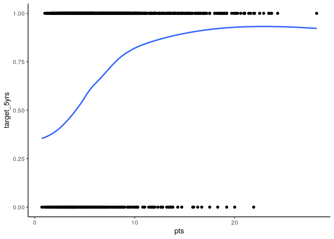
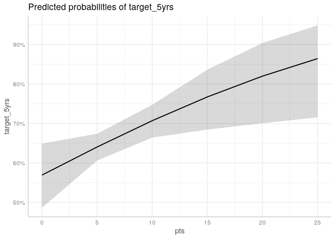
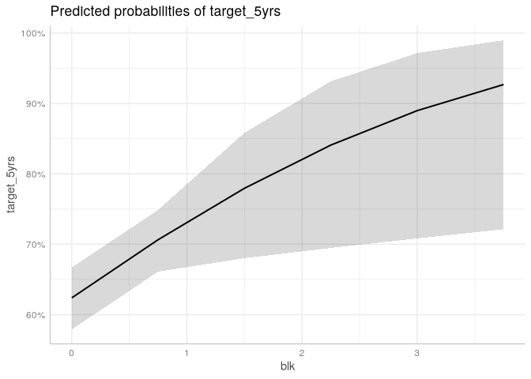
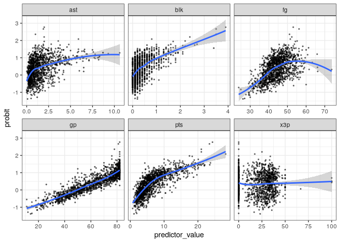
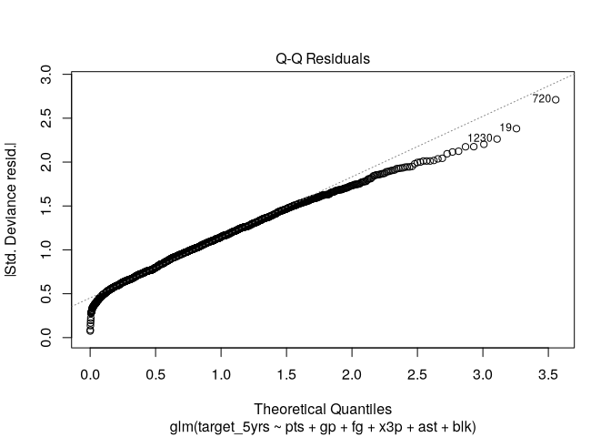

# Probit Regression


[Source](https://bookdown.org/sarahwerth2024/CategoricalBook/probit-regression-r.html)

``` r
libraries <- list(
  "tidyverse", "car", "janitor",
  "ggeffects", "margins"
)
invisible(lapply(libraries, library, character.only = TRUE))
```

``` r
nba <- read.csv("data/nba_rookie.csv") %>% 
  clean_names()
```

# Probit Regression

Probit uses the cumulative normal distribution curve rather than the
logistic curve.


$$P(Y=1) = \Phi(\beta_0 + \beta_1X_1 + ... \beta_kX_k)$$
or

$$\Phi^{-1}(P(Y = 1)) = \beta_0 + \beta_1X_1 + ... \beta_kX_k$$

Where $\Phi$ is the cumulative normal distribution function. The result
is a z-score. Since there are no odds ratio, the z-score can be turned
into probabilities.

## Assumpations

1.  Binary outcome
2.  Z-score and independent variables have linear relationship
3.  Normally distributed errors, ok to violate if large sample size (\>
    20)
4.  Errors are independent (no clusters)
5.  No severe multicolinearity (VIF, consider dropping, combining
    variables)

# Running a probit regression

What rookie characteristics are associated with a career greater than 5
years?

## Plot the outcome and key variables

``` r
ggplot(nba, aes(x = pts, y = target_5yrs)) +
  geom_point() +
  geom_smooth(method = "loess", se = F) +
  theme_classic()
```

    `geom_smooth()` using formula = 'y ~ x'



## Run the models

Start with a basic model

``` r
fit_basic <- glm(target_5yrs ~ pts, data = nba,
                 family = binomial(link = "probit"))
summary(fit_basic)
```


    Call:
    glm(formula = target_5yrs ~ pts, family = binomial(link = "probit"), 
        data = nba)

    Coefficients:
                Estimate Std. Error z value Pr(>|z|)    
    (Intercept) -0.43212    0.07247  -5.963 2.48e-09 ***
    pts          0.11621    0.01050  11.067  < 2e-16 ***
    ---
    Signif. codes:  0 '***' 0.001 '**' 0.01 '*' 0.05 '.' 0.1 ' ' 1

    (Dispersion parameter for binomial family taken to be 1)

        Null deviance: 1779.5  on 1339  degrees of freedom
    Residual deviance: 1624.3  on 1338  degrees of freedom
    AIC: 1628.3

    Number of Fisher Scoring iterations: 4

``` r
fit_full <- glm(target_5yrs ~ pts + gp + fg + x3p + ast + blk,
                data = nba, family = binomial(link = probit))
summary(fit_full)
```


    Call:
    glm(formula = target_5yrs ~ pts + gp + fg + x3p + ast + blk, 
        family = binomial(link = probit), data = nba)

    Coefficients:
                 Estimate Std. Error z value Pr(>|z|)    
    (Intercept) -2.444898   0.329215  -7.426 1.12e-13 ***
    pts          0.037039   0.014674   2.524  0.01160 *  
    gp           0.022011   0.002651   8.303  < 2e-16 ***
    fg           0.023796   0.007315   3.253  0.00114 ** 
    x3p          0.001158   0.002619   0.442  0.65825    
    ast          0.031501   0.036920   0.853  0.39353    
    blk          0.303360   0.129373   2.345  0.01904 *  
    ---
    Signif. codes:  0 '***' 0.001 '**' 0.01 '*' 0.05 '.' 0.1 ' ' 1

    (Dispersion parameter for binomial family taken to be 1)

        Null deviance: 1763.1  on 1328  degrees of freedom
    Residual deviance: 1494.4  on 1322  degrees of freedom
      (11 observations deleted due to missingness)
    AIC: 1508.4

    Number of Fisher Scoring iterations: 4

## Interpret

The estimate represents the change in z-score. eg. for each additional
point scored per game, there is a .037 increase in the z-score of having
a career longer than 5 years.

### Marginal effects

Can use at means, at representative values, or average marginal effects.
This is the average marginal effects method.

``` r
margins(fit_full, variables = "pts")
```

    Average marginal effects

    glm(formula = target_5yrs ~ pts + gp + fg + x3p + ast + blk,     family = binomial(link = probit), data = nba)

        pts
     0.0118

Each additional point scored per game is associated with a 1.2% increase
in the probability of having a career longer than 5 years.

``` r
margins(fit_full, variables = "blk")
```

    Average marginal effects

    glm(formula = target_5yrs ~ pts + gp + fg + x3p + ast + blk,     family = binomial(link = probit), data = nba)

         blk
     0.09665

### Predicted probability plots

``` r
ggpredict(fit_full, terms = "pts[0:25 by = 5]") %>% 
  plot()
```



``` r
ggpredict(fit_full, terms = "blk[0:4 by = 0.75]") %>% 
  plot()
```



``` r
summary(fit_full$data$blk)
```

       Min. 1st Qu.  Median    Mean 3rd Qu.    Max. 
     0.0000  0.1000  0.2000  0.3686  0.5000  3.9000 

## Check assumptions

1.  Binary outcome
2.  z-score outcome and x variables have linear relationship

Predict the probit and plot against independent variables.

``` r
nba_model <- nba %>% 
  select(pts, gp, fg, x3p, ast, blk) %>% 
  drop_na()
predictors <- names(nba_model)
nba_model$probabilities <- fit_full$fitted.values
nba_model <- nba_model %>% 
  mutate(probit = qnorm(probabilities)) %>% 
  select(-probabilities) %>% 
  pivot_longer(cols = 1:6,
               names_to = "predictors",
               values_to = "predictor_value")
```

``` r
ggplot(nba_model, aes(y = probit, x = predictor_value))+
    geom_point(size = 0.5, alpha = 0.5) +
    geom_smooth(method = "loess") +
    theme_bw() +
    facet_wrap(~predictors, scales = "free_x")
```

    `geom_smooth()` using formula = 'y ~ x'



`fg` should probably be squared.

3.  Normally distributed errors

``` r
plot(fit_full, which = 2)
```



Some non-linearity, but ok due to sample size.

4.  Independent errors

Tere is no clustering.

5.  Multicolinearity

``` r
vif(fit_full)
```

         pts       gp       fg      x3p      ast      blk 
    2.179735 1.417555 1.382302 1.268479 1.820501 1.437157 

None are over 10
